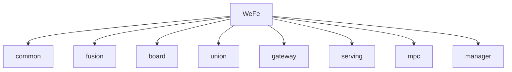

# Basic Information

|      |      |
|------|------|
| Name | WeFe |
| Language | .java |
| Code Path | WeFe |
| Brief Description | Federated learning platform full-stack modules, covering data governance, secure communication, and development support, supporting multiple databases, national cryptographic algorithms, and certificate management, integrated with Spring, MongoDB, etc. |

### Package Internal Structure View

This flowchart illustrates the module structure of the WeFe project, where WeFe serves as the root directory encompassing 8 submodules: common, fusion, board, union, gateway, serving, mpc, and manager. Each submodule maintains a direct hierarchical relationship with the main project, showcasing a typical microservices architecture project layout.

# Module List

| Name   | Type  | Description |
|-------|------|-------------|
| [board](board/_module.md) | module | The module system encompasses the full-stack functionality of the federated learning platform, including file system management, session state maintenance, Spring Bean configuration, data persistence, API services, scheduled tasks, exception handling, and componentized machine learning workflows. The core modules provide file lifecycle management, RESTful interfaces, JPA data operations, and distributed communication protocols, supporting both horizontal and vertical federated learning scenarios. Adopting a layered design, it integrates technologies such as Spring, gRPC, and cryptographic libraries to enable end-to-end collaborative workflows from data preprocessing to model training. |
| [fusion](fusion/_module.md) | module | The core management system of federated learning integrates data persistence, privacy-preserving computation (PSI algorithm), and task scheduling, supporting full lifecycle management. It adopts a layered architecture, relying on Spring Data JPA and multiple database drivers. Typical workflows include initialization, data preparation, secure computation, and result callback. |
| [manager](manager/_module.md) | module | The digital certificate management module implements the entire process of application, issuance, and key binding. The core component CertOperationService relies on CertDao for persistence, with data structures including CertRequestVO, etc., using FastJSON for serialization, and exceptions handled by CertMgrException. The consortium chain management system is responsible for multi-dimensional resource management and smart contract interaction, adopting a layered design that supports scenarios such as member registration and data tagging. It depends on MongoDB, FISCO BCOS SDK, etc., with functionalities covering state management and permission verification. |
| [mpc](mpc/_module.md) | module | This series of modules implements core functionalities of Secure Multi-party Computation (MPC): PIR (Private Information Retrieval), PSI (Private Set Intersection), key exchange, and secure aggregation. Utilizing protocols such as Naor-Pinkas, Hauck, and ECDH, it supports federated learning and joint risk control scenarios. The modules incorporate mechanisms like encrypted transmission, data obfuscation, and thread-safe caching, offering full lifecycle management through layered APIs and POJO specifications. |
| [serving](serving/_module.md) | module | The federated learning prediction framework uniformly manages the prediction process and result merging, supporting horizontal/vertical federated learning, and relies on XGBoost and multi-threading tools. The privacy-preserving computing system integrates secure data interaction and collaborative machine learning, adopts a layered design, supports encrypted communication and joint computation, and depends on encryption libraries and the Spring ecosystem. |
| [gateway](gateway/_module.md) | module | The gRPC gateway system includes functional modules such as server management, cache loading, security interception, data transmission, storage access, scheduled refresh, and health checks. It supports dual-channel communication, dynamic TLS, streaming processing, and distributed monitoring. |
| [union](union/_module.md) | module | The consortium chain management module provides member, data, contract, and monitoring management, adopting a layered interface design and relying on FISCO BCOS and Spring. The data synchronization module is responsible for on-chain event parsing and persistence, supporting multi-threaded ETL processes, and depends on MongoDB and node SDK. |
| [common](common/_module.md) | module | Java basic utility library, including configuration management, data processing, validation, HTTP communication, etc., with dependencies such as Log4j. Full-stack web application solution, supporting API management, access control, logging, with dependencies such as Spring. JPA data access layer, providing CRUD and dynamic queries, dependent on JPA. Cross-cloud data storage, supporting sharding and connection pool management, dependent on Druid. Protobuf protocol, supporting data serialization. MongoDB data management, supporting CRUD and aggregation queries. Federated learning framework, including health checks, configuration management, etc. CAPTCHA service, supporting SMS/email delivery. Cryptography toolkit, supporting key management and certificate operations. JDBC framework, supporting multi-database operations. |

