# Basic Information

|      |      |
|------|------|
| Name | com |
| Language | .java |
| Code Path | WeFe/board/board-service/src/main/java/com |
| Package Name | docs.board.board-service.src.main.java.com |
| Brief Description | The module system encompasses the full-stack functionality of the federated learning platform, including file system management, session state maintenance, Spring Bean configuration, data persistence, API services, scheduled tasks, exception handling, and componentized machine learning workflows. The core modules provide file lifecycle management, RESTful interfaces, JPA data operations, and distributed communication protocols, supporting both horizontal and vertical federated learning scenarios. Adopting a layered design, it integrates technologies such as Spring, gRPC, and cryptographic libraries to enable end-to-end collaborative workflows from data preprocessing to model training. |

# Description

## Overview  
This module serves as the core service matrix of the federated learning platform, integrating capabilities such as file system management, session state maintenance, Spring container configuration, data persistence, and distributed communication, akin to an enterprise-level AI collaboration hub. Unified interface standards encompass RESTful APIs (layered inheritance of AbstractApi), JPA specifications (BaseRepository extensions), and Protobuf/gRPC protocols (TransferServiceGrpc). Key data structures form a multi-dimensional system: business entity classes (JobMySqlModel), validation models (Input annotated with @Check), enumeration constants (ServiceStatus), and transmission metadata (TransferMeta sharding units). External dependencies are concentrated in the Spring ecosystem (JPA/WebSocket), encryption components (RSA/AES), machine learning frameworks (PaddlePaddle/XGBoost), and storage systems (MySQL/LMDB). For example, DownloadDeepLearningModel handles model files, while GenerateRsaKeyPairApi manages key lifecycle.

## Key Business Scenarios  
The module supports end-to-end federated learning scenarios: 1) Secure initialization (RSA key generation → CA certificate cache refresh → gateway connection testing); 2) Collaborative modeling (data sharding and deduplication → PSI sample alignment → horizontal logistic regression training); 3) System operations (scheduled cleanup of inactive accounts → hot configuration updates → file shard uploads). Interaction modes blend synchronous CRUD (e.g., AccountService), asynchronous workflows (ModelExportService), and event-driven mechanisms (ApplicationListener), resembling a hybrid of a workflow engine and message bus. Typical applications include cross-institution data fusion (Bloom filter deduplication), flowchart node management (BaseFlowGraph anti-circular dependency), and real-time communication (WebSocket duplex sessions). Functional completeness is reflected in multi-component coordination, such as project deletion triggering cascaded cleanup and model exports synchronously pushing keys to the Serving system.

### Package Internal Structure View

Since the path information of PATH2 is extremely large and complex, I will generate a flowchart of the main modules according to the rules. Here, the hierarchical relationships of the core service modules are displayed:

```mermaid
graph TD
    board --> service
    service --> base
    service --> api
    service --> data_resource
    service --> project
    service --> member
    service --> fusion
    service --> component
    
    base --> WeFeFileSystem.java
    base --> OnlineDemoApi.java
    base --> LoginAccountInfo.java
    
    api --> crypto
    api --> global_config
    api --> account
    api --> online_demo
    api --> data_resource
    api --> storage
    api --> chat
    api --> message
    api --> service
    api --> blacklist
    api --> partner_config
    api --> file
    api --> gateway
    api --> data_output_info
    api --> union
    api --> operation
    api --> project
    api --> datasource
    api --> member
    api --> model
    api --> component
    
    data_resource --> table_data_set
    data_resource --> upload_task
    data_resource --> bloom_filter
    data_resource --> image_data_set
    
    project --> modeling
    project --> job
    project --> dataset
    project --> project
    project --> flow
    project --> member
    project --> fusion
    project --> node
    
    component --> base
    component --> modeling
    component --> deep_learning
    component --> feature
    component --> temp
```

This flowchart illustrates the core module structure of WeFe/board-service, including the main service module and its key submodules such as base, api, data_resource, project, member, fusion, and component. Each submodule contains more specific functional components. For example, the api module includes 15 functional submodules like crypto and account, while the project module comprises 7 functional submodules such as modeling and job. This modular design reflects clear responsibility division and hierarchical relationships.

# File List

| Name   | Type  | Description |
|-------|------|-------------|
| [welab](welab/_module.md) | package | The module system encompasses full-stack functionalities of the federated learning platform, including file system management, session state maintenance, Spring Bean configuration, data persistence, API services, scheduled tasks, exception handling, and componentized machine learning workflows. The core modules provide file lifecycle management, RESTful interfaces, JPA data operations, and distributed communication protocols, supporting both horizontal and vertical federated learning scenarios. Adopting a layered design, it integrates technologies such as Spring, gRPC, and cryptographic libraries to enable end-to-end collaborative workflows from data preprocessing to model training. |

