# Basic Information

|      |      |
|------|------|
| Name | welab |
| Language | .java |
| Code Path | WeFe/board/board-service/src/main/java/com/welab |
| Package Name | docs.board.board-service.src.main.java.com.welab |
| Brief Description | The module system encompasses full-stack functionalities of the federated learning platform, including file system management, session state maintenance, Spring Bean configuration, data persistence, API services, scheduled tasks, exception handling, and componentized machine learning workflows. The core modules provide file lifecycle management, RESTful interfaces, JPA data operations, and distributed communication protocols, supporting both horizontal and vertical federated learning scenarios. Adopting a layered design, it integrates technologies such as Spring, gRPC, and cryptographic libraries to enable end-to-end collaborative workflows from data preprocessing to model training. |

# Description

## Overview  
This module serves as the core service matrix of the federated learning platform, integrating capabilities such as file system management, session state maintenance, Spring container configuration, data persistence, and distributed communication, akin to an enterprise-level AI collaboration hub. Unified interface specifications encompass RESTful APIs (layered inheritance of `AbstractApi`), JPA standards (`BaseRepository` extensions), and Protobuf/gRPC protocols (`TransferServiceGrpc`). Key data structures form a multi-dimensional system: business entity classes (`JobMySqlModel`), validation models (`Input` annotated with `@Check`), enumerated constants (`ServiceStatus`), and transmission metadata (`TransferMeta` sharding units). External dependencies are concentrated in the Spring ecosystem (JPA/WebSocket), encryption components (RSA/AES), machine learning frameworks (PaddlePaddle/XGBoost), and storage systems (MySQL/LMDB). For instance, `DownloadDeepLearningModel` handles model files, while `GenerateRsaKeyPairApi` manages key lifecycle.  

## Key Business Scenarios  
The module supports end-to-end federated learning scenarios: 1) Secure initialization (RSA key generation → CA certificate cache refresh → gateway connection test); 2) Collaborative modeling (data sharding deduplication → PSI sample alignment → horizontal logistic regression training); 3) System operations (scheduled cleanup of inactive accounts → hot configuration updates → file shard uploads). Interaction modes blend synchronous CRUD (e.g., `AccountService`), asynchronous workflows (`ModelExportService`), and event-driven mechanisms (`ApplicationListener`), resembling a hybrid of workflow engines and message buses. Typical applications include cross-institution data fusion (Bloom filter deduplication), flowchart node management (`BaseFlowGraph` anti-circular dependency), and real-time communication (WebSocket duplex sessions). Functional completeness is reflected in multi-component coordination, such as project deletion triggering cascaded cleanup and model exports synchronously pushing keys to the Serving system.

### Package Internal Structure View

```mermaid
graph TD
    wefe --> board
    board --> service
    service --> api
    service --> database
    service --> dto
    service --> component
    service --> model
    service --> fusion
    service --> operation
    service --> scheduled
    service --> cache
    service --> constant
    service --> exception
    service --> kernel
    service --> listener
    service --> onlinedemo
    service --> proto
    service --> sdk
    service --> util
    api --> account
    api --> blacklist
    api --> chat
    api --> component
    api --> crypto
    api --> data_resource
    api --> datasource
    api --> dev
    api --> file
    api --> gateway
    api --> global_config
    api --> member
    api --> message
    api --> model
    api --> operation
    api --> partner_config
    api --> project
    api --> service
    api --> storage
    api --> union
    database --> entity
    database --> repository
    dto --> base
    dto --> entity
    dto --> fusion
    dto --> kernel
    dto --> serving
    dto --> union
    dto --> vo
    component --> base
    component --> deep_learning
    component --> feature
    component --> modeling
    component --> temp
    fusion --> actuator
    fusion --> enums
    fusion --> manager
    scheduled --> AccountScheduledService
    scheduled --> CaCertificateScheduledService
    scheduled --> OnlineDemoScheduledService
    constant --> BloomfilterAddMethod
    constant --> ChatConstant
    constant --> Config
    constant --> DataSetAddMethod
    constant --> ServiceStatus
    kernel --> deep_learning
    kernel --> machine_learning
    listener --> AppListener
    listener --> ApplicationReadyListener
    listener --> ApplicationStartedListener
    onlinedemo --> OnlineDemoBranchStrategy
    onlinedemo --> TianmiantechService
    proto --> meta
    proto --> TransferServiceGrpc
    proto --> TransferServiceProto
    sdk --> FlowService
    sdk --> PaddleVisualService
    sdk --> union
    util --> primarykey
    util --> unique
    util --> AbstractBloomFilterReader
    util --> AbstractTableDataSetReader
    util --> CsvBloomFilterReader
    util --> CsvTableDataSetReader
    util --> ExcelBloomfilterReader
    util --> ExcelTableDataSetReader
    util --> SqlBloomFilterReader
    util --> SqlTableDataSetReader
    util --> TlsUtil
```

This flowchart illustrates the core module structure of the WeFe/board/board-service project, starting from the top-level wefe module and hierarchically expanding to include major modules such as api, database, dto, and component. The api module is subdivided into business interfaces including account, blacklist, and chat; the database module comprises entity and repository; the component module includes base, deep_learning, and other component types. The diagram presents a clear hierarchical relationship, encompassing 7 first-level modules and over 50 terminal nodes, comprehensively covering all provided path information.

# File List

| Name   | Type  | Description |
|-------|------|-------------|
| [wefe](wefe/_module.md) | package | The module system encompasses the full-stack functionality of the federated learning platform, including file system management, session state maintenance, Spring Bean configuration, data persistence, API services, scheduled tasks, exception handling, and modularized machine learning workflows. The core modules provide file lifecycle management, RESTful interfaces, JPA data operations, and distributed communication protocols, supporting both horizontal and vertical federated learning scenarios. Adopting a layered design, it integrates technologies such as Spring, gRPC, and cryptographic libraries to enable end-to-end collaborative workflows from data preprocessing to model training. |

