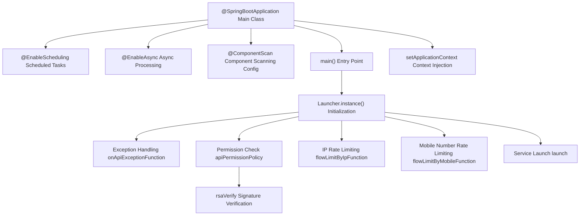

# Basic Information

|      |      |
|------|------|
| Name | BoardService |
| Language | .java |
| Code Path | WeFe/board/board-service/src/main/java/com/welab/wefe/board/service/BoardService.java |
| Package Name | com.welab.wefe.board.service |
| Dependencies | ['com.alibaba.fastjson.JSONObject', 'com.welab.wefe.board.service.base.OnlineDemoApi', 'com.welab.wefe.board.service.constant.Config', 'com.welab.wefe.board.service.exception.FlowNodeException', 'com.welab.wefe.board.service.service.CacheObjects', 'com.welab.wefe.common.StatusCode', 'com.welab.wefe.common.exception.StatusCodeWithException', 'com.welab.wefe.common.util.JObject', 'com.welab.wefe.common.util.RSAUtil', 'com.welab.wefe.common.util.SignUtil', 'com.welab.wefe.common.web.Launcher', 'com.welab.wefe.common.web.config.ApiBeanNameGenerator', 'com.welab.wefe.common.web.dto.ApiResult', 'com.welab.wefe.common.web.dto.SignedApiInput', 'com.welab.wefe.common.web.service.flowlimit.FlowLimitByIpService', 'com.welab.wefe.common.web.service.flowlimit.FlowLimitByMobileService', 'com.welab.wefe.common.wefe.checkpoint.CheckpointManager', 'org.slf4j.Logger', 'org.slf4j.LoggerFactory', 'org.springframework.beans.BeansException', 'org.springframework.boot.autoconfigure.SpringBootApplication', 'org.springframework.context.ApplicationContext', 'org.springframework.context.ApplicationContextAware', 'org.springframework.context.annotation.ComponentScan', 'org.springframework.scheduling.annotation.EnableAsync', 'org.springframework.scheduling.annotation.EnableScheduling', 'java.nio.charset.StandardCharsets'] |
| Brief Description | BoardService serves as the entry point for SpringBoot applications, integrating scheduled and asynchronous tasks, custom component scanning, and permission control. It handles API exceptions and rate limiting while supporting RSA signature verification. |

# Description

BoardService is the main class of a Spring Boot application, integrating scheduled tasks and asynchronous processing capabilities. It specifies the base scan package and a custom Bean name generator through @ComponentScan. This class implements the ApplicationContextAware interface for setting the application context. The main method configures a Launcher instance, including API package classes, exception handling, permission policies, and traffic limiting features. Exception handling specifically processes FlowNodeException, returning error messages containing node IDs. Permission checks include restrictions for the online demo environment and RSA signature verification. The RSA signature verification logic handles requests from the frontend and other subsystems to ensure data integrity.

# Class Summary

| Name   | Type  | Description |
|-------|------|-------------|
| BoardService | class | BoardService is a SpringBoot application that enables scheduled and asynchronous tasks, with custom component scanning and naming. The main method configures API permissions, exception handling, and rate limiting, supporting RSA signature verification and online demo environment checks. |

## Class BoardService

|      |      |
|------|------|
| Access Modifier | @SpringBootApplication;@EnableScheduling;@EnableAsync;@ComponentScan(;        lazyInit = true,;        nameGenerator = ApiBeanNameGenerator.class,;        basePackageClasses = {;                BoardService.class,;                Launcher.class,;                CheckpointManager.class;        };);public |
| Type | class |
| Name | BoardService |
| Description | BoardService is a SpringBoot application that enables scheduled and asynchronous tasks, with custom component scanning and naming. The main method configures API permissions, exception handling, and rate limiting, supporting RSA signature verification and online demo environment checks. |

### UML Class Diagram

```mermaid
classDiagram
    class BoardService {
        -Logger LOG
        +main(String[] args) void
        +setApplicationContext(ApplicationContext applicationContext) void
        -rsaVerify(JSONObject params) void
    }
    class Launcher {
        +CONTEXT: ApplicationContext
        +instance() Launcher
        +apiPackageClass(Class~?~ clazz) Launcher
        +onApiExceptionFunction(Function~Api, Exception, ApiResult~?~~) Launcher
        +apiPermissionPolicy(TriConsumer~Api, Annotation, JSONObject~) Launcher
        +flowLimitByIpFunctionFunction(TriFunction~HttpServletRequest, Api, JSONObject, Boolean~) Launcher
        +flowLimitByMobileFunctionFunction(TriFunction~HttpServletRequest, Api, JSONObject, Boolean~) Launcher
        +launch(Class~?~ clazz, String[] args) void
        +getBean(Class~T~ clazz) T
    }
    class FlowNodeException {
        +getNode() Node
        +getStatusCode() StatusCode
    }
    class StatusCodeWithException {
        +StatusCode statusCode
        +String message
    }
    class SignedApiInput {
        +String data
        +String sign
        +getData() String
        +getSign() String
    }
    class ApiResult~T~ {
        +int code
        +String message
        +T data
    }
    class JObject {
        +create() JObject
        +put(String key, Object value) JObject
    }
    class Config {
        +isOnlineDemo() Boolean
    }
    class FlowLimitByIpService {
        +FlowLimitByIpService(HttpServletRequest, Api, JSONObject)
        +check() Boolean
    }
    class FlowLimitByMobileService {
        +FlowLimitByMobileService(HttpServletRequest, Api, JSONObject)
        +check() Boolean
    }
    class SignUtil {
        +verify(byte[] data, String publicKey, String sign, String secretKeyType) Boolean
    }
    class CacheObjects {
        +getRsaPublicKey() String
        +getSecretKeyType() String
    }

    BoardService --> Launcher : "Configures launch parameters"
    BoardService --> FlowNodeException : "Handles node exceptions"
    BoardService --> StatusCodeWithException : "Throws permission exceptions"
    BoardService --> SignedApiInput : "Processes signed input"
    BoardService --> ApiResult~JObject~ : "Builds error response"
    BoardService --> JObject : "Creates exception info"
    BoardService --> Config : "Checks online demo config"
    BoardService --> FlowLimitByIpService : "IP flow limit check"
    BoardService --> FlowLimitByMobileService : "Mobile flow limit check"
    BoardService --> SignUtil : "Verifies signature"
    BoardService --> CacheObjects : "Retrieves key info"
    Launcher --> ApplicationContext : "Sets application context"
```

This code represents the Spring Boot application startup class for BoardService, with core functionalities including: 1) Configuring API permission policies and exception handling; 2) Implementing RSA signature verification; 3) Providing IP and mobile number flow limit checks. The Launcher class handles service launch configuration, processes specific exceptions like FlowNodeException, and uses SignUtil for signature verification. The class diagram illustrates interactions between BoardService, Launcher, exception classes, and utility classes, reflecting core features of permission control, flow limiting, and exception handling.

### Internal Method Call Graph

This flowchart illustrates the startup process and core functional modules of a SpringBoot application. Starting from the main class annotation configuration, the service is initialized via Launcher, incorporating critical functionalities such as exception handling, permission verification, and flow control. The permission check module triggers the RSA signature verification process, demonstrating the application's security control and exception handling mechanisms. Context injection and component scanning configuration provide the foundational runtime environment for the entire application.

### Field List

| Name  | Type  | Description |
|-------|-------|------|
| LOG = LoggerFactory.getLogger(BoardService.class) | Logger | A static immutable logger instance LOG is declared in the BoardService class. |

### Method List

| Name  | Type  | Description |
|-------|-------|------|
| main | void | The Java main method configures a Launcher instance, sets the API package class, exception handling, permission policies, and traffic limits, and finally starts the service. |
| setApplicationContext | void | This method overrides setApplicationContext, assigning the passed-in Spring application context to the static variable CONTEXT of the Launcher class. |
| rsaVerify | void | RSA verification method, checks the validity of input parameter signatures, uses the system public key to verify the data, throws an exception upon failure, and parses the data into the parameter object upon successful verification. |

