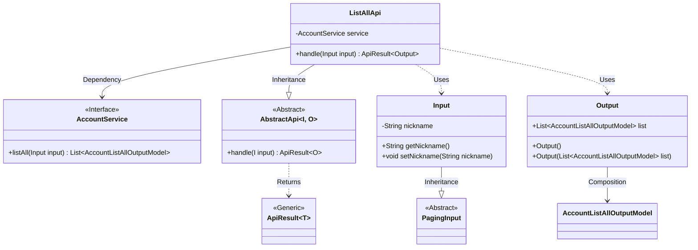
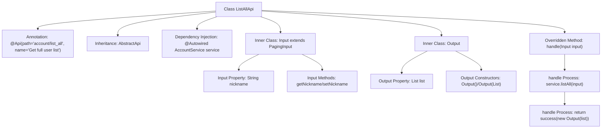

# Basic Information

|      |      |
|------|------|
| Name | ListAllApi |
| Language | .java |
| Code Path | WeFe/board/board-service/src/main/java/com/welab/wefe/board/service/api/account/ListAllApi.java |
| Package Name | com.welab.wefe.board.service.api.account |
| Dependencies | ['com.welab.wefe.board.service.dto.base.PagingInput', 'com.welab.wefe.board.service.dto.entity.AccountListAllOutputModel', 'com.welab.wefe.board.service.service.account.AccountService', 'com.welab.wefe.common.web.api.base.AbstractApi', 'com.welab.wefe.common.web.api.base.Api', 'com.welab.wefe.common.web.dto.ApiResult', 'org.springframework.beans.factory.annotation.Autowired', 'java.util.List'] |
| Brief Description | The API class ListAllApi is used to retrieve a complete list of users, accepting pagination parameters and nickname filtering, and returns user list data. |

# Description

The code defines an API class named `ListAllApi`, designed to retrieve a comprehensive list of users. The class inherits from `AbstractApi` and includes two nested classes: `Input` and `Output`. The `Input` class extends `PagingInput` and contains a `nickname` property along with its getter/setter methods. The `Output` class features a list property of type `AccountListAllOutputModel`. The API path is `account/list_all`, which processes requests by invoking the `listAll` method of the auto-injected `AccountService` and returns a result containing the user list. The entire class implements pagination and nickname-based filtering functionality.

# Class Summary

| Name   | Type  | Description |
|-------|------|-------------|
| ListAllApi | class | Define an API class for retrieving user lists, including pagination input and nickname filtering, returning user list data. |

## Class ListAllApi

|      |      |
|------|------|
| Access Modifier | @Api(path = "account/list_all", name = "获取全量的用户列表");public |
| Type | class |
| Name | ListAllApi |
| Description | Define an API class for retrieving user lists, including pagination input and nickname filtering, returning user list data. |

### UML Class Diagram

This class diagram illustrates the structural relationships of ListAllApi and its associated classes. ListAllApi inherits from the generic abstract class AbstractApi<Input, Output> and contains a dependency on the AccountService interface. The Input class inherits from PagingInput and includes nickname attributes with getter/setter methods. The Output class contains a list of AccountListAllOutputModel. The overall structure implements the functionality of retrieving user lists through AccountService, adhering to layered design principles. Input handles pagination and query parameters, while Output encapsulates the returned results.

### Internal Method Call Graph

This code defines an API class named ListAllApi for retrieving a full user list. The class inherits from AbstractApi with specified input/output generic types, containing core processing logic to fetch data via AccountService. The structure includes two static inner classes: Input for receiving pagination parameters and nickname filters, and Output for wrapping returned user list data. The main flow retrieves data through service.listAll() and constructs an Output object for response, adhering to layered architecture patterns.

### Field List

| Name  | Type  | Description |
|-------|-------|------|
| service | AccountService | Using @Autowired to automatically inject an instance of AccountService. |

### Method List

| Name  | Type  | Description |
|-------|-------|------|
| handle | ApiResult<Output> | The method overrides the input processing and returns a list of account results. After invoking the service to retrieve the list, it encapsulates the response as a successful one. |

