# Basic Information

|      |      |
|------|------|
| Name | QueryMemberAccountsApi |
| Language | .java |
| Code Path | WeFe/board/board-service/src/main/java/com/welab/wefe/board/service/api/account/QueryMemberAccountsApi.java |
| Package Name | com.welab.wefe.board.service.api.account |
| Dependencies | ['com.welab.wefe.board.service.dto.base.PagingInput', 'com.welab.wefe.board.service.dto.base.PagingOutput', 'com.welab.wefe.board.service.dto.entity.AccountOutputModel', 'com.welab.wefe.board.service.service.account.AccountService', 'com.welab.wefe.common.exception.StatusCodeWithException', 'com.welab.wefe.common.fieldvalidate.annotation.Check', 'com.welab.wefe.common.web.api.base.AbstractApi', 'com.welab.wefe.common.web.api.base.Api', 'com.welab.wefe.common.web.dto.ApiResult', 'com.welab.wefe.common.wefe.enums.AuditStatus', 'org.springframework.beans.factory.annotation.Autowired'] |
| Brief Description | API for querying account information by member ID, including pagination input parameters such as memberId, phoneNumber, etc., returning paginated account data. |

# Description

The code defines an API class named `QueryMemberAccountsApi`, which is used to query account information by member ID. The API path is `account/query_by_member_id`, inheriting from `AbstractApi`, with the input type as the inner class `Input` and the output as paginated `AccountOutputModel`. The `Input` class includes pagination parameters and multiple query conditions: the required `memberId`, `phoneNumber`, `nickname`, `auditStatus`, and `adminRole`. The processing logic calls the `queryMemberAccounts` method of `accountService` and returns the paginated query results. All fields have corresponding getter and setter methods.

# Class Summary

| Name   | Type  | Description |
|-------|------|-------------|
| QueryMemberAccountsApi | class | API for querying account information by member ID, including pagination input parameters such as memberId, phoneNumber, etc., returning paginated account data. |


## Class QueryMemberAccountsApi

|      |      |
|------|------|
| Access Modifier | @Api(path = "account/query_by_member_id", name = "Query account information by member ID");public |
| Type | class |
| Name | QueryMemberAccountsApi |
| Description | API for querying account information by member ID, including pagination input parameters such as memberId, phoneNumber, etc., returning paginated account data. |


### UML Class Diagram

```mermaid
classDiagram
    class QueryMemberAccountsApi {
        -AccountService accountService
        +handle(Input input) ApiResult~PagingOutput~AccountOutputModel~~
    }
    class Input {
        -String memberId
        -String phoneNumber
        -String nickname
        -AuditStatus auditStatus
        -Boolean adminRole
        +getMemberId() String
        +setMemberId(String memberId) void
        +getPhoneNumber() String
        +setPhoneNumber(String phoneNumber) void
        +getNickname() String
        +setNickname(String nickname) void
        +getAuditStatus() AuditStatus
        +setAuditStatus(AuditStatus auditStatus) void
        +getAdminRole() Boolean
        +setAdminRole(Boolean adminRole) void
    }
    class PagingInput {
        <<Abstract>>
    }
    class AccountService {
        <<Interface>>
        +queryMemberAccounts(Input input) PagingOutput~AccountOutputModel~
    }
    class PagingOutput~T~ {
        <<Generic>>
    }
    class AccountOutputModel {
    }
    class AuditStatus {
        <<Enum>>
    }
    class ApiResult~T~ {
        <<Generic>>
    }

    QueryMemberAccountsApi --> AccountService : Dependency
    Input --|> PagingInput : Inheritance
    QueryMemberAccountsApi ..> Input : Uses
    AccountService ..> PagingOutput~AccountOutputModel~ : Returns
    QueryMemberAccountsApi ..> ApiResult~PagingOutput~AccountOutputModel~~ : Returns
    Input ..> AuditStatus : Contains
    PagingOutput~T~ ..> AccountOutputModel : Contains
```

This code demonstrates an API implementation for querying account information based on member ID. QueryMemberAccountsApi inherits from AbstractApi, utilizes AccountService for business logic processing, accepts Input parameters, and returns paginated AccountOutputModel results. The Input class inherits PagingInput, containing query conditions such as member ID, phone number, etc., and employs the enum type AuditStatus. The overall design reflects clear hierarchical relationships and dependencies, achieving type-safe input/output handling through generics.


### Internal Method Call Graph

```mermaid
graph TD
    A["Class QueryMemberAccountsApi"]
    B["Annotation: @Api(path='account/query_by_member_id', name='Query account information by member ID')"]
    C["Inheritance: AbstractApi<Input, PagingOutput<AccountOutputModel>>"]
    D["Dependency Injection: @Autowired AccountService accountService"]
    E["Overridden Method: handle(Input input)"]
    F["Inner Class: Input extends PagingInput"]
    G["Property: @Check(require=true) String memberId"]
    H["Property: String phoneNumber"]
    I["Property: String nickname"]
    J["Property: AuditStatus auditStatus"]
    K["Property: Boolean adminRole"]
    L["Getter/Setter Methods"]

    A --> B
    A --> C
    A --> D
    A --> E
    A --> F
    F --> G
    F --> H
    F --> I
    F --> J
    F --> K
    F --> L
    E --> M["Invocation: accountService.queryMemberAccounts(input)"]
    E --> N["Return: success(result)"]
```



This code describes an API class for querying account information based on member ID, which inherits from an abstract API template class. The core flow involves calling AccountService through the handle method to query member accounts and return paginated results. The inner class Input defines query parameters, including the mandatory memberId and other optional fields, all with corresponding getter/setter methods. The flowchart illustrates the class structure, dependencies, and the main method invocation chain.

### Field List

| Name  | Type  | Description |
|-------|-------|------|
| accountService | AccountService | Using @Autowired to automatically inject an instance of AccountService. |

### Method List

| Name  | Type  | Description |
|-------|-------|------|
| handle | ApiResult<PagingOutput<AccountOutputModel>> | Rewriting the parent class method to call accountService for querying member accounts and return paginated results. Throws a status code exception in case of errors. |


