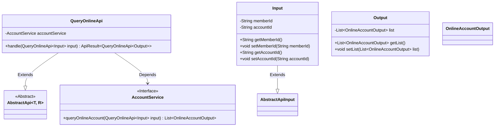
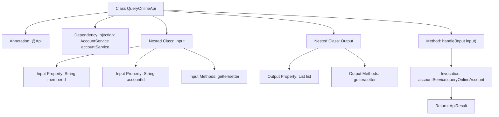

# Basic Information

|      |      |
|------|------|
| Name | QueryOnlineApi |
| Language | .java |
| Code Path | WeFe/board/board-service/src/main/java/com/welab/wefe/board/service/api/account/QueryOnlineApi.java |
| Package Name | com.welab.wefe.board.service.api.account |
| Dependencies | ['com.welab.wefe.board.service.dto.vo.OnlineAccountOutput', 'com.welab.wefe.board.service.service.account.AccountService', 'com.welab.wefe.common.exception.StatusCodeWithException', 'com.welab.wefe.common.fieldvalidate.annotation.Check', 'com.welab.wefe.common.web.api.base.AbstractApi', 'com.welab.wefe.common.web.api.base.Api', 'com.welab.wefe.common.web.dto.AbstractApiInput', 'com.welab.wefe.common.web.dto.ApiResult', 'org.springframework.beans.factory.annotation.Autowired', 'java.util.List'] |
| Brief Description | API for querying exchange online accounts requires providing a member ID and an optional account ID, and returns a list of online accounts. |

# Description

The code defines an API class named QueryOnlineApi, which is used to query online accounts in the exchange center. The API path is account/query_online, and it inherits from the AbstractApi class, handling Input and Output. The Input includes the mandatory memberId field and an optional accountId field, while the Output contains a list of online accounts. The request is processed through the queryOnlineAccount method of AccountService, returning a result list. All fields are accessed and modified via getter and setter methods.

# Class Summary

| Name   | Type  | Description |
|-------|------|-------------|
| QueryOnlineApi | class | API for querying exchange online accounts, requiring member ID and optional account ID, returns a list of online accounts. |

## Class QueryOnlineApi

|      |      |
|------|------|
| Access Modifier | @Api(path = "account/query_online", name = "Query the online account of the exchange center");public |
| Type | class |
| Name | QueryOnlineApi |
| Description | API for querying exchange online accounts, requiring member ID and optional account ID, returns a list of online accounts. |

### UML Class Diagram

This code demonstrates an implementation of a query online account API. The core class QueryOnlineApi extends the generic abstract class AbstractApi and relies on the AccountService interface for business processing. The input parameter Input and output result Output are encapsulated as inner classes, where Input contains memberId and accountId fields, and Output contains a list of online accounts. The class diagram clearly reflects inheritance and dependency relationships, embodying a layered design approach.

### Internal Method Call Graph

This code illustrates a Spring framework-based API class QueryOnlineApi for querying online account status in an exchange center. The API inherits from AbstractApi and contains two nested classes: Input parameters and Output results. The main flow involves calling AccountService's queryOnlineAccount service through the handle method, returning an ApiResult containing a list of online accounts. The Input class includes mandatory memberId and optional accountId fields, while the Output class encapsulates an OnlineAccountOutput list. The entire structure exemplifies a typical Spring Boot API layered design pattern.

### Field List

| Name  | Type  | Description |
|-------|-------|------|
| accountService | AccountService | Use @Autowired to automatically inject an instance of AccountService. |

### Method List

| Name  | Type  | Description |
|-------|-------|------|
| handle | ApiResult<QueryOnlineApi.Output> | Process the request for querying an online account, invoke the service to obtain the result, and return a successful response. |

