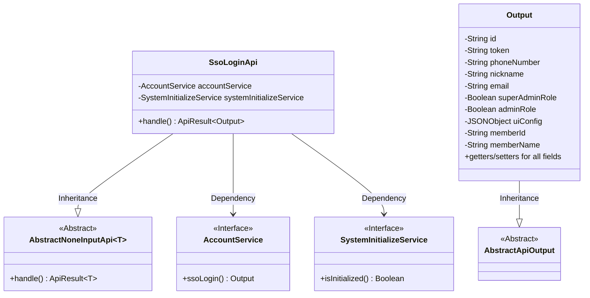
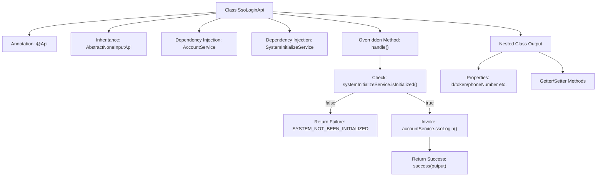

# Basic Information

|      |      |
|------|------|
| Name | SsoLoginApi |
| Language | .java |
| Code Path | WeFe/board/board-service/src/main/java/com/welab/wefe/board/service/api/account/SsoLoginApi.java |
| Package Name | com.welab.wefe.board.service.api.account |
| Dependencies | ['com.alibaba.fastjson.JSONObject', 'com.welab.wefe.board.service.service.SystemInitializeService', 'com.welab.wefe.board.service.service.account.AccountService', 'com.welab.wefe.common.StatusCode', 'com.welab.wefe.common.exception.StatusCodeWithException', 'com.welab.wefe.common.web.api.base.AbstractNoneInputApi', 'com.welab.wefe.common.web.api.base.Api', 'com.welab.wefe.common.web.dto.AbstractApiOutput', 'com.welab.wefe.common.web.dto.ApiResult', 'org.springframework.beans.factory.annotation.Autowired'] |
| Brief Description | SSO Login API: After checking system initialization, call the account service to log in, returning user ID, token, role, configuration information, and other details. |

# Description

The code defines an API class named `SsoLoginApi`, designed to handle single sign-on requests. The endpoint path is `account/sso_login`, which can be accessed without login. The class inherits from `AbstractNoneInputApi`, with the output type being the inner class `Output`. The main logic involves checking whether the system is initialized—returning an error if not—otherwise invoking the `ssoLogin` method of `accountService` to return user information. The `Output` class includes fields such as user ID, token, phone number, nickname, email, admin role identifier, UI configuration, and membership details, along with corresponding getter and setter methods.

# Class Summary

| Name   | Type  | Description |
|-------|------|-------------|
| SsoLoginApi | class | SSO login API, checks system initialization and then calls the account service to log in, returning user ID, token, role, configuration, and other information. |

## Class SsoLoginApi

|      |      |
|------|------|
| Access Modifier | @Api(path = "account/sso_login", name = "sso_login", login = false);public |
| Type | class |
| Name | SsoLoginApi |
| Description | SSO login API, checks system initialization and then calls the account service to log in, returning user ID, token, role, configuration, and other information. |

### UML Class Diagram

This code demonstrates the implementation structure of an SSO login API. SsoLoginApi inherits from the generic abstract class AbstractNoneInputApi, handling API requests without input parameters, and relies on AccountService for login operations and SystemInitializeService to check system initialization status. Output, as an inner class inheriting AbstractApiOutput, encapsulates various post-login user information (such as ID, token, role permissions, etc.). The overall design adheres to a layered architecture, isolating implementation details through interfaces, with the Output class providing comprehensive user information encapsulation.

### Internal Method Call Graph

This flowchart illustrates the core structure of the SSO login API, including class annotations, dependency injection, main processing logic, and output class definition. The processing flow first checks whether the system is initialized, returning an error if not, otherwise executing SSO login and returning the result. The nested class Output defines a complex data structure containing user identity information, permissions, and configurations, with access interfaces provided through Getter/Setter methods.

### Field List

| Name  | Type  | Description |
|-------|-------|------|
| systemInitializeService | SystemInitializeService | Automatic injection system initializes service instances. |
| accountService | AccountService | Automatically inject the AccountService instance. |

### Method List

| Name  | Type  | Description |
|-------|-------|------|
| handle | ApiResult<Output> | The code checks whether the system is initialized. If not, it returns an error status code; if initialized, it invokes the account service for single sign-on and returns the result. |

