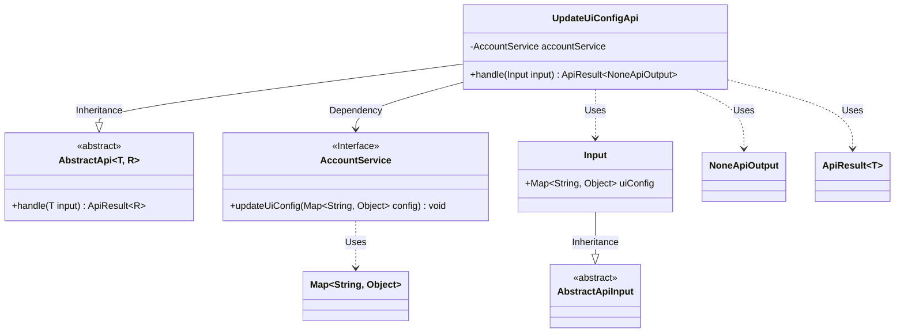

# Basic Information

|      |      |
|------|------|
| Name | UpdateUiConfigApi |
| Language | .java |
| Code Path | WeFe/board/board-service/src/main/java/com/welab/wefe/board/service/api/account/UpdateUiConfigApi.java |
| Package Name | com.welab.wefe.board.service.api.account |
| Dependencies | ['com.welab.wefe.board.service.service.account.AccountService', 'com.welab.wefe.common.exception.StatusCodeWithException', 'com.welab.wefe.common.fieldvalidate.annotation.Check', 'com.welab.wefe.common.web.api.base.AbstractApi', 'com.welab.wefe.common.web.api.base.Api', 'com.welab.wefe.common.web.dto.AbstractApiInput', 'com.welab.wefe.common.web.dto.ApiResult', 'com.welab.wefe.common.web.dto.NoneApiOutput', 'org.springframework.beans.factory.annotation.Autowired', 'java.util.Map'] |
| Brief Description | API for modifying user UI configuration, which receives configuration information, invokes the service to update, and returns a successful result. |

# Description

This is an API class for modifying user UI configuration information, with the path "account/update_ui_config". The class inherits from AbstractApi, accepts UpdateUiConfigApi.Input as the input parameter, and returns NoneApiOutput. It uses the auto-injected AccountService to call the updateUiConfig method to process the uiConfig configuration information in the input parameters. The input class Input inherits from AbstractApiInput and includes a required Map-type field uiConfig for passing user interface configuration information. An empty result is returned upon successful processing.

# Class Summary

| Name   | Type  | Description |
|-------|------|-------------|
| UpdateUiConfigApi | class | This is an API interface for modifying user UI configurations, which receives configuration information, invokes the service to update, and returns an empty result. The input parameter is a required UI configuration mapping. |

## Class UpdateUiConfigApi

|      |      |
|------|------|
| Access Modifier | @Api(path = "account/update_ui_config", name = "修改用户UI配置信息");public |
| Type | class |
| Name | UpdateUiConfigApi |
| Description | This is an API interface for modifying user UI configurations, which receives configuration information, invokes the service to update, and returns an empty result. The input parameter is a required UI configuration mapping. |

### UML Class Diagram

This code describes an API class `UpdateUiConfigApi` for updating user UI configurations. It inherits from the generic abstract class `AbstractApi` and utilizes the `AccountService` interface to perform the actual configuration updates. The input parameter `Input` inherits from `AbstractApiInput` and contains a required UI configuration map. The API returns `NoneApiOutput` to indicate no specific output data, with results wrapped in `ApiResult`. The class diagram clearly illustrates inheritance relationships, dependencies, and usage relationships.

### Internal Method Call Graph

```mermaid
graph TD
    A["Class UpdateUiConfigApi"]
    B["Annotation: @Api(path='account/update_ui_config', name='Update user UI configuration')"]
    C["Inheritance: AbstractApi<Input, NoneApiOutput>"]
    D["Dependency Injection: @Autowired AccountService accountService"]
    E["Overridden Method: handle(Input input)"]
    F["Inner Class: Input extends AbstractApiInput"]
    G["Validation Annotation: @Check(name='User interface configuration', require=true)"]
    H["Field: Map<String, Object> uiConfig"]
    I["Invocation: accountService.updateUiConfig(input.uiConfig)"]
    J["Return: ApiResult<NoneApiOutput> success()"]

    A --> B
    A --> C
    A --> D
    A --> E
    E --> I
    E --> J
    A --> F
    F --> G
    F --> H
```

This flowchart illustrates the structure and main logic flow of the UpdateUiConfigApi class. The class is an API interface designed for updating user UI configurations, implemented by extending AbstractApi and overriding the handle method to process requests. The workflow includes dependency injection of AccountService, input parameter validation, invoking the service layer to update configurations, and finally returning a success result. The inner class Input defines the required uiConfig field with annotation-based validation. The overall design adheres to API layered architecture with clear responsibilities.

### Field List

| Name  | Type  | Description |
|-------|-------|------|
| accountService | AccountService | Use @Autowired to automatically inject an instance of AccountService. |

### Method List

| Name  | Type  | Description |
|-------|-------|------|
| handle | ApiResult<NoneApiOutput> | Process the request to update UI configuration, invoke the service to update the configuration, and return a successful result. |

