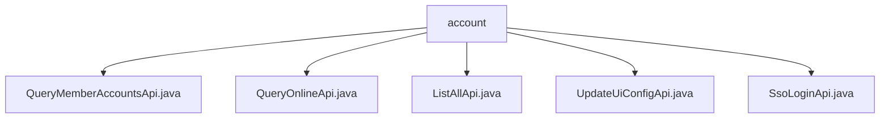

# Basic Information

|      |      |
|------|------|
| Name | account |
| Language | .java |
| Code Path | WeFe/board/board-service/src/main/java/com/welab/wefe/board/service/api/account |
| Package Name | docs.board.board-service.src.main.java.com.welab.wefe.board.service.api.account |
| Brief Description | QueryMemberAccountsApi retrieves account information by member ID. QueryOnlineApi queries online accounts. ListAllApi obtains a full list of users. UpdateUiConfigApi modifies user UI configurations. SsoLoginApi processes single sign-on requests. |

# Description

## Overview  
This module provides account management-related APIs, with core responsibilities including querying member account information, online status, full user lists, updating UI configurations, and handling single sign-on (SSO). The interface specifications uniformly inherit from `AbstractApi` or its subclasses, with both input and output adopting nested class structures. For example, `QueryMemberAccountsApi.Input` includes pagination parameters and query conditions. Key data structures include `AccountOutputModel` (pagination results), `AccountListAllOutputModel` (full list), and the `Map`-type `uiConfig` (UI configuration). External dependencies are limited to `AccountService`, which handles business logic. For instance, `QueryOnlineApi` retrieves online accounts via its `queryOnlineAccount` method.  

## Key Business Scenarios  
The module supports various account management scenarios: paginated account queries by member ID (similar to CRUD filtering), fetching online trading accounts, paginated full user list queries (with nickname filtering), and UI configuration updates. The interaction mode is exclusively HTTP API calls. For example, `SsoLoginApi` validates system status and returns user tokens during SSO login. Typical applications include backend management system integrations (e.g., paginated user displays) and SSO login flows. API types encompass query classes (e.g., `ListAllApi`) and update classes (e.g., `UpdateUiConfigApi`), where the latter dynamically receives UI configurations via `Map`.

### Package Internal Structure View

This flowchart illustrates the API file structure under the account directory in the WeFe project. The root node is the account folder, which contains five Java interface files: QueryMemberAccountsApi, QueryOnlineApi, ListAllApi, UpdateUiConfigApi, and SsoLoginApi. These files are directly subordinate to the account directory with no deeper nested relationships.

# File List

| Name   | Type  | Description |
|-------|------|-------------|
| [QueryMemberAccountsApi.java](QueryMemberAccountsApi.md) | file | API for querying account information by member ID, including pagination input parameters such as memberId, phoneNumber, etc., returning paginated account data. |
| [QueryOnlineApi.java](QueryOnlineApi.md) | file | API for querying exchange online accounts requires providing a member ID and an optional account ID, and returns a list of online accounts. |
| [ListAllApi.java](ListAllApi.md) | file | The API class `ListAllApi` is used to retrieve a complete list of users, accepting pagination parameters and nickname filtering, and returning user list data. |
| [UpdateUiConfigApi.java](UpdateUiConfigApi.md) | file | API for modifying user UI configuration, which receives configuration information, invokes the service to update, and returns a successful result. |
| [SsoLoginApi.java](SsoLoginApi.md) | file | SSO Login API, checks system initialization and then calls the account service to log in, returning user ID, token, role, configuration, and other information. |

