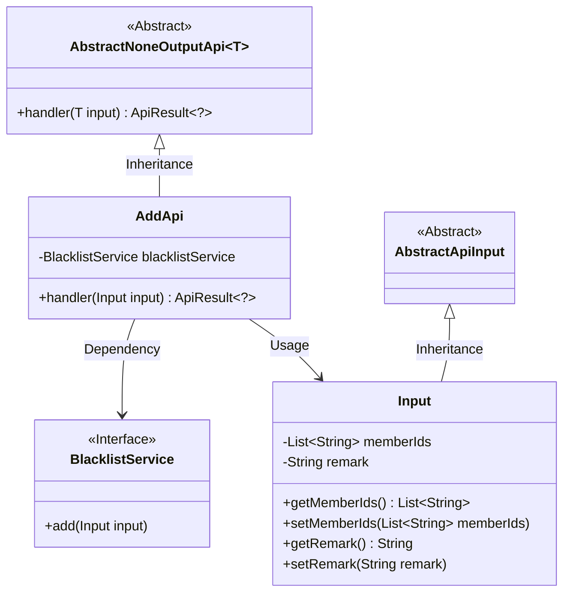

# Basic Information

|      |      |
|------|------|
| Name | AddApi |
| Language | .java |
| Code Path | WeFe/board/board-service/src/main/java/com/welab/wefe/board/service/api/blacklist/AddApi.java |
| Package Name | com.welab.wefe.board.service.api.blacklist |
| Dependencies | ['com.welab.wefe.board.service.service.BlacklistService', 'com.welab.wefe.common.exception.StatusCodeWithException', 'com.welab.wefe.common.fieldvalidate.annotation.Check', 'com.welab.wefe.common.web.api.base.AbstractNoneOutputApi', 'com.welab.wefe.common.web.api.base.Api', 'com.welab.wefe.common.web.dto.AbstractApiInput', 'com.welab.wefe.common.web.dto.ApiResult', 'org.springframework.beans.factory.annotation.Autowired', 'java.util.List'] |
| Brief Description | The code defines an API interface for adding members to a blacklist, including a member ID list and remark information, which calls the BlacklistService to perform the addition operation. |

# Description

The code defines an API class named `AddApi`, which is used to add members to a blacklist. The API path is `blacklist/add`, and it inherits from `AbstractNoneOutputApi`, with the input type being the inner class `Input`. `Input` includes a required list of member IDs `memberIds` and an optional remark field `remark`. The input is processed via the `add` method of `BlacklistService`, returning an empty result upon success. The entire API defines the path, name, and parameter validation rules through annotations.

# Class Summary

| Name   | Type  | Description |
|-------|------|-------------|
| AddApi | class | This is an API class for adding members to a blacklist. It receives a list of member IDs and remarks, then invokes the blacklist service to complete the addition operation. |

## Class AddApi

|      |      |
|------|------|
| Access Modifier | @Api(path = "blacklist/add", name = "add members to blacklist");public |
| Type | class |
| Name | AddApi |
| Description | This is an API class for adding members to a blacklist. It receives a list of member IDs and remarks, then invokes the blacklist service to complete the addition operation. |

### UML Class Diagram

This code describes the implementation structure of a blacklist addition API. The AddApi inherits from the generic AbstractNoneOutputApi class, processes Input-type parameters, and implements the blacklist addition functionality through the dependency-injected BlacklistService interface. The Input class inherits from AbstractApiInput and contains a list of member IDs and remark information. The overall design reflects a clear hierarchical relationship, where AbstractNoneOutputApi provides the basic API framework, AddApi implements specific business logic, Input encapsulates request parameters, and BlacklistService defines the core business operation interface.

### Internal Method Call Graph

```mermaid
graph TD
    A["Class AddApi"]
    B["Annotation: @Api(path='blacklist/add', name='add members to blacklist')"]
    C["Inheritance: AbstractNoneOutputApi<Input>"]
    D["Dependency Injection: @Autowired BlacklistService"]
    E["Overridden Method: handler(Input input)"]
    F["Inner Class: Input"]
    G["Field: List<String> memberIds"]
    H["Field: String remark"]
    I["Methods: getMemberIds()/setMemberIds()"]
    J["Methods: getRemark()/setRemark()"]
    K["Validation Annotation: @Check(name='member id', require=true)"]
    L["Invocation: blacklistService.add(input)"]
    M["Return: success()"]

    A --> B
    A --> C
    A --> D
    A --> E
    E --> L
    E --> M
    C -.-> F
    F --> G
    F --> H
    F --> I
    F --> J
    G --> K
```

This code represents an API implementation class for blacklist addition functionality, inheriting from the abstract template class AbstractNoneOutputApi. The main flow processes input parameters through the handler method and invokes BlacklistService to perform the add operation. The Input inner class contains member ID list and remark fields, where the memberIds field is mandatorily validated as non-empty via the @Check annotation. The overall design adopts a layered architecture, delegating business logic to the Service layer, adhering to the Single Responsibility Principle.

### Field List

| Name  | Type  | Description |
|-------|-------|------|
| blacklistService | BlacklistService | Use @Autowired to automatically inject an instance of BlacklistService. |

### Method List

| Name  | Type  | Description |
|-------|-------|------|
| handler | ApiResult<?> | The code snippet is a Java method that overrides the handler to process input, calls `blacklistService.add` to add the input, and returns `ApiResult` upon success. |

