# Basic Information

|      |      |
|------|------|
| Name | BlacklistApi |
| Language | .java |
| Code Path | WeFe/board/board-service/src/main/java/com/welab/wefe/board/service/api/blacklist/BlacklistApi.java |
| Package Name | com.welab.wefe.board.service.api.blacklist |
| Dependencies | ['com.welab.wefe.board.service.dto.base.PagingInput', 'com.welab.wefe.board.service.dto.base.PagingOutput', 'com.welab.wefe.board.service.dto.entity.BlacklistOutputModel', 'com.welab.wefe.board.service.service.BlacklistService', 'com.welab.wefe.common.exception.StatusCodeWithException', 'com.welab.wefe.common.web.api.base.AbstractApi', 'com.welab.wefe.common.web.api.base.Api', 'com.welab.wefe.common.web.dto.ApiResult', 'org.springframework.beans.factory.annotation.Autowired'] |
| Brief Description | Blacklist pagination query API, inherits from AbstractApi, invokes BlacklistService to handle pagination requests, and returns paginated results. |

# Description

This is an API class named BlacklistApi, designed for paginated querying of blacklist data. It inherits from the AbstractApi base class, accepts Input parameters, and returns paginated results in the BlacklistOutputModel format. The class is annotated with an Api annotation, specifying the path as blacklist/list and describing its functionality as paginated blacklist querying. Internally, it invokes the list method of the injected BlacklistService to handle business logic. The Input class inherits from PagingInput, indicating this is a paginated query request. The handle method is responsible for calling the service layer and returning the encapsulated paginated results. The entire API design adheres to standard parameter input-output specifications.

# Class Summary

| Name   | Type  | Description |
|-------|------|-------------|
| BlacklistApi | class | Blacklist Pagination Query API, inherits from AbstractApi, uses BlacklistService to process the input PagingInput, and returns the paginated result PagingOutput<BlacklistOutputModel>. |


## Class BlacklistApi

|      |      |
|------|------|
| Access Modifier | @Api(path = "blacklist/list", name = "query blacklist by pagination");public |
| Type | class |
| Name | BlacklistApi |
| Description | Blacklist Pagination Query API, inherits from AbstractApi, uses BlacklistService to process the input PagingInput, and returns the paginated result PagingOutput<BlacklistOutputModel>. |


### UML Class Diagram

```mermaid
classDiagram
    class AbstractApi~T, R~ {
        <<Abstract>>
        +handle(T input) ApiResult~R~
    }
    class BlacklistApi {
        -BlacklistService blacklistService
        +handle(Input input) ApiResult~PagingOutput~BlacklistOutputModel~~
    }
    class BlacklistService {
        <<Interface>>
        +list(Input input) PagingOutput~BlacklistOutputModel~
    }
    class PagingInput {
        <<Abstract>>
    }
    class Input {
    }
    class PagingOutput~T~ {
    }
    class ApiResult~T~ {
    }
    class BlacklistOutputModel {
    }

    BlacklistApi --|> AbstractApi~Input, PagingOutput~BlacklistOutputModel~~ : Inheritance
    Input --|> PagingInput : Inheritance
    BlacklistApi --> BlacklistService : Dependency
    BlacklistService ..> PagingOutput~BlacklistOutputModel~ : Creates
    BlacklistService ..> BlacklistOutputModel : Uses
    AbstractApi ..> ApiResult~R~ : Uses
```

This code demonstrates the implementation of a paginated blacklist query API. BlacklistApi inherits from the generic abstract class AbstractApi, specifying the input type Input and output type PagingOutput<BlacklistOutputModel>. Input inherits from PagingInput for pagination parameters, with business logic implemented through the dependency-injected BlacklistService interface. The overall design adopts a layered architecture, achieving type-safe API processing via generics, where BlacklistService handles actual data queries and pagination, returning a wrapped object containing blacklist data.


### Internal Method Call Graph

```mermaid
graph TD
    A["Class BlacklistApi"]
    B["Annotation: @Api(path='blacklist/list', name='query blacklist by pagination')"]
    C["Inheritance: AbstractApi<Input, PagingOutput<BlacklistOutputModel>>"]
    D["Dependency Injection: @Autowired BlacklistService"]
    E["Overridden Method: handle(Input input)"]
    F["Inner Class: Input extends PagingInput"]
    G["Invocation: blacklistService.list(input)"]
    H["Return: success(PagingOutput result)"]

    A --> B
    A --> C
    A --> D
    A --> E
    A --> F
    E --> G
    G --> H
```



This flowchart illustrates the structure and execution flow of the BlacklistApi class. The class defines an API path via the @Api annotation, inherits from the AbstractApi base class with specified input/output generic types. The core logic resides in the handle method, which performs paginated queries through the auto-injected BlacklistService and ultimately returns an encapsulated success result. The inner class Input extends the pagination parameter base class, demonstrating the complete chain from request processing to service invocation.

### Field List

| Name  | Type  | Description |
|-------|-------|------|
| blacklistService | BlacklistService | Automatically inject blacklisted service instances. |

### Method List

| Name  | Type  | Description |
|-------|-------|------|
| handle | ApiResult<PagingOutput<BlacklistOutputModel>> | Process the input and return a paginated list of blacklisted items, invoking the service layer method upon success. |


