# Basic Information

|      |      |
|------|------|
| Name | BlacklistMemberApi |
| Language | .java |
| Code Path | WeFe/board/board-service/src/main/java/com/welab/wefe/board/service/api/blacklist/BlacklistMemberApi.java |
| Package Name | com.welab.wefe.board.service.api.blacklist |
| Dependencies | ['com.welab.wefe.board.service.dto.base.PagingInput', 'com.welab.wefe.board.service.dto.base.PagingOutput', 'com.welab.wefe.board.service.dto.entity.MemberOutputModel', 'com.welab.wefe.board.service.service.BlacklistService', 'com.welab.wefe.common.exception.StatusCodeWithException', 'com.welab.wefe.common.web.api.base.AbstractApi', 'com.welab.wefe.common.web.api.base.Api', 'com.welab.wefe.common.web.dto.ApiResult', 'org.springframework.beans.factory.annotation.Autowired'] |
| Brief Description | Blacklist Member Query API, retrieves paginated results of blacklisted members by ID or name. |

# Description

The code defines an API class named `BlacklistMemberApi`, which is used to query blacklisted members. The API path is `blacklist/member`, accepting paginated input parameters `Input` containing `id` and `name`, and returning paginated `MemberOutputModel` results. The query logic is processed by `BlacklistService`, and the paginated data is encapsulated in `ApiResult` for return. The input class `Input` inherits from `PagingInput` and includes two read-write properties: `id` and `name`.

# Class Summary

| Name   | Type  | Description |
|-------|------|-------------|
| BlacklistMemberApi | class | Blacklist Member Query API, inherits from AbstractApi, utilizes BlacklistService for paginated queries. Input includes ID and name, outputs paginated member results. |


## Class BlacklistMemberApi

|      |      |
|------|------|
| Access Modifier | @Api(path = "blacklist/member", name = "query blacklist members");public |
| Type | class |
| Name | BlacklistMemberApi |
| Description | Blacklist Member Query API, inherits from AbstractApi, utilizes BlacklistService for paginated queries. Input includes ID and name, outputs paginated member results. |


### UML Class Diagram

```mermaid
classDiagram
    class AbstractApi~T, R~ {
        <<Abstract>>
        +handle(T input) ApiResult~R~
    }

    class BlacklistMemberApi {
        -BlacklistService blacklistService
        +handle(Input input) ApiResult~PagingOutput~MemberOutputModel~~
    }

    class PagingInput {
        <<Abstract>>
    }

    class Input {
        -String id
        -String name
        +String getId()
        +void setId(String id)
        +String getName()
        +void setName(String name)
    }

    class BlacklistService {
        <<Interface>>
        +queryBlacklistMember(Input input) PagingOutput~MemberOutputModel~
    }

    class PagingOutput~T~ {
        // Generic paging output class
    }

    class MemberOutputModel {
        // Member output model
    }

    class ApiResult~T~ {
        // API result wrapper
    }

    AbstractApi~Input, PagingOutput~MemberOutputModel~~ <|-- BlacklistMemberApi
    PagingInput <|-- Input
    BlacklistMemberApi --> BlacklistService : Dependency
    BlacklistMemberApi ..> Input : Contains
    BlacklistService ..> PagingOutput~MemberOutputModel~ : Returns
    BlacklistService ..> Input : Parameter
    BlacklistMemberApi ..> ApiResult~PagingOutput~MemberOutputModel~~ : Returns
```

This code describes the implementation structure of a blacklist member query API. BlacklistMemberApi inherits from the generic abstract class AbstractApi, processes Input parameters, and returns paginated member results. The Input class extends PagingInput and contains id and name query fields. The BlacklistService interface provides query functionality, returning PagingOutput<MemberOutputModel> paginated results. The overall architecture adopts a layered design, encapsulating responses through ApiResult to decouple query logic from the API layer.


### Internal Method Call Graph

```mermaid
graph TD
    A["Class BlacklistMemberApi"]
    B["Annotation: @Api(path='blacklist/member', name='query blacklist members')"]
    C["Inheritance: AbstractApi<Input, PagingOutput<MemberOutputModel>>"]
    D["Dependency Injection: @Autowired BlacklistService blacklistService"]
    E["Overridden Method: handle(Input input)"]
    F["Inner Class: Input"]
    G["Field: String id"]
    H["Field: String name"]
    I["Method: getId()/setId()"]
    J["Method: getName()/setName()"]
    K["Invocation: blacklistService.queryBlacklistMember(input)"]
    L["Return: ApiResult.success()"]

    A --> B
    A --> C
    A --> D
    A --> E
    A --> F
    F --> G
    F --> H
    F --> I
    F --> J
    E --> K
    K --> L
```



This flowchart illustrates the structure of the BlacklistMemberApi class, including class annotations, inheritance relationships, dependency-injected BlacklistService, and the processing logic of the overridden handle method. The inner class Input contains pagination query parameters id and name along with their getter/setter methods. The core flow involves querying blacklist members through blacklistService and returning encapsulated results, demonstrating a typical design pattern in the API layer of Spring Boot.

### Field List

| Name  | Type  | Description |
|-------|-------|------|
| blacklistService | BlacklistService | The code snippet uses the @Autowired annotation to automatically inject an instance of BlacklistService. |

### Method List

| Name  | Type  | Description |
|-------|-------|------|
| handle | ApiResult<PagingOutput<MemberOutputModel>> | Rewrite the method to handle blacklist member queries, call the service, and return paginated results. |


