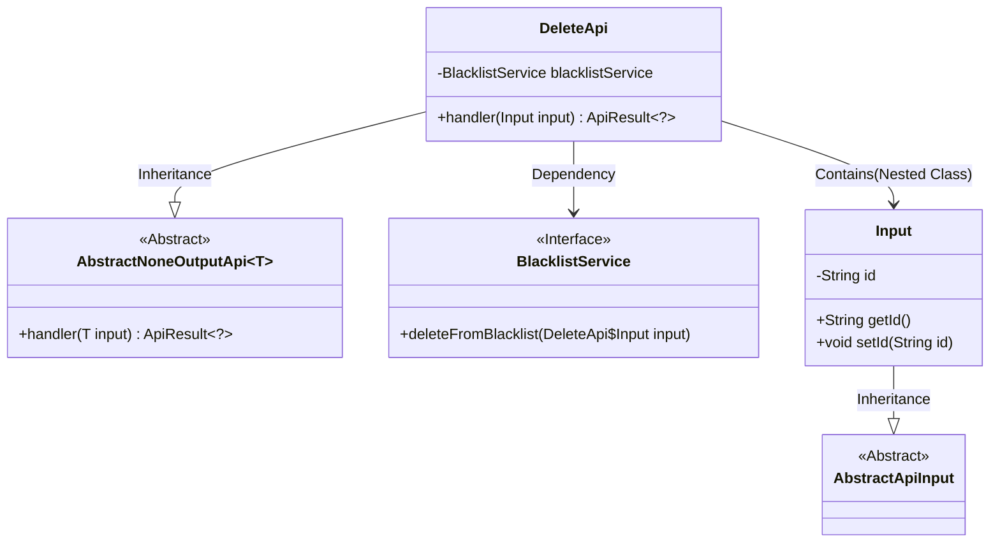
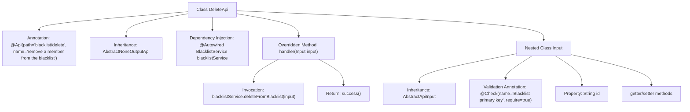

# Basic Information

|      |      |
|------|------|
| Name | DeleteApi |
| Language | .java |
| Code Path | WeFe/board/board-service/src/main/java/com/welab/wefe/board/service/api/blacklist/DeleteApi.java |
| Package Name | com.welab.wefe.board.service.api.blacklist |
| Dependencies | ['com.welab.wefe.board.service.service.BlacklistService', 'com.welab.wefe.common.exception.StatusCodeWithException', 'com.welab.wefe.common.fieldvalidate.annotation.Check', 'com.welab.wefe.common.web.api.base.AbstractNoneOutputApi', 'com.welab.wefe.common.web.api.base.Api', 'com.welab.wefe.common.web.dto.AbstractApiInput', 'com.welab.wefe.common.web.dto.ApiResult', 'org.springframework.beans.factory.annotation.Autowired'] |
| Brief Description | API for removing blacklisted members requires passing the primary key ID, calls the BlacklistService to perform the deletion operation, and returns no data. |

# Description

The code defines an API class named DeleteApi, which is used to remove members from a blacklist. The API path is "blacklist/delete", and the input parameter is an Input class containing the mandatory field "id". The request is processed by calling the deleteFromBlacklist method of BlacklistService, and an empty result is returned upon success. The input class Input inherits from AbstractApiInput and includes getter and setter methods for the id attribute. The entire API inherits from AbstractNoneOutputApi, indicating no output data.

# Class Summary

| Name   | Type  | Description |
|-------|------|-------------|
| DeleteApi | class | API for removing blacklisted members requires providing the primary key ID of the blacklist and invoking the BlacklistService to perform the deletion operation. |

## Class DeleteApi

|      |      |
|------|------|
| Access Modifier | @Api(path = "blacklist/delete", name = "remove a member from the blacklist");public |
| Type | class |
| Name | DeleteApi |
| Description | API for removing blacklisted members requires providing the primary key ID of the blacklist and invoking the BlacklistService to perform the deletion operation. |

### UML Class Diagram

This code demonstrates an API implementation for deleting members from a blacklist. The DeleteApi inherits from the generic class AbstractNoneOutputApi, using the nested class Input as the parameter type, and executes the deletion operation through the dependency-injected BlacklistService interface. The Input class inherits from AbstractApiInput and contains a mandatory id field. The overall design adheres to a layered architecture, achieving functional decoupling through inheritance and composition.

### Internal Method Call Graph

This flowchart illustrates the complete structure of the DeleteApi class, including class annotations, inheritance relationships, service injection, and core business logic processing flow. The main class invokes the blacklistService through the handler method to perform deletion operations, while the nested Input class defines the required id field and its validation rules. The diagram clearly presents the full call chain from API entry to business processing, with hierarchical clarity reflecting the typical layered architecture characteristics of a Spring Boot application.

### Field List

| Name  | Type  | Description |
|-------|-------|------|
| blacklistService | BlacklistService | The code snippet uses @Autowired to automatically inject an instance of BlacklistService. |

### Method List

| Name  | Type  | Description |
|-------|-------|------|
| handler | ApiResult<?> | Delete blacklist entry and return success result after processing input. |

