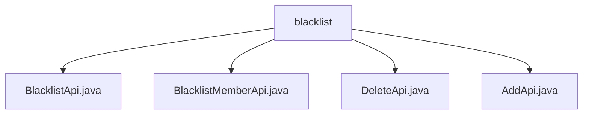

# Basic Information

|      |      |
|------|------|
| Name | blacklist |
| Language | .java |
| Code Path | WeFe/board/board-service/src/main/java/com/welab/wefe/board/service/api/blacklist |
| Package Name | docs.board.board-service.src.main.java.com.welab.wefe.board.service.api.blacklist |
| Brief Description | The BlacklistApi retrieves blacklists with pagination, accessible via the path blacklist/list. The BlacklistMemberApi queries blacklist members, accessible via the path blacklist/member. The DeleteApi removes blacklist members, accessible via the path blacklist/delete. The AddApi adds members to the blacklist, accessible via the path blacklist/add. All inherit from the base class and handle logic through the BlacklistService. |

# Description

## Overview  
This module serves as a blacklist management system, with its core responsibility being to provide CRUD-like operations for adding, deleting, and querying blacklisted members. The interface specifications include three types of APIs: paginated queries (/blacklist/list, /blacklist/member), addition (/blacklist/add), and deletion (/blacklist/delete), all of which inherit from the AbstractApi base class. Key data structures include the pagination input PagingInput, the blacklist model BlacklistOutputModel, and the member model MemberOutputModel. The only external dependency is the BlacklistService, which handles business logic. For example, AddApi adds members via the memberIds and remark parameters, while DeleteApi removes members by their IDs.  

## Key Business Scenarios  
The workflow revolves around the lifecycle management of blacklists: paginated queries support filtering by ID or name (e.g., BlacklistMemberApi), additions support batch operations (e.g., AddApi), and deletions support single-record operations (e.g., DeleteApi). The interaction model follows a unified RESTful style, with inputs and outputs adhering to standard specifications. Typical applications include risk control scenarios, such as batch-blocking abnormal users. API types encompass query-based (returning paginated data) and operation-based (returning no data) categories, with integration cases including collaboration with other risk control modules.

### Package Internal Structure View

This flowchart illustrates the structure of four API files under the blacklist directory. The root node is the blacklist folder, which directly contains four Java interface files: BlacklistApi, BlacklistMemberApi, DeleteApi, and AddApi, clearly presenting the organization of API files within the blacklist functional module.

# File List

| Name   | Type  | Description |
|-------|------|-------------|
| [BlacklistApi.java](BlacklistApi.md) | file | Blacklist Pagination Query API, inherits from AbstractApi, invokes BlacklistService to handle pagination requests, and returns paginated results. |
| [BlacklistMemberApi.java](BlacklistMemberApi.md) | file | Blacklist Member Query API, retrieves paginated results of blacklisted members by ID or name. |
| [DeleteApi.java](DeleteApi.md) | file | API for removing blacklisted members requires passing the primary key ID, invokes the BlacklistService to perform the deletion operation, and returns no data. |
| [AddApi.java](AddApi.md) | file | The code defines an API interface for adding members to a blacklist, including a list of member IDs and remark information, which calls the BlacklistService to perform the addition operation. |

