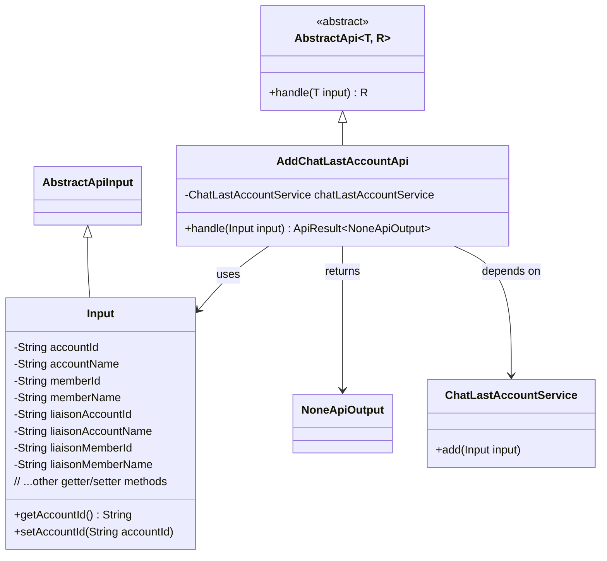

# Basic Information

|      |      |
|------|------|
| Name | AddChatLastAccountApi |
| Language | .java |
| Code Path | WeFe/board/board-service/src/main/java/com/welab/wefe/board/service/api/chat/AddChatLastAccountApi.java |
| Package Name | com.welab.wefe.board.service.api.chat |
| Dependencies | ['com.welab.wefe.board.service.service.ChatLastAccountService', 'com.welab.wefe.common.exception.StatusCodeWithException', 'com.welab.wefe.common.fieldvalidate.annotation.Check', 'com.welab.wefe.common.web.api.base.AbstractApi', 'com.welab.wefe.common.web.api.base.Api', 'com.welab.wefe.common.web.dto.AbstractApiInput', 'com.welab.wefe.common.web.dto.ApiResult', 'com.welab.wefe.common.web.dto.NoneApiOutput', 'org.springframework.beans.factory.annotation.Autowired'] |
| Brief Description | The API class `AddChatLastAccountApi` is used to add the most recent chat account. The input includes account, member, and contact information. After validating the required fields, it invokes the service for processing. |

# Description

The code defines an API class named `AddChatLastAccountApi`, which is used to add the most recent chat account. The API path is `chat/add_chat_last_account`. The input parameters include account ID, account name, member ID, member name, contact account ID, contact account name, contact member ID, and contact member name, all of which are mandatory fields. The processing logic is implemented through the `add` method of `ChatLastAccountService`, and upon success, it returns an empty output. The input parameters are defined via the inner class `Input`, with getter and setter methods provided for each field.

# Class Summary

| Name   | Type  | Description |
|-------|------|-------------|
| AddChatLastAccountApi | class | API for adding recently chatted accounts, including account, member, and contact information, with mandatory field validation before invoking the service processing. |

## Class AddChatLastAccountApi

|      |      |
|------|------|
| Access Modifier | @Api(path = "chat/add_chat_last_account", name = "Add a recent chat account");public |
| Type | class |
| Name | AddChatLastAccountApi |
| Description | API for adding recently chatted accounts, including account, member, and contact information, with mandatory field validation before invoking the service processing. |

### UML Class Diagram

This code describes an API implementation for adding recently chatted accounts. AddChatLastAccountApi inherits from AbstractApi, processes Input-type parameters, and returns NoneApiOutput. The Input class contains multiple fields related to accounts, members, and liaisons, with core business logic handled by ChatLastAccountService. The class diagram illustrates inheritance relationships, dependencies, and input/output types, clearly presenting the structural design of this API.

### Internal Method Call Graph

```mermaid
graph TD
    A["Class AddChatLastAccountApi"]
    B["Annotation: @Api(path='chat/add_chat_last_account', name='Add a recent chat account')"]
    C["Inheritance: AbstractApi<Input, NoneApiOutput>"]
    D["Dependency Injection: @Autowired ChatLastAccountService"]
    E["Overridden Method: handle(Input input)"]
    F["Inner Class: Input"]
    G["Field: String accountId (with @Check validation)"]
    H["Field: String accountName (with @Check validation)"]
    I["Field: String memberId (with @Check validation)"]
    J["Field: String memberName (with @Check validation)"]
    K["Field: String liaisonAccountId (with @Check validation)"]
    L["Field: String liaisonAccountName (with @Check validation)"]
    M["Field: String liaisonMemberId (with @Check validation)"]
    N["Field: String liaisonMemberName (with @Check validation)"]
    O["Getter/Setter Method Group"]

    A --> B
    A --> C
    A --> D
    A --> E
    A --> F
    F --> G
    F --> H
    F --> I
    F --> J
    F --> K
    F --> L
    F --> M
    F --> N
    F --> O
```

This flowchart illustrates the complete structure of the AddChatLastAccountApi class, including API annotations, parent class inheritance, service injection, and input parameter processing logic. The core functionality involves the handle method processing input parameters through the injected chatLastAccountService. The Input inner class contains 8 mandatory fields with validation rules, each accompanied by corresponding getter/setter methods. This design implements an API for adding recent chat accounts, ensuring data integrity through strict parameter validation.

### Field List

| Name  | Type  | Description |
|-------|-------|------|
| chatLastAccountService | ChatLastAccountService | Using @Autowired to automatically inject an instance of ChatLastAccountService. |

### Method List

| Name  | Type  | Description |
|-------|-------|------|
| handle | ApiResult<NoneApiOutput> | Rewrite the handle method to invoke chatLastAccountService.add for processing the input and return a successful result. |

