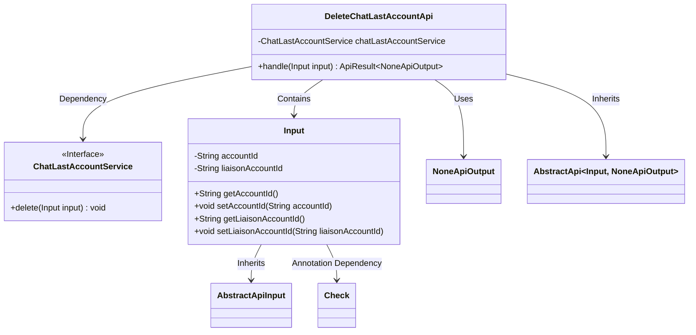

# Basic Information

|      |      |
|------|------|
| Name | DeleteChatLastAccountApi |
| Language | .java |
| Code Path | WeFe/board/board-service/src/main/java/com/welab/wefe/board/service/api/chat/DeleteChatLastAccountApi.java |
| Package Name | com.welab.wefe.board.service.api.chat |
| Dependencies | ['com.welab.wefe.board.service.service.ChatLastAccountService', 'com.welab.wefe.common.exception.StatusCodeWithException', 'com.welab.wefe.common.fieldvalidate.annotation.Check', 'com.welab.wefe.common.web.api.base.AbstractApi', 'com.welab.wefe.common.web.api.base.Api', 'com.welab.wefe.common.web.dto.AbstractApiInput', 'com.welab.wefe.common.web.dto.ApiResult', 'com.welab.wefe.common.web.dto.NoneApiOutput', 'org.springframework.beans.factory.annotation.Autowired'] |
| Brief Description | API endpoint for deleting the most recent chat account requires providing the account ID and contact account ID. After invoking the service to delete the record, it returns a successful result. |

# Description

This is an API class named DeleteChatLastAccountApi, designed to delete the most recent chat account record. It inherits from AbstractApi, accepts an Input parameter, and returns a NoneApiOutput. The Input class contains two mandatory fields: accountId (account ID) and liaisonAccountId (liaison account ID). This API processes the deletion operation through the injected ChatLastAccountService and returns an empty result upon success. The entire class structure is clear, including necessary input validation and field access methods.

# Class Summary

| Name   | Type  | Description |
|-------|------|-------------|
| DeleteChatLastAccountApi | class | API endpoint for deleting recent chat accounts requires providing the account ID and contact account ID. After invoking the service to delete the record, it returns a successful result. |

## Class DeleteChatLastAccountApi

|      |      |
|------|------|
| Access Modifier | @Api(path = "chat/delete_chat_last_account", name = "Delete recent chat account");public |
| Type | class |
| Name | DeleteChatLastAccountApi |
| Description | API endpoint for deleting recent chat accounts requires providing the account ID and contact account ID. After invoking the service to delete the record, it returns a successful result. |

### UML Class Diagram

This code demonstrates an API implementation for deleting the most recent chat account. The `DeleteChatLastAccountApi` inherits from `AbstractApi`, processes input parameters containing account ID and liaison ID, and performs the deletion by invoking the `ChatLastAccountService` interface. The class diagram clearly illustrates inheritance relationships, dependencies, and containment relationships. The `Input` class encapsulates necessary validation fields as an inner class, while the service layer achieves decoupling through interface implementation. The overall design adheres to layered architecture principles with well-defined responsibility boundaries.

### Internal Method Call Graph

```mermaid
graph TD
    A["Class DeleteChatLastAccountApi"]
    B["Annotation: @Api(path='chat/delete_chat_last_account', name='Delete recent chat account')"]
    C["Inheritance: AbstractApi<Input, NoneApiOutput>"]
    D["Dependency Injection: @Autowired ChatLastAccountService"]
    E["Overridden Method: handle(Input input)"]
    F["Inner Class: Input extends AbstractApiInput"]
    G["Property: @Check String accountId"]
    H["Property: @Check String liaisonAccountId"]
    I["Method: getAccountId()/setAccountId()"]
    J["Method: getLiaisonAccountId()/setLiaisonAccountId()"]
    K["Invocation: chatLastAccountService.delete(input)"]
    L["Return: success()"]

    A --> B
    A --> C
    A --> D
    A --> E
    A --> F
    F --> G
    F --> H
    F --> I
    F --> J
    E --> K
    E --> L
```

This code defines an API class for deleting recent chat accounts, inheriting from an abstract API base class. The main flow involves executing the deletion operation through the injected ChatLastAccountService, with input parameters including two mandatory fields: account ID and liaison account ID. The flowchart illustrates the class structure, annotations, inheritance relationships, inner class definition, and the processing logic of the core method handle(), which invokes the service layer's delete method and returns a success result. The input parameter class ensures mandatory fields through the @Check annotation and provides standard getter/setter methods.

### Field List

| Name  | Type  | Description |
|-------|-------|------|
| chatLastAccountService | ChatLastAccountService | Automatically inject the ChatLastAccountService service instance. |

### Method List

| Name  | Type  | Description |
|-------|-------|------|
| handle | ApiResult<NoneApiOutput> | Java Method: Delete chat account records, with the input parameter being an Input object, returning a successful result or no output. Throws StatusCodeWithException in case of exceptions. |

