# Basic Information

|      |      |
|------|------|
| Name | QueryChatDetailApi |
| Language | .java |
| Code Path | WeFe/board/board-service/src/main/java/com/welab/wefe/board/service/api/chat/QueryChatDetailApi.java |
| Package Name | com.welab.wefe.board.service.api.chat |
| Dependencies | ['com.welab.wefe.board.service.dto.base.PagingInput', 'com.welab.wefe.board.service.dto.base.PagingOutput', 'com.welab.wefe.board.service.dto.entity.MemberChatOutputModel', 'com.welab.wefe.board.service.service.MemberChatService', 'com.welab.wefe.common.exception.StatusCodeWithException', 'com.welab.wefe.common.fieldvalidate.annotation.Check', 'com.welab.wefe.common.web.api.base.AbstractApi', 'com.welab.wefe.common.web.api.base.Api', 'com.welab.wefe.common.web.dto.AbstractApiOutput', 'com.welab.wefe.common.web.dto.ApiResult', 'org.springframework.beans.factory.annotation.Autowired', 'java.util.List'] |
| Brief Description | API for querying chat details requires providing sender and recipient account IDs, with optional time constraints, and returns a paginated list of chat records. |

# Description

The code defines an API class named QueryChatDetailApi, which is used to query chat details. The API path is chat/detail, accepting an Input class as the input parameter and returning a paginated list of MemberChatOutputModel. The Input class includes mandatory sender account ID, recipient account ID, and optional query time constraints. The Output class contains a list of chat records. The API processes the query request through MemberChatService and returns paginated results. All fields are validated using annotations to ensure data integrity.

# Class Summary

| Name   | Type  | Description |
|-------|------|-------------|
| QueryChatDetailApi | class | API class for querying chat details. The input includes sender and recipient account IDs along with time constraints, and the output is a paginated list of chat records. |


## Class QueryChatDetailApi

|      |      |
|------|------|
| Access Modifier | @Api(path = "chat/detail", name = "Query chat details");public |
| Type | class |
| Name | QueryChatDetailApi |
| Description | API class for querying chat details. The input includes sender and recipient account IDs along with time constraints, and the output is a paginated list of chat records. |


### UML Class Diagram

```mermaid
classDiagram
    class QueryChatDetailApi {
        +MemberChatService memberChatService
        +handle(Input input) ApiResult~PagingOutput~MemberChatOutputModel~~
    }
    class AbstractApi~T, R~ {
        <<Interface>>
    }
    class PagingInput {
        <<Interface>>
    }
    class PagingOutput~T~ {
        <<Interface>>
    }
    class MemberChatOutputModel {
    }
    class MemberChatService {
        +queryChatDetail(Input input) PagingOutput~MemberChatOutputModel~
    }
    class Input {
        -String fromAccountId
        -String toAccountId
        -Long limitCreateTime
        +getFromAccountId() String
        +setFromAccountId(String fromAccountId) void
        +getToAccountId() String
        +setToAccountId(String toAccountId) void
        +getLimitCreateTime() Long
        +setLimitCreateTime(Long limitCreateTime) void
    }
    class Output {
        -List~MemberChatOutputModel~ list
        +getList() List~MemberChatOutputModel~
        +setList(List~MemberChatOutputModel~ list) Output
    }
    class AbstractApiOutput {
        <<Interface>>
    }

    QueryChatDetailApi --> AbstractApi : Extends
    QueryChatDetailApi --> MemberChatService : Depends on
    Input --> PagingInput : Extends
    Output --> AbstractApiOutput : Extends
    PagingOutput~MemberChatOutputModel~ <|.. MemberChatService : Implements
    AbstractApi~Input, PagingOutput~MemberChatOutputModel~~ <|.. QueryChatDetailApi : Implements
```

This code illustrates the class structure of a chat detail query API. QueryChatDetailApi inherits from the AbstractApi generic class, processes Input parameters, and returns paginated MemberChatOutputModel results. The Input class extends PagingInput with sender/receiver account IDs and timestamp limit parameters, while the Output class extends AbstractApiOutput containing a chat record list. MemberChatService provides the actual query functionality. The overall architecture demonstrates clear hierarchical relationships and dependencies, with Input/Output models decoupled from business logic, adhering to sound API design principles.


### Internal Method Call Graph

```mermaid
graph TD
    A["Class QueryChatDetailApi"]
    B["Annotation: @Api(path='chat/detail', name='Query chat details')"]
    C["Inheritance: AbstractApi<Input, PagingOutput<MemberChatOutputModel>>"]
    D["Dependency Injection: @Autowired MemberChatService"]
    E["Overridden Method: handle(Input input)"]
    F["Inner Class: Input extends PagingInput"]
    G["Property: @Check String fromAccountId"]
    H["Property: @Check String toAccountId"]
    I["Property: @Check Long limitCreateTime"]
    J["Method: getter/setter"]
    K["Inner Class: Output extends AbstractApiOutput"]
    L["Property: List<MemberChatOutputModel> list"]
    M["Method: getList/setList"]

    A --> B
    A --> C
    A --> D
    A --> E
    A --> F
    F --> G
    F --> H
    F --> I
    F --> J
    A --> K
    K --> L
    K --> M
    E --> D
    E --> F
```



This code defines an API class for querying chat details, which inherits from an abstract API base class and includes input/output data structures and business processing methods. The flowchart illustrates the main structure of the class: the top-level is the main class with API annotations, which obtains service instances through dependency injection and overrides the handle method to process requests. It contains two inner classes: the Input class defines query parameters with validation and corresponding getter/setter methods, while the Output class encapsulates the paginated query result list. The overall design follows a layered approach, conforming to standard API development patterns.

### Field List

| Name  | Type  | Description |
|-------|-------|------|
| memberChatService | MemberChatService | Using @Autowired to automatically inject the MemberChatService member chat service. |

### Method List

| Name  | Type  | Description |
|-------|-------|------|
| handle | ApiResult<PagingOutput<MemberChatOutputModel>> | Process the input and return the member chat details query results. |


