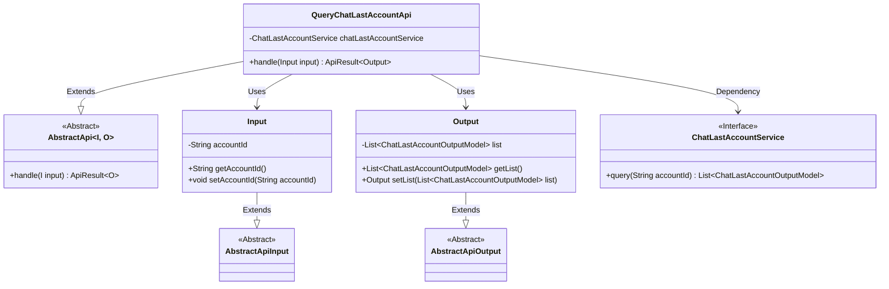
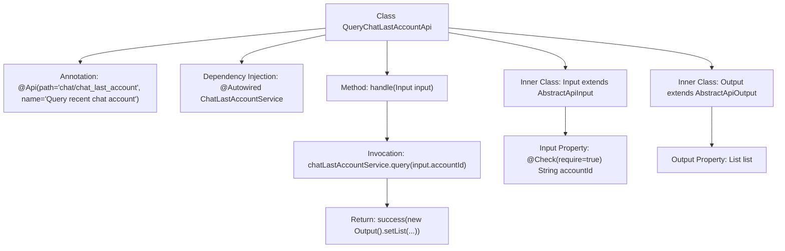

# Basic Information

|      |      |
|------|------|
| Name | QueryChatLastAccountApi |
| Language | .java |
| Code Path | WeFe/board/board-service/src/main/java/com/welab/wefe/board/service/api/chat/QueryChatLastAccountApi.java |
| Package Name | com.welab.wefe.board.service.api.chat |
| Dependencies | ['com.welab.wefe.board.service.dto.entity.ChatLastAccountOutputModel', 'com.welab.wefe.board.service.service.ChatLastAccountService', 'com.welab.wefe.common.exception.StatusCodeWithException', 'com.welab.wefe.common.fieldvalidate.annotation.Check', 'com.welab.wefe.common.web.api.base.AbstractApi', 'com.welab.wefe.common.web.api.base.Api', 'com.welab.wefe.common.web.dto.AbstractApiInput', 'com.welab.wefe.common.web.dto.AbstractApiOutput', 'com.welab.wefe.common.web.dto.ApiResult', 'org.springframework.beans.factory.annotation.Autowired', 'java.util.List'] |
| Brief Description | You are a professional translation assistant. Please accurately translate the following content into the target language.  Please strictly adhere to the following guidelines:  1. Maintain consistency with the original text's semantics, context, and style.  2. Preserve the original hierarchical structure and numbering system in full.  3. Strictly retain all formatting elements of the original text, such as code block identifiers (```text/```, ```mermaid/```), etc.  4. Translate only the natural language content, without adjusting formats, adding content, or providing explanatory processing.  5. Output only the translation of the original text, without any additional prompt information.  Content to be translated:  API class for querying recently chatted accounts, which retrieves a list of chat accounts by accountId, including input/output definitions and service invocation.  Target language code: en |

# Description

The code defines an API class named `QueryChatLastAccountApi`, which is used to query the most recent chat accounts. The API path is `chat/chat_last_account`, and requests are processed via the `ChatLastAccountService` service. The input class `Input` includes a mandatory `accountId` field, while the output class `Output` contains a list of `ChatLastAccountOutputModel`. The processing logic involves querying by `accountId` and returning the result list.

# Class Summary

| Name   | Type  | Description |
|-------|------|-------------|
| QueryChatLastAccountApi | class | API for querying recent chat accounts, which accepts an account ID parameter and returns a list of chat accounts. |


## Class QueryChatLastAccountApi

|      |      |
|------|------|
| Access Modifier | @Api(path = "chat/chat_last_account", name = "Query recent chat account");public |
| Type | class |
| Name | QueryChatLastAccountApi |
| Description | API for querying recent chat accounts, which accepts an account ID parameter and returns a list of chat accounts. |


### UML Class Diagram



This code implements an API interface for querying recently chatted accounts. The core class QueryChatLastAccountApi inherits from the generic abstract class AbstractApi, processes Input parameters, and returns Output results. The Input class contains a mandatory accountId field, while the Output class encapsulates the query result list. The specific query logic is implemented through the dependency-injected ChatLastAccountService interface. The overall design adopts a layered pattern, with both input and output inheriting from abstract base classes, ensuring excellent extensibility and type safety.


### Internal Method Call Graph



This code demonstrates the structure of a Spring framework-based API class primarily used for querying recent chat accounts. The flowchart clearly presents the class hierarchy, including the inheritance relationship between the main class QueryChatLastAccountApi and its inner classes Input/Output, as well as the processing flow of the core handle method. The service layer component is injected via @Autowired, where the handle method invokes the service layer query logic and packages the return result. Meanwhile, the Input class implements parameter validation through the @Check annotation. The overall design reflects clear responsibility division and a standard API response handling pattern.

### Field List

| Name  | Type  | Description |
|-------|-------|------|
| chatLastAccountService | ChatLastAccountService | Automatically inject the ChatLastAccountService service instance. |

### Method List

| Name  | Type  | Description |
|-------|-------|------|
| handle | ApiResult<QueryChatLastAccountApi.Output> | Process the query chat last account request and return the result list corresponding to the account ID. |


