# Basic Information

|      |      |
|------|------|
| Name | ResendMessageApi |
| Language | .java |
| Code Path | WeFe/board/board-service/src/main/java/com/welab/wefe/board/service/api/chat/ResendMessageApi.java |
| Package Name | com.welab.wefe.board.service.api.chat |
| Dependencies | ['com.welab.wefe.board.service.service.MemberChatService', 'com.welab.wefe.common.exception.StatusCodeWithException', 'com.welab.wefe.common.fieldvalidate.annotation.Check', 'com.welab.wefe.common.web.api.base.AbstractApi', 'com.welab.wefe.common.web.api.base.Api', 'com.welab.wefe.common.web.dto.AbstractApiInput', 'com.welab.wefe.common.web.dto.ApiResult', 'com.welab.wefe.common.web.dto.NoneApiOutput', 'org.springframework.beans.factory.annotation.Autowired'] |
| Brief Description | This is an API for resending failed messages, with the path "chat/resend_message". It accepts input containing the message ID, calls the resendMessage method of MemberChatService for processing, and returns empty output upon success. The input parameter memberChatId is mandatory, representing the message ID in the backend database. |

# Description

The code defines an API class named ResendMessageApi, which is used to resend failed messages. The API path is "chat/resend_message" and accepts an input parameter containing memberChatId, which is the message ID in the backend database and is a required field. The processing logic is implemented through the resendMessage method of MemberChatService, returning an empty output upon success. The input class Input inherits from AbstractApiInput and includes getter and setter methods for memberChatId.

# Class Summary

| Name   | Type  | Description |
|-------|------|-------------|
| ResendMessageApi | class | Defined an API interface for resending failed messages, with the path `chat/resend_message`, which takes a member chat ID as input, invokes the `MemberChatService` to resend the message, and returns an empty output upon success. |


## Class ResendMessageApi

|      |      |
|------|------|
| Access Modifier | @Api(path = "chat/resend_message", name = "Resend send failure message");public |
| Type | class |
| Name | ResendMessageApi |
| Description | Defined an API interface for resending failed messages, with the path `chat/resend_message`, which takes a member chat ID as input, invokes the `MemberChatService` to resend the message, and returns an empty output upon success. |


### UML Class Diagram

```mermaid
classDiagram
    class ResendMessageApi {
        -MemberChatService memberChatService
        +handle(Input input) ApiResult~NoneApiOutput~
    }
    ResendMessageApi --> MemberChatService : Dependency
    ResendMessageApi --> AbstractApi~Input, NoneApiOutput~ : Inheritance
    ResendMessageApi ..|> <<Interface>> Api : Implementation

    class Input {
        -String memberChatId
        +String getMemberChatId()
        +void setMemberChatId(String memberChatId)
    }
    Input --> AbstractApiInput : Inheritance
    Input --> Check : Annotation

    class MemberChatService {
        +resendMessage(String memberChatId)
    }

    class NoneApiOutput {
    }

    class AbstractApi~T, R~ {
        <<abstract>>
        +handle(T input) ApiResult~R~
    }

    class AbstractApiInput {
    }

    <<Interface>> Api {
        <<Interface>>
    }
```

Class Diagram Description: This diagram illustrates the core structure of the message resend API. ResendMessageApi inherits from the generic abstract class AbstractApi and implements the Api interface, relying on MemberChatService to handle business logic. The input parameter Input inherits from AbstractApiInput and contains a memberChatId field with validation annotations. NoneApiOutput serves as an empty output type, forming the foundational framework of the template method pattern together with AbstractApi.


### Internal Method Call Graph

```mermaid
graph TD
    A["Class ResendMessageApi"]
    B["Annotation: @Api(path='chat/resend_message', name='Resend send failure message')"]
    C["Inheritance: AbstractApi<Input, NoneApiOutput>"]
    D["Dependency Injection: @Autowired MemberChatService"]
    E["Overridden Method: handle(Input input)"]
    F["Invocation: memberChatService.resendMessage(input.memberChatId)"]
    G["Return: success()"]
    H["Static Inner Class Input"]
    I["Field: @Check String memberChatId"]
    J["Method: getMemberChatId()"]
    K["Method: setMemberChatId()"]

    A --> B
    A --> C
    A --> D
    A --> E
    E --> F
    F --> G
    A --> H
    H --> I
    H --> J
    H --> K
```



This flowchart illustrates the structure and internal relationships of the ResendMessageApi class. The class defines an API path via the @Api annotation, inherits from the AbstractApi template class, and implements the handle method to process requests. The core flow involves invoking the resendMessage method of memberChatService to resend messages, ultimately returning a success status. The static inner class Input encapsulates the mandatory memberChatId parameter with its getter/setter methods, validated by the @Check annotation. The overall design adheres to Spring Boot API development standards, achieving clear business logic layering.

### Field List

| Name  | Type  | Description |
|-------|-------|------|
| memberChatService | MemberChatService | Using @Autowired to automatically inject an instance of MemberChatService. |

### Method List

| Name  | Type  | Description |
|-------|-------|------|
| handle | ApiResult<NoneApiOutput> | Resend chat message by calling the memberChatService.resendMessage method, which returns an empty result upon success. |


