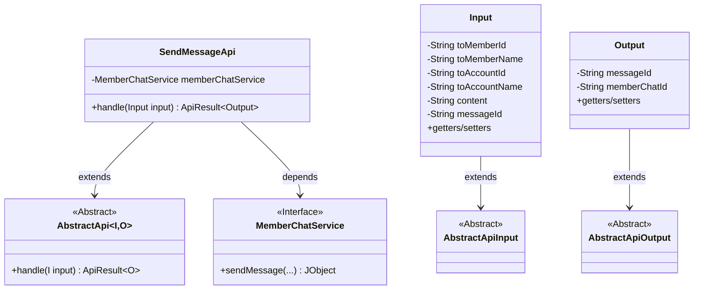
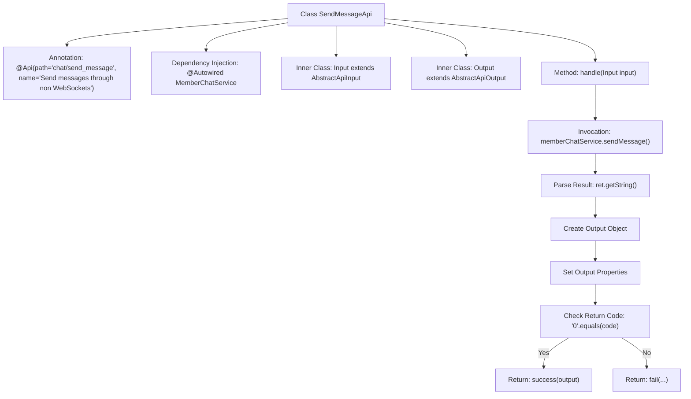

# Basic Information

|      |      |
|------|------|
| Name | SendMessageApi |
| Language | .java |
| Code Path | WeFe/board/board-service/src/main/java/com/welab/wefe/board/service/api/chat/SendMessageApi.java |
| Package Name | com.welab.wefe.board.service.api.chat |
| Dependencies | ['com.welab.wefe.board.service.constant.ChatConstant', 'com.welab.wefe.board.service.service.MemberChatService', 'com.welab.wefe.common.StatusCode', 'com.welab.wefe.common.exception.StatusCodeWithException', 'com.welab.wefe.common.fieldvalidate.annotation.Check', 'com.welab.wefe.common.util.JObject', 'com.welab.wefe.common.web.api.base.AbstractApi', 'com.welab.wefe.common.web.api.base.Api', 'com.welab.wefe.common.web.dto.AbstractApiInput', 'com.welab.wefe.common.web.dto.AbstractApiOutput', 'com.welab.wefe.common.web.dto.ApiResult', 'org.springframework.beans.factory.annotation.Autowired'] |
| Brief Description | Non-WebSocket message sending API, which takes recipient information and content as input, and returns both frontend and backend message IDs. Returns 0 on success, or an error code and message on failure. |

# Description

SendMessageApi is a non-WebSocket message sending interface with the path chat/send_message. It inherits from AbstractApi, and its input class Input includes mandatory fields such as recipient member ID, name, account ID, name, and message content. The output class Output contains the frontend message ID and backend database message ID. The processing logic sends the message via MemberChatService and returns a result comprising a status code, message content, and message ID. Upon success, it returns the output data; upon failure, it returns a system error. All input fields must be validated.

# Class Summary

| Name   | Type  | Description |
|-------|------|-------------|
| SendMessageApi | class | Non-WebSocket interfaces for sending messages, including recipient information, message content, and frontend-backend ID mapping, returning processing results. |

## Class SendMessageApi

|      |      |
|------|------|
| Access Modifier | @Api(path = "chat/send_message", name = "Send messages through non WebSockets");public |
| Type | class |
| Name | SendMessageApi |
| Description | Non-WebSocket interfaces for sending messages, including recipient information, message content, and frontend-backend ID mapping, returning processing results. |

### UML Class Diagram

This code demonstrates the implementation structure of a message sending API. SendMessageApi inherits from the generic abstract class AbstractApi, processing Input and Output data types. The Input class contains recipient information and message content, while the Output class includes frontend and backend message IDs. The message sending functionality is implemented through the MemberChatService interface, and responses are constructed based on the returned results. The overall design follows a layered approach, with standardized input and output achieved through inheritance from abstract base classes.

### Internal Method Call Graph

This code represents an API handler class for sending messages via non-WebSocket methods. The flowchart illustrates the complete process from class definition to core method handling: it first defines the API path and name through annotations, then injects service dependencies. When processing requests, it invokes the member chat service to send messages, parses the returned results, and determines whether to return a success or failure response based on the status code. The inner classes Input and Output are used to encapsulate request parameters and response data respectively.

### Field List

| Name  | Type  | Description |
|-------|-------|------|
| memberChatService | MemberChatService | Using @Autowired to automatically inject an instance of MemberChatService. |

### Method List

| Name  | Type  | Description |
|-------|-------|------|
| handle | ApiResult<Output> | This method processes the message sending request, invokes the memberChatService to send the message, and returns the result. If the return code is 0, it returns a successful result; otherwise, it returns a system error along with the error message. |

