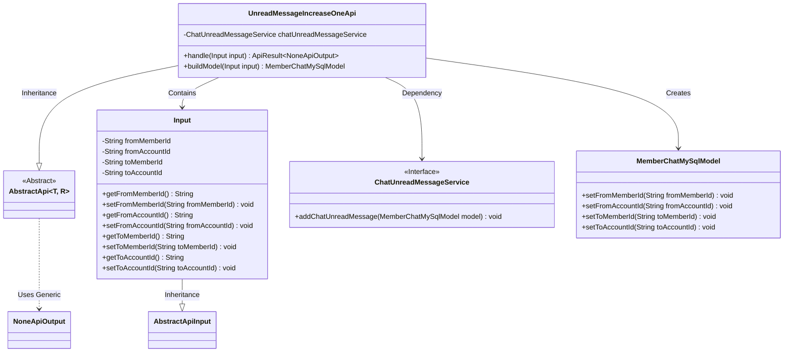

# Basic Information

|      |      |
|------|------|
| Name | UnreadMessageIncreaseOneApi |
| Language | .java |
| Code Path | WeFe/board/board-service/src/main/java/com/welab/wefe/board/service/api/chat/UnreadMessageIncreaseOneApi.java |
| Package Name | com.welab.wefe.board.service.api.chat |
| Dependencies | ['com.welab.wefe.board.service.database.entity.chat.MemberChatMySqlModel', 'com.welab.wefe.board.service.service.ChatUnreadMessageService', 'com.welab.wefe.common.exception.StatusCodeWithException', 'com.welab.wefe.common.fieldvalidate.annotation.Check', 'com.welab.wefe.common.web.api.base.AbstractApi', 'com.welab.wefe.common.web.api.base.Api', 'com.welab.wefe.common.web.dto.AbstractApiInput', 'com.welab.wefe.common.web.dto.ApiResult', 'com.welab.wefe.common.web.dto.NoneApiOutput', 'org.springframework.beans.factory.annotation.Autowired'] |
| Brief Description | API class UnreadMessageIncreaseOneApi, path chat/unread_message_increase_one, function is to receive the sender's and recipient's member and account IDs, and increment the unread message count via chatUnreadMessageService. |

# Description

This code defines an API class named `UnreadMessageIncreaseOneApi`, designed to handle requests for incrementing the unread message count by 1. The API path is `"chat/unread_message_increase_one"`. The class inherits from `AbstractApi`, with the input type being an internally defined `Input` class and the output type being `NoneApiOutput`. The `Input` class includes four mandatory fields: sender member ID, sender account ID, receiver member ID, and receiver account ID. The processing logic is implemented by invoking the `addChatUnreadMessage` method of `chatUnreadMessageService`, which accepts a `MemberChatMySqlModel` object constructed from the input parameters. The overall functionality of this API is to increment the unread message count by 1 for the specified chat participants.

# Class Summary

| Name   | Type  | Description |
|-------|------|-------------|
| UnreadMessageIncreaseOneApi | class | This API is used to increment the unread message count by 1 for the specified sender and receiver, including validation of both member and account IDs. |

## Class UnreadMessageIncreaseOneApi

|      |      |
|------|------|
| Access Modifier | @Api(path = "chat/unread_message_increase_one", name = "Unread message plus 1");public |
| Type | class |
| Name | UnreadMessageIncreaseOneApi |
| Description | This API is used to increment the unread message count by 1 for the specified sender and receiver, including validation of both member and account IDs. |

### UML Class Diagram

This code defines an `UnreadMessageIncreaseOneApi` class for handling API requests to increment unread message count by 1. The class inherits from the generic abstract class `AbstractApi`, accepts `Input` as parameters and returns `NoneApiOutput`. Its core functionality is converting input parameters into `MemberChatMySqlModel` through `ChatUnreadMessageService` for storage. The `Input` class contains sender and recipient member IDs and account IDs, with all fields validated as mandatory via `@Check` annotation. The overall design adopts a layered architecture achieving loose coupling through dependency injection and service interfaces.

### Internal Method Call Graph

```mermaid
graph TD
    A["Class UnreadMessageIncreaseOneApi"]
    B["Annotation: @Api"]
    C["Inheritance: AbstractApi<Input, NoneApiOutput>"]
    D["Dependency Injection: @Autowired ChatUnreadMessageService"]
    E["Overridden Method: handle(Input input)"]
    F["Inner Class: Input extends AbstractApiInput"]
    G["Input Property: String fromMemberId"]
    H["Input Property: String fromAccountId"]
    I["Input Property: String toMemberId"]
    J["Input Property: String toAccountId"]
    K["Input Methods: getter/setter"]
    L["Private Method: buildModel(Input input)"]
    M["Create: MemberChatMySqlModel"]
    N["Set Model Properties"]
    O["Return: ApiResult<NoneApiOutput>"]

    A --> B
    A --> C
    A --> D
    A --> E
    A --> F
    F --> G
    F --> H
    F --> I
    F --> J
    F --> K
    A --> L
    L --> M
    L --> N
    E --> L
    E --> O
    E --> D
```

This flowchart illustrates the structure of an API class for handling unread message increment by one. The core process starts from the handle method, constructs a data model through the buildModel method, and then invokes the chatUnreadMessageService to complete business operations. The Input inner class encapsulates essential sender and recipient information, with parameter validation implemented via annotations. The design demonstrates clear hierarchical relationships and division of responsibilities, forming a complete call chain from API entry to concrete business implementation.

### Field List

| Name  | Type  | Description |
|-------|-------|------|
| chatUnreadMessageService | ChatUnreadMessageService | Use @Autowired to automatically inject an instance of ChatUnreadMessageService. |

### Method List

| Name  | Type  | Description |
|-------|-------|------|
| buildModel | MemberChatMySqlModel | Construct a MemberChatMySqlModel object, set the sender's and receiver's member IDs and account IDs, and return the model instance. |
| handle | ApiResult<NoneApiOutput> | Method override, processes the input and invokes the service to add an unread message, returning an empty result upon success. |

