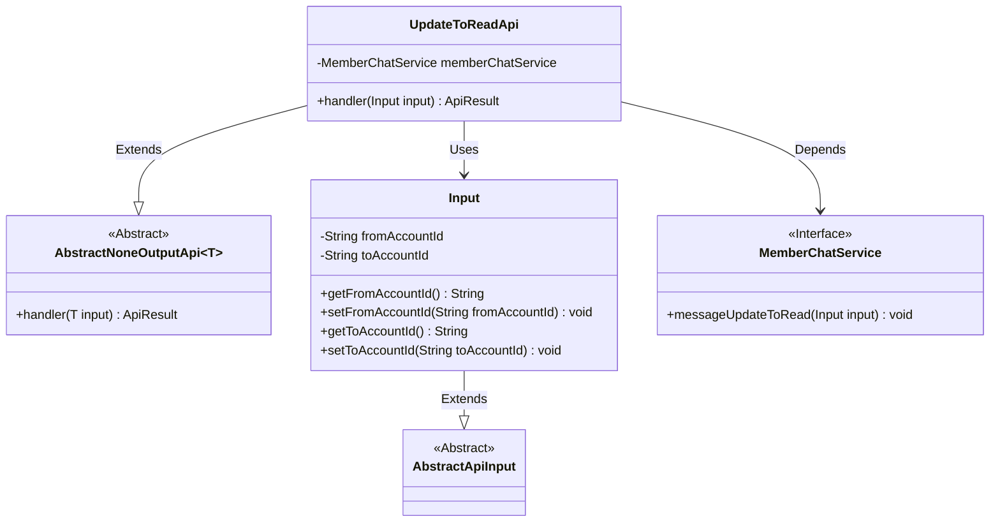

# Basic Information

|      |      |
|------|------|
| Name | UpdateToReadApi |
| Language | .java |
| Code Path | WeFe/board/board-service/src/main/java/com/welab/wefe/board/service/api/chat/UpdateToReadApi.java |
| Package Name | com.welab.wefe.board.service.api.chat |
| Dependencies | ['com.welab.wefe.board.service.service.MemberChatService', 'com.welab.wefe.common.exception.StatusCodeWithException', 'com.welab.wefe.common.fieldvalidate.annotation.Check', 'com.welab.wefe.common.web.api.base.AbstractNoneOutputApi', 'com.welab.wefe.common.web.api.base.Api', 'com.welab.wefe.common.web.dto.AbstractApiInput', 'com.welab.wefe.common.web.dto.ApiResult', 'org.springframework.beans.factory.annotation.Autowired'] |
| Brief Description | API for updating chat messages to read status, which takes sender and recipient account IDs as input and invokes the service layer for processing. |

# Description

This API is used to update the chat messages of a specified account to the "read" status. The path is "chat/update_to_read," and it accepts two required parameters: the sender's account ID and the recipient's account ID. The request is processed by the MemberChatService, and no data is returned. The input class contains two string-type fields, both of which must be validated as non-empty.

# Class Summary

| Name   | Type  | Description |
|-------|------|-------------|
| UpdateToReadApi | class | API for updating chat messages to read status requires sender and recipient account IDs, which are processed by calling the MemberChatService. |

## Class UpdateToReadApi

|      |      |
|------|------|
| Access Modifier | @Api(path = "chat/update_to_read", name = "Update the chat message of the account as read");public |
| Type | class |
| Name | UpdateToReadApi |
| Description | API for updating chat messages to read status requires sender and recipient account IDs, which are processed by calling the MemberChatService. |

### UML Class Diagram

This code implements an API interface for marking chat messages as read. UpdateToReadApi inherits from AbstractNoneOutputApi, utilizes MemberChatService to handle business logic, and the Input class inherits from AbstractApiInput containing sender and recipient account IDs. The class diagram illustrates inheritance relationships, dependency relationships, and usage relationships, clearly presenting the collaboration between components.

### Internal Method Call Graph

```mermaid
graph TD
    A["Class UpdateToReadApi"]
    B["Annotation: @Api(path='chat/update_to_read', name='Update the chat message of the account as read')"]
    C["Inheritance: AbstractNoneOutputApi<Input>"]
    D["Dependency Injection: @Autowired MemberChatService"]
    E["Overridden Method: handler(Input input)"]
    F["Invocation: memberChatService.messageUpdateToRead(input)"]
    G["Return: success()"]
    H["Nested Class Input"]
    I["Property: @Check String fromAccountId"]
    J["Property: @Check String toAccountId"]
    K["Getter/Setter Methods"]

    A --> B
    A --> C
    A --> D
    A --> E
    E --> F
    E --> G
    A --> H
    H --> I
    H --> J
    H --> K
```

Flowchart Description: This flowchart illustrates the complete structure of the UpdateToReadApi class, including class annotations, inheritance relationships, the dependency-injected MemberChatService, and the processing logic of the overridden handler method. The handler method invokes memberChatService's messageUpdateToRead method and returns a success result. The nested Input class contains two mandatory fields (fromAccountId and toAccountId) with their Getter/Setter methods, validated via the @Check annotation.

### Field List

| Name  | Type  | Description |
|-------|-------|------|
| memberChatService | MemberChatService | Using @Autowired to automatically inject the MemberChatService instance. |

### Method List

| Name  | Type  | Description |
|-------|-------|------|
| handler | ApiResult<?> | Method override, call memberChatService to update the message as read, and return the result upon success. |

