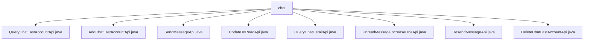

# Basic Information

|      |      |
|------|------|
| Name | chat |
| Language | .java |
| Code Path | WeFe/board/board-service/src/main/java/com/welab/wefe/board/service/api/chat |
| Package Name | docs.board.board-service.src.main.java.com.welab.wefe.board.service.api.chat |
| Brief Description | Multiple chat-related APIs are defined: query recent accounts, add recent accounts, send messages, update read status, query chat details, increment unread messages, resend messages, and delete recent accounts. Each API includes necessary input parameters, processes requests through corresponding services, and returns results or empty outputs. |

# Description

## Overview  
The core responsibility of this module is to provide account management, message sending/receiving, and status update functionalities for a chat system, similar to the backend service of an instant messaging system. The interface specifications uniformly adopt the RESTful style, with paths prefixed by `chat/`. Input and output are defined through internal classes, and all fields require validation. Key data structures include `ChatLastAccountOutputModel` (recent chat accounts), `MemberChatOutputModel` (chat details), and `MemberChatMySqlModel` (message storage model). External dependencies are `ChatLastAccountService` (account management) and `MemberChatService` (message processing). For example, `QueryChatLastAccountApi` returns an account list, while `SendMessageApi` handles message sending.  

## Key Business Scenarios  
The module supports a complete chat business workflow: account management (add/delete/query), message sending/receiving (send/resend), status updates (read markers/unread counts), and detail queries. The interaction mode is synchronous API calls. For instance, after adding an account via `AddChatLastAccountApi`, messages can be sent through `SendMessageApi`, and then marked as read via `UpdateToReadApi`. Typical applications include maintaining recent contact lists (e.g., `QueryChatLastAccountApi`), real-time message processing (e.g., retry mechanism in `ResendMessageApi`), and unread message statistics (e.g., count updates in `UnreadMessageIncreaseOneApi`). API types cover CRUD operations and status changes, with integration cases including联动 updating unread counts after message sending.

### Package Internal Structure View

This flowchart illustrates the API file structure of the chat service in the WeFe project. Under the root node "chat", there are 8 specific API implementation classes, covering functionalities such as chat history query, addition, message sending, read status marking, detail query, unread message counting, message resending, and account deletion. These APIs collectively form the complete chat service functional module.

# File List

| Name   | Type  | Description |
|-------|------|-------------|
| [QueryChatLastAccountApi.java](QueryChatLastAccountApi.md) | file | API class for querying recent chat accounts, which retrieves a list of chat accounts by accountId, including input/output definitions and service invocation. |
| [AddChatLastAccountApi.java](AddChatLastAccountApi.md) | file | The API class `AddChatLastAccountApi` is used to add the most recent chat account. The input includes account, member, and contact information. After validating the required fields, it invokes the service for processing. |
| [SendMessageApi.java](SendMessageApi.md) | file | Non-WebSocket message sending API, which takes recipient information and content as input, and returns both frontend and backend message IDs. Returns 0 on success, or an error code and message on failure. |
| [UpdateToReadApi.java](UpdateToReadApi.md) | file | API for updating chat messages to read status, which takes the sender and recipient account IDs as input and invokes the service layer for processing. |
| [QueryChatDetailApi.java](QueryChatDetailApi.md) | file | API for querying chat details requires providing sender and recipient account IDs, with optional time constraints, and returns a paginated list of chat records. |
| [UnreadMessageIncreaseOneApi.java](UnreadMessageIncreaseOneApi.md) | file | API class UnreadMessageIncreaseOneApi, path chat/unread_message_increase_one, function is to receive the sender's and receiver's member and account IDs, and increment the unread message count via chatUnreadMessageService. |
| [ResendMessageApi.java](ResendMessageApi.md) | file | This is an API for resending failed messages, with the path "chat/resend_message". It accepts input containing the message ID, calls the resendMessage method of MemberChatService for processing, and returns empty output upon success. The input parameter memberChatId is mandatory, representing the message ID in the backend database. |
| [DeleteChatLastAccountApi.java](DeleteChatLastAccountApi.md) | file | API endpoint for deleting recent chat accounts requires providing the account ID and contact account ID. After invoking the service to delete the record, it returns a success result. |

