# Basic Information

|      |      |
|------|------|
| Name | ListApi |
| Language | .java |
| Code Path | WeFe/board/board-service/src/main/java/com/welab/wefe/board/service/api/component/ListApi.java |
| Package Name | com.welab.wefe.board.service.api.component |
| Dependencies | ['com.welab.wefe.board.service.dto.entity.component.ComponentOutputModel', 'com.welab.wefe.common.exception.StatusCodeWithException', 'com.welab.wefe.common.fieldvalidate.annotation.Check', 'com.welab.wefe.common.web.api.base.AbstractApi', 'com.welab.wefe.common.web.api.base.Api', 'com.welab.wefe.common.web.dto.AbstractApiInput', 'com.welab.wefe.common.web.dto.ApiResult', 'com.welab.wefe.common.wefe.enums.ComponentType', 'com.welab.wefe.common.wefe.enums.FederatedLearningType', 'java.util.Arrays', 'java.util.List', 'java.util.stream.Collectors'] |
| Brief Description | The ListApi interface filters the component list based on input conditions, excluding deep learning, undeveloped, and removed components, and returns information on the components that meet the criteria. The input parameter is the federated learning type. |

# Description

The code defines an API class named ListApi, which is used to retrieve a list of components. The API path is "component/list", accepting Input parameters and returning a list of ComponentOutputModel. The processing logic includes: filtering components based on the input federated learning type, excluding deep learning components, undeveloped validation dataset-related components, and the removed "Calculate Feature Value" component (it is recommended to use the "Feature Statistics" component as an alternative). The Input class contains a federated learning type parameter along with its getter and setter methods. The final returned component list includes name, label, and description information.

# Class Summary

| Name   | Type  | Description |
|-------|------|-------------|
| ListApi | class | The ListApi interface returns a list of components, filtering out non-deep learning components, undeveloped components, and specific removed components based on the input type, and outputs the component names, labels, and descriptions. |


## Class ListApi

|      |      |
|------|------|
| Access Modifier | @Api(path = "component/list", name = "list components");public |
| Type | class |
| Name | ListApi |
| Description | The ListApi interface returns a list of components, filtering out non-deep learning components, undeveloped components, and specific removed components based on the input type, and outputs the component names, labels, and descriptions. |


### UML Class Diagram

```mermaid
classDiagram
    class AbstractApi~T, R~ {
        <<Abstract>>
        +handle(T input) ApiResult~R~
    }
    class ListApi {
        +handle(Input input) ApiResult~List~ComponentOutputModel~~
    }
    class AbstractApiInput {
        <<Abstract>>
    }
    class Input {
        -FederatedLearningType federatedLearningType
        +getFederatedLearningType() FederatedLearningType
        +setFederatedLearningType(FederatedLearningType federatedLearningType)
    }
    class ComponentOutputModel {
        +String name
        +String label
        +String desc
    }
    class ComponentType {
        <<Enumeration>>
        +getFederatedLearningTypes() List~FederatedLearningType~
        +getLabel() String
        +getDesc() String
        +isDeepLearningComponents() boolean
    }
    class FederatedLearningType {
        <<Enumeration>>
    }
    class ApiResult~T~ {
        +success(T data) ApiResult~T~
    }

    ListApi --|> AbstractApi~Input, List~ComponentOutputModel~~
    Input --|> AbstractApiInput
    ListApi --> Input : uses
    ListApi --> ComponentOutputModel : generates
    ListApi --> ComponentType : filters
    ComponentType --> FederatedLearningType : associates
    ListApi --> ApiResult~List~ComponentOutputModel~~ : returns
```

This code demonstrates an API class `ListApi` that inherits from the generic abstract class `AbstractApi`, designed to handle component list requests. By utilizing the federated learning type specified in the input parameter `Input`, it filters `ComponentType` enumeration values to generate a list of `ComponentOutputModel`. The filtering criteria include excluding deep learning components, undeveloped validation dataset components, and removed feature computation components. The class diagram clearly illustrates the inheritance, dependency, and association relationships among components, reflecting the data transformation and filtering logic in the request processing flow.


### Internal Method Call Graph

```mermaid
graph TD
    A["Class ListApi"]
    B["Inheritance: AbstractApi<ListApi.Input, List<ComponentOutputModel>>"]
    C["Annotation: @Api(path='component/list', name='list components')"]
    D["Method: handle(Input input)"]
    E["Inner Class: Input"]
    F["Field: FederatedLearningType federatedLearningType"]
    G["Getter/Setter methods"]

    A --> B
    A --> C
    A --> D
    A --> E
    E --> F
    E --> G

    D --> H["Filter 1: Match federated learning type"]
    D --> I["Filter 2: Exclude deep learning components"]
    D --> J["Filter 3: Exclude validation dataset components"]
    D --> K["Filter 4: Exclude FeatureCalculation"]
    D --> L["Mapping: ComponentType→ComponentOutputModel"]
    D --> M["Return: ApiResult.success(list)"]
```



This flowchart illustrates the structure and main processing logic of the ListApi class. The class inherits from AbstractApi and processes input parameters through the handle method, returning a component list after multiple filtering and mapping steps. The inner class Input contains a federated learning type field and its access methods. The handle method applies 4 filtering conditions and 1 mapping operation before ultimately returning a successful result.

### Field List

| Name  | Type  | Description |
|-------|-------|------|

### Method List

| Name  | Type  | Description |
|-------|-------|------|
| handle | ApiResult<List<ComponentOutputModel>> | This method filters component types based on input conditions, excluding deep learning components, undeveloped dataset validation components, and specific removed components, then generates and returns a list of eligible components. |


