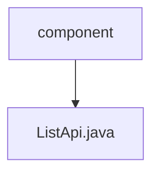

# Basic Information

|      |      |
|------|------|
| Name | component |
| Language | .java |
| Code Path | WeFe/board/board-service/src/main/java/com/welab/wefe/board/service/api/component |
| Package Name | docs.board.board-service.src.main.java.com.welab.wefe.board.service.api.component |
| Brief Description | The ListApi interface filters the component list based on input conditions, excluding deep learning, undeveloped, and removed components, and returns information on the components that meet the criteria. The input parameter is the federated learning type. |

# Description

The code defines an API class named `ListApi` for retrieving a list of components. The API path is `"component/list"`, which accepts an `Input` parameter and returns a list of `ComponentOutputModel`. The processing logic includes: filtering components based on the input federated learning type, excluding deep learning components, undeveloped validation dataset-related components, and the removed "Calculate Feature Importance" component (it is recommended to use the "Feature Statistics" component as a replacement). The `Input` class contains a federated learning type parameter along with its getter and setter methods. The returned component list includes name, label, and description information.

### Package Internal Structure View

This flowchart illustrates the component API structure of the board-service module in the WeFe project. The root node "component" represents the component directory, and its child node "ListApi.java" is the specific API implementation file under this directory. The entire structure is concise and clear, reflecting the typical package-class hierarchy in Java projects.

# File List

| Name   | Type  | Description |
|-------|------|-------------|
| [ListApi.java](ListApi.md) | file | The ListApi interface filters the component list based on input criteria, excluding deep learning, undeveloped, and removed components, and returns information on the components that meet the conditions. The input parameter is the federated learning type. |

