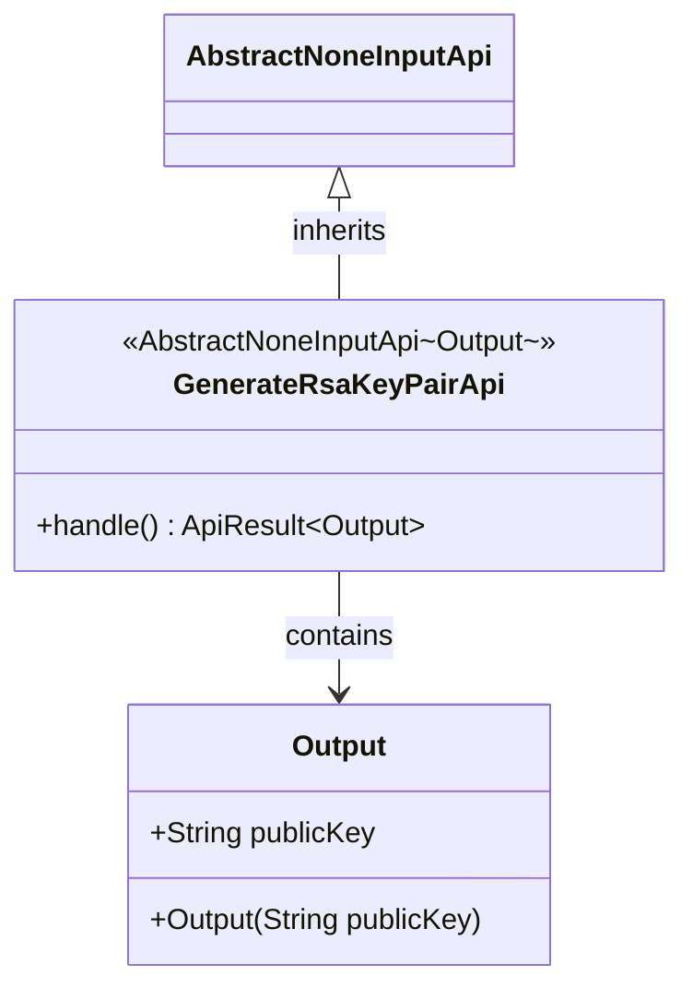
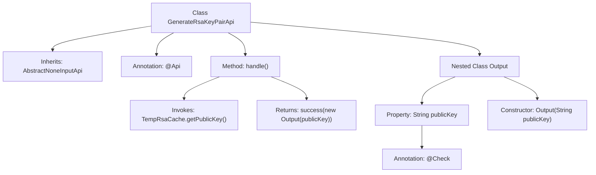

# Basic Information

|      |      |
|------|------|
| Name | GenerateRsaKeyPairApi |
| Language | .java |
| Code Path | WeFe/board/board-service/src/main/java/com/welab/wefe/board/service/api/crypto/GenerateRsaKeyPairApi.java |
| Package Name | com.welab.wefe.board.service.api.crypto |
| Dependencies | ['com.welab.wefe.common.exception.StatusCodeWithException', 'com.welab.wefe.common.fieldvalidate.annotation.Check', 'com.welab.wefe.common.web.TempRsaCache', 'com.welab.wefe.common.web.api.base.AbstractNoneInputApi', 'com.welab.wefe.common.web.api.base.Api', 'com.welab.wefe.common.web.dto.ApiResult'] |
| Brief Description | API for generating RSA key pairs, returning the public key for encrypted data transmission. |

# Description

This is an API class named GenerateRsaKeyPairApi, with the path crypto/generate_rsa_key_pair, which generates a new RSA key pair and returns the public key. It inherits from AbstractNoneInputApi, does not accept input parameters, and outputs an Output class containing a publicKey field. The publicKey field is labeled as an RSA public key, used for encrypting data. The processing logic retrieves the public key via TempRsaCache and returns a successful result.

# Class Summary

| Name   | Type  | Description |
|-------|------|-------------|
| GenerateRsaKeyPairApi | class | API for generating RSA key pairs, returning the public key for encrypted data transmission. |

## Class GenerateRsaKeyPairApi

|      |      |
|------|------|
| Access Modifier | @Api(path = "crypto/generate_rsa_key_pair", name = "创建一对新的 Rsa 密钥，并得到其中的公钥。");public |
| Type | class |
| Name | GenerateRsaKeyPairApi |
| Description | API for generating RSA key pairs, returning the public key for encrypted data transmission. |

### UML Class Diagram

This class diagram illustrates the structure of an RSA key pair generation API. The GenerateRsaKeyPairApi inherits from the generic abstract class AbstractNoneInputApi, with Output specified as the generic parameter. It overrides the handle() method, returning an ApiResult containing the public key. Output is a static nested class that includes a publicKey field and a constructor. The relationships between classes clearly demonstrate inheritance and composition structures, reflecting the business logic where the API returns public key information after processing requests.

### Internal Method Call Graph

This flowchart describes the structure and workflow of the GenerateRsaKeyPairApi class. The class inherits from AbstractNoneInputApi and defines API paths and names via the @Api annotation. The core method handle() invokes TempRsaCache to obtain a public key and returns an Output object containing the public key. The nested Output class includes a publicKey property annotated with @Check for storing and validating RSA public keys. The entire process illustrates the complete call chain from key generation to result return.

### Field List

| Name  | Type  | Description |
|-------|-------|------|

### Method List

| Name  | Type  | Description |
|-------|-------|------|
| handle | ApiResult<Output> | This method overrides the parent class logic, retrieves the temporary RSA public key, and encapsulates it as a successful result for return. |

