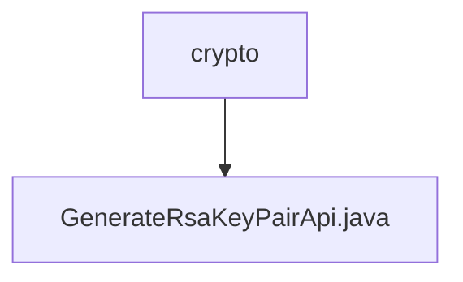

# Basic Information

|      |      |
|------|------|
| Name | crypto |
| Language | .java |
| Code Path | WeFe/board/board-service/src/main/java/com/welab/wefe/board/service/api/crypto |
| Package Name | docs.board.board-service.src.main.java.com.welab.wefe.board.service.api.crypto |
| Brief Description | API for generating RSA key pairs, returning the public key for encrypted data transmission. |

# Description

This is an API class named GenerateRsaKeyPairApi, with the path crypto/generate_rsa_key_pair, which generates a new RSA key pair and returns the public key. It inherits from AbstractNoneInputApi, does not accept input parameters, and outputs an Output class containing a publicKey field. The publicKey field is labeled as an RSA public key for encrypting data. The processing logic retrieves the public key via TempRsaCache and returns a successful result.

### Package Internal Structure View

This flowchart illustrates the hierarchical structure of the encryption module in the WeFe project. The crypto folder serves as the parent node, containing a child node, the GenerateRsaKeyPairApi.java file. This concise hierarchical relationship clearly reflects the file organization of the encryption API module, making it easier for developers to quickly understand the project layout.

# File List

| Name   | Type  | Description |
|-------|------|-------------|
| [GenerateRsaKeyPairApi.java](GenerateRsaKeyPairApi.md) | file | API for generating RSA key pairs, returns the public key for encrypted data transmission. |

