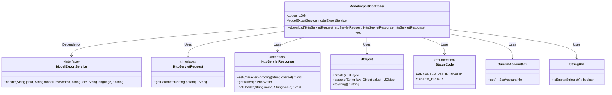
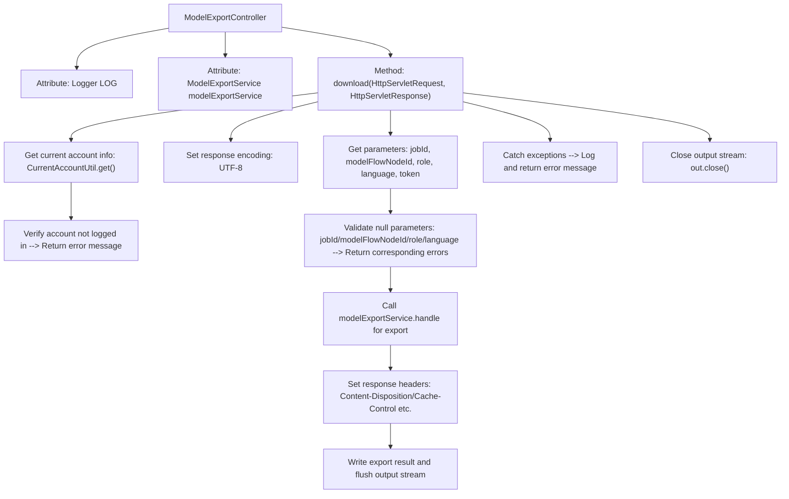

# Basic Information

|      |      |
|------|------|
| Name | ModelExportController |
| Language | .java |
| Code Path | WeFe/board/board-service/src/main/java/com/welab/wefe/board/service/api/data_output_info/ModelExportController.java |
| Package Name | com.welab.wefe.board.service.api.data_output_info |
| Dependencies | ['com.welab.wefe.board.service.service.modelexport.ModelExportService', 'com.welab.wefe.common.StatusCode', 'com.welab.wefe.common.util.JObject', 'com.welab.wefe.common.util.StringUtil', 'com.welab.wefe.common.web.service.account.SsoAccountInfo', 'com.welab.wefe.common.web.util.CurrentAccountUtil', 'com.welab.wefe.common.wefe.enums.ModelExportLanguage', 'org.slf4j.Logger', 'org.slf4j.LoggerFactory', 'org.springframework.beans.factory.annotation.Autowired', 'org.springframework.stereotype.Controller', 'org.springframework.web.bind.annotation.RequestMapping', 'javax.servlet.http.HttpServletRequest', 'javax.servlet.http.HttpServletResponse', 'java.io.PrintWriter'] |
| Brief Description | The ModelExportController handles model export requests, validates the parameters, and then invokes the ModelExportService to export the data, returning JSON results or error messages. |

# Description

This is a Spring controller class named ModelExportController, primarily used to handle model export requests. It contains a download method that receives HTTP requests via the `/data_output_info/model_export` path. The method first retrieves the jobId, modelFlowNodeId, role, language, and token from the request parameters and performs non-null validation. If the user is not logged in or parameters are missing, it returns corresponding error messages. Upon successful validation, it invokes the modelExportService to process the export request, sets response headers including content type, attachment download, and cache control, and finally writes the export result to the response. If an exception occurs during the process, it logs the error and returns a system error message. The method ensures the output stream is closed upon completion.

# Class Summary

| Name   | Type  | Description |
|-------|------|-------------|
| ModelExportController | class | This is a Spring controller class ModelExportController that handles model export requests. It accepts parameters such as jobId, modelFlowNodeId, role, and language. After validating the parameters and login status, it invokes ModelExportService to export the model and returns the file for download. In case of exceptions, it logs the error and returns an error message. |

## Class ModelExportController

|      |      |
|------|------|
| Access Modifier | @Controller;public |
| Type | class |
| Name | ModelExportController |
| Description | This is a Spring controller class ModelExportController that handles model export requests. It accepts parameters such as jobId, modelFlowNodeId, role, and language. After validating the parameters and login status, it invokes ModelExportService to export the model and returns the file for download. In case of exceptions, it logs the error and returns an error message. |

### UML Class Diagram

This code demonstrates a Spring MVC controller `ModelExportController` that handles model export requests. The controller relies on `ModelExportService` to perform the actual export operations, obtains parameters via `HttpServletRequest`, and returns responses using `HttpServletResponse`. The logic includes parameter validation, error handling, and response configuration, assisted by utility classes such as `JObject`, `StatusCode`, etc. The overall design reflects a layered architecture, where the controller coordinates and the service class handles business logic.

### Internal Method Call Graph

This flowchart describes the complete process of ModelExportController handling model export. Starting from receiving HTTP requests, it sequentially shows preprocessing steps including parameter acquisition, permission verification, and null checks, then calls the service layer for actual export operations, and finally sets response headers and returns results. Exception handling runs through the entire process to ensure any errors are caught and returned with user-friendly prompts. The flow strictly follows HTTP response specifications, including character encoding settings, cross-origin header handling, etc., and correctly closes the output stream whether successful or failed.

### Field List

| Name  | Type  | Description |
|-------|-------|------|
| modelExportService | ModelExportService | The code snippet uses the @Autowired annotation to automatically inject an instance of ModelExportService. |
| LOG = LoggerFactory.getLogger(this.getClass()) | Logger | Define a protected constant LOG in the class for logging the current class. |

### Method List

| Name  | Type  | Description |
|-------|-------|------|
| download | void | The code implements a model export interface that receives parameters such as jobId, verifies login and parameters, calls the service to export the model file, sets response headers to return the file for download, and returns error messages in case of exceptions. |

