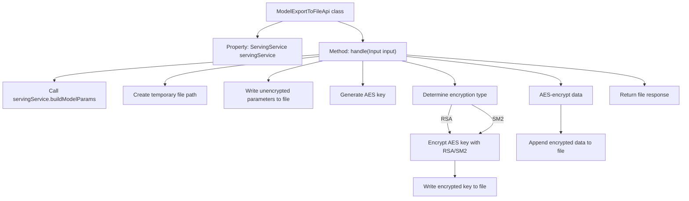

# Basic Information

|      |      |
|------|------|
| Name | ModelExportToFileApi |
| Language | .java |
| Code Path | WeFe/board/board-service/src/main/java/com/welab/wefe/board/service/api/data_output_info/ModelExportToFileApi.java |
| Package Name | com.welab.wefe.board.service.api.data_output_info |
| Dependencies | ['com.alibaba.fastjson.JSON', 'com.welab.wefe.board.service.base.file_system.WeFeFileSystem', 'com.welab.wefe.board.service.service.CacheObjects', 'com.welab.wefe.board.service.service.ServingService', 'com.welab.wefe.common.SecurityUtil', 'com.welab.wefe.common.constant.SecretKeyType', 'com.welab.wefe.common.fieldvalidate.annotation.Check', 'com.welab.wefe.common.util', 'com.welab.wefe.common.web.api.base.AbstractApi', 'com.welab.wefe.common.web.api.base.Api', 'com.welab.wefe.common.web.dto.AbstractApiInput', 'com.welab.wefe.common.web.dto.ApiResult', 'com.welab.wefe.common.wefe.enums.JobMemberRole', 'org.springframework.beans.factory.annotation.Autowired', 'org.springframework.http.ResponseEntity', 'java.io.File', 'java.util.TreeMap'] |
| Brief Description | The API exports model parameters to a file, encrypts the data using AES and the key with RSA/SM2, then returns the encrypted file. Input requires a task ID and role. |

# Description

The code defines an API class named `ModelExportToFileApi`, which is used to export models to files. The API path is `data_output_info/model_export_to_file`. Its main functionalities include: constructing model parameters through `ServingService` and writing them to a temporary file; randomly generating an AES key and writing it to the file after encryption with RSA or SM2; and finally encrypting the model data with AES and appending it to the file. The input parameter `Input` includes required fields `taskId` and `role`. The entire process involves file operations and multiple encryption methods, ultimately returning the generated file.

# Class Summary

| Name   | Type  | Description |
|-------|------|-------------|
| ModelExportToFileApi | class | This API class is used to export models to files, accepting task ID and role parameters, generating encrypted files and returning them. The file content includes model parameters and encryption keys, using AES and RSA/SM2 encryption to ensure data security. |


## Class ModelExportToFileApi

|      |      |
|------|------|
| Access Modifier | @Api(path = "data_output_info/model_export_to_file", name = "导出模型到文件中");public |
| Type | class |
| Name | ModelExportToFileApi |
| Description | This API class is used to export models to files, accepting task ID and role parameters, generating encrypted files and returning them. The file content includes model parameters and encryption keys, using AES and RSA/SM2 encryption to ensure data security. |


### UML Class Diagram

```mermaid
classDiagram
    class ModelExportToFileApi {
        <<Api>> 
        +ServingService servingService
        +handle(Input input) ApiResult~ResponseEntity~?~
    }

    class AbstractApi~T, R~ {
        <<Abstract>> 
        #handle(T input) ApiResult~R~
    }

    class ServingService {
        +buildModelParams(String taskId, JobMemberRole role) TreeMap~String, Object~
    }

    class Input {
        -String taskId
        -JobMemberRole role
        +getTaskId() String
        +setTaskId(String taskId) void
        +getRole() JobMemberRole
        +setRole(JobMemberRole role) void
    }

    class AbstractApiInput {
        <<Abstract>> 
    }

    class JobMemberRole {
        <<Enumeration>> 
    }

    ModelExportToFileApi --|> AbstractApi~Input, ResponseEntity~?~ : Inheritance
    Input --|> AbstractApiInput : Inheritance
    ModelExportToFileApi --> ServingService : Dependency
    ModelExportToFileApi --> Input : Uses
    Input --> JobMemberRole : Association
```

This code implements an API for exporting models to files, with core functionalities including: constructing model parameters, generating temporary files, encrypting AES keys using RSA/SM2, and writing AES-encrypted data to files. The class diagram illustrates the core class structure: ModelExportToFileApi inherits from the generic abstract class AbstractApi, depends on the ServingService, uses the nested Input class as a parameter object, which in turn inherits from AbstractApiInput and associates with the JobMemberRole enumeration. Encryption functionality is implemented via utility classes (not shown in the diagram).


### Internal Method Call Graph



This code flowchart illustrates the complete process of exporting models to files. It begins by constructing model parameters through servingService, then creates a temporary file and writes data in sequential steps: first writing unencrypted JSON parameters, followed by generating an AES key and encrypting it using either RSA or SM2 based on configuration. The encrypted key is written to the file, and finally the original data is AES-encrypted and appended to the file. The entire process demonstrates a complete chain of parameter processing, multi-layer encryption, and file operations, ultimately returning a file response containing the encrypted data.

### Field List

| Name  | Type  | Description |
|-------|-------|------|
| servingService | ServingService | Automatically inject the ServingService service instance. |

### Method List

| Name  | Type  | Description |
|-------|-------|------|
| handle | ApiResult<ResponseEntity<?>> | Process the input data, construct parameters and write them to a file, generate an AES key and encrypt it with RSA or SM2 for storage, then use AES to encrypt the data and return the file. |


