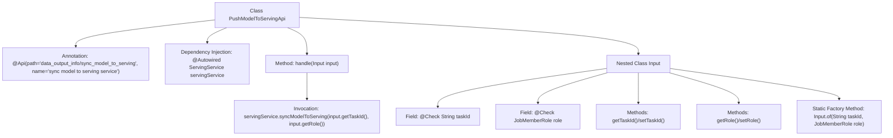

# Basic Information

|      |      |
|------|------|
| Name | PushModelToServingApi |
| Language | .java |
| Code Path | WeFe/board/board-service/src/main/java/com/welab/wefe/board/service/api/data_output_info/PushModelToServingApi.java |
| Package Name | com.welab.wefe.board.service.api.data_output_info |
| Dependencies | ['com.welab.wefe.board.service.service.ServingService', 'com.welab.wefe.common.fieldvalidate.annotation.Check', 'com.welab.wefe.common.web.api.base.AbstractApi', 'com.welab.wefe.common.web.api.base.Api', 'com.welab.wefe.common.web.dto.AbstractApiInput', 'com.welab.wefe.common.web.dto.ApiResult', 'com.welab.wefe.common.wefe.enums.JobMemberRole', 'org.springframework.beans.factory.annotation.Autowired'] |
| Brief Description | This API is used to synchronize the model to the server, receiving the task ID and role parameters, and invoking the ServingService to complete the synchronization operation. |

# Description

This is an API class named PushModelToServingApi, used for synchronizing models to the server. The API path is "data_output_info/sync_model_to_serving". This class inherits from AbstractApi, accepts an Input type parameter, and returns an Object type result. The Input class contains two required fields: taskId (task ID) and role (model role). The processing logic is implemented by calling the servingService's syncModelToServing method, passing in the taskId and role parameters. The Input class provides getter/setter methods and a static factory method "of" for creating instances.

# Class Summary

| Name   | Type  | Description |
|-------|------|-------------|
| PushModelToServingApi | class | The API class PushModelToServingApi, with the path data_output_info/sync_model_to_serving, is used to synchronize models to the serving environment. The input parameters are taskId and role, which invoke the syncModelToServing method of ServingService for processing. |


## Class PushModelToServingApi

|      |      |
|------|------|
| Access Modifier | @Api(path = "data_output_info/sync_model_to_serving", name = "sync model to serving service");public |
| Type | class |
| Name | PushModelToServingApi |
| Description | The API class PushModelToServingApi, with the path data_output_info/sync_model_to_serving, is used to synchronize models to the serving environment. The input parameters are taskId and role, which invoke the syncModelToServing method of ServingService for processing. |


### UML Class Diagram

```mermaid
classDiagram
    class PushModelToServingApi {
        -ServingService servingService
        +handle(Input input) ApiResult~Object~
    }
    <<Interface>> AbstractApi~Input, Object~
    PushModelToServingApi --|> AbstractApi~Input, Object~ : extends
    PushModelToServingApi --> ServingService : depends

    class Input {
        -String taskId
        -JobMemberRole role
        +getTaskId() String
        +setTaskId(String taskId)
        +getRole() JobMemberRole
        +setRole(JobMemberRole role)
        +of(String taskId, JobMemberRole role) Input
    }
    <<Interface>> AbstractApiInput
    Input --|> AbstractApiInput : extends
```

This class diagram illustrates the structural relationships of PushModelToServingApi and its inner class Input. PushModelToServingApi inherits from the generic abstract class AbstractApi and relies on ServingService to achieve model synchronization functionality. As an inner input parameter class, Input inherits from AbstractApiInput, containing two core fields (taskId and role) while providing standard getter/setter methods and a factory method of(). The overall design demonstrates clear hierarchical structure and separation of responsibilities: the Input class specializes in parameter validation and encapsulation, while the main class focuses on business logic processing.


### Internal Method Call Graph



This code describes an API class PushModelToServingApi designed for synchronizing models to a serving system. Its core functionality involves invoking the synchronization service of ServingService through the handle method. The nested Input class encapsulates task ID and role parameters, includes parameter validation annotations and standard getter/setter methods, and provides a static factory method "of" to simplify object creation. The flowchart clearly illustrates the class structure, dependency relationships, and method invocation chain, with special emphasis on key annotations and parameter validation logic.

### Field List

| Name  | Type  | Description |
|-------|-------|------|
| servingService | ServingService | Using @Autowired to automatically inject an instance of the ServingService. |

### Method List

| Name  | Type  | Description |
|-------|-------|------|
| handle | ApiResult<Object> | Java method override, calling the service to synchronize the model to Serving, returning a successful result. |


