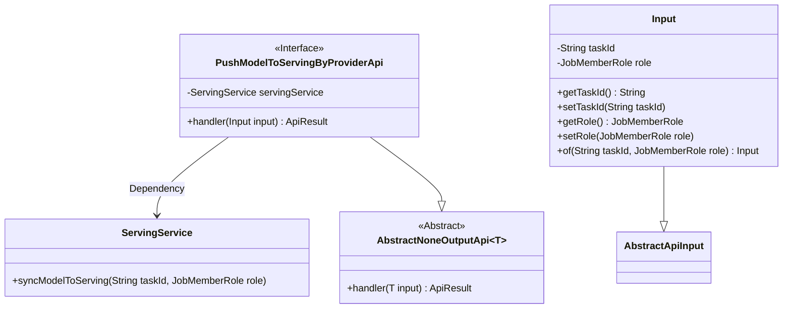

# Basic Information

|      |      |
|------|------|
| Name | PushModelToServingByProviderApi |
| Language | .java |
| Code Path | WeFe/board/board-service/src/main/java/com/welab/wefe/board/service/api/data_output_info/PushModelToServingByProviderApi.java |
| Package Name | com.welab.wefe.board.service.api.data_output_info |
| Dependencies | ['com.welab.wefe.board.service.service.ServingService', 'com.welab.wefe.common.exception.StatusCodeWithException', 'com.welab.wefe.common.fieldvalidate.annotation.Check', 'com.welab.wefe.common.web.api.base.AbstractNoneOutputApi', 'com.welab.wefe.common.web.api.base.Api', 'com.welab.wefe.common.web.dto.AbstractApiInput', 'com.welab.wefe.common.web.dto.ApiResult', 'com.welab.wefe.common.wefe.enums.JobMemberRole', 'org.springframework.beans.factory.annotation.Autowired'] |
| Brief Description | API class PushModelToServingByProviderApi, with the path data_output_info/provider/push_model_to_serving, allows signed access. Its function is to synchronize models to the serving environment, requiring inputs of taskId and model role. |

# Description

The code defines an API class named `PushModelToServingByProviderApi`, which is used to push models to the serving system. The API path is `data_output_info/provider/push_model_to_serving`, allowing signed access. The class inherits from `AbstractNoneOutputApi` and uses `ServingService` to handle the logic of synchronizing models to the serving system. The input parameter `Input` includes required fields `taskId` and `role`, providing getter/setter methods and a static factory method `of`. The `handler` method calls `servingService.syncModelToServing` to complete task synchronization and returns a successful result.

# Class Summary

| Name   | Type  | Description |
|-------|------|-------------|
| PushModelToServingByProviderApi | class | This API is used to push models to the service system, requiring the task ID and role parameters, supporting signed access, and invoking the ServingService to synchronize models. |

## Class PushModelToServingByProviderApi

|      |      |
|------|------|
| Access Modifier | @Api(;        path = "data_output_info/provider/push_model_to_serving",;        name = "push model to serving service",;        allowAccessWithSign = true;);public |
| Type | class |
| Name | PushModelToServingByProviderApi |
| Description | This API is used to push models to the service system, requiring the task ID and role parameters, supporting signed access, and invoking the ServingService to synchronize models. |

### UML Class Diagram

This code describes an API implementation for pushing models to a serving system. PushModelToServingByProviderApi inherits from AbstractNoneOutputApi, processes input parameters containing task ID and role information, and synchronizes the model to the serving system via ServingService. The Input class, as an inner class, encapsulates the necessary task ID and role parameters and provides a convenient static factory method. The overall design demonstrates clear separation of responsibilities, with the core business logic completed through dependency injection of ServingService.

### Internal Method Call Graph

```mermaid
graph TD
    A["Class PushModelToServingByProviderApi"]
    B["Annotation: @Api"]
    C["Inheritance: AbstractNoneOutputApi<Input>"]
    D["Dependency Injection: ServingService servingService"]
    E["Overridden Method: handler(Input input)"]
    F["Inner Class: Input"]
    G["Field: String taskId"]
    H["Field: JobMemberRole role"]
    I["Methods: getTaskId/setTaskId"]
    J["Methods: getRole/setRole"]
    K["Static Factory Method: of(String, JobMemberRole)"]
    L["Invocation: servingService.syncModelToServing"]
    M["Return: ApiResult.success()"]

    A --> B
    A --> C
    A --> D
    A --> E
    A --> F
    F --> G
    F --> H
    F --> I
    F --> J
    F --> K
    E --> L
    E --> M
```

This flowchart illustrates the complete structure of the PushModelToServingByProviderApi class, including API annotation, parent class inheritance, service dependency injection, and core handler method implementation. It highlights the field structure, access methods, and factory method of the inner Input class, while clearly outlining the processing flow where the handler method invokes servingService to synchronize models to the serving end and returns a success result. The class relationships visually present the complete call chain from API entry to business logic processing.

### Field List

| Name  | Type  | Description |
|-------|-------|------|
| servingService | ServingService | Using @Autowired to automatically inject an instance of ServingService. |

### Method List

| Name  | Type  | Description |
|-------|-------|------|
| handler | ApiResult | This method overrides the parent class logic, invokes the service to synchronize the model to Serving, takes the task ID and role as input, and returns the result upon success. |

