# Basic Information

|      |      |
|------|------|
| Name | PushRsaKeyToServingApi |
| Language | .java |
| Code Path | WeFe/board/board-service/src/main/java/com/welab/wefe/board/service/api/data_output_info/PushRsaKeyToServingApi.java |
| Package Name | com.welab.wefe.board.service.api.data_output_info |
| Dependencies | ['com.welab.wefe.board.service.service.ServingService', 'com.welab.wefe.common.exception.StatusCodeWithException', 'com.welab.wefe.common.web.api.base.AbstractNoneOutputApi', 'com.welab.wefe.common.web.api.base.Api', 'com.welab.wefe.common.web.dto.AbstractApiInput', 'com.welab.wefe.common.web.dto.ApiResult', 'org.springframework.beans.factory.annotation.Autowired'] |
| Brief Description | The API class for pushing RSA keys to the server, inheriting from AbstractNoneOutputApi, executes the push operation via ServingService, with an empty input class. |

# Description

The code defines an API class named `PushRsaKeyToServingApi`, which is used to push an RSA key to the server. This class inherits from `AbstractNoneOutputApi` and specifies the input type as the inner class `Input`. The `ServingService` is injected via `Autowired`, and the `handler` method calls the `pushRsaKeyToServing` method to complete the key-pushing operation, returning an `ApiResult` upon success. The `Input` class inherits from `AbstractApiInput` and currently contains no specific fields. The API path is `data_output_info/push_rsa_key_to_serving`.

# Class Summary

| Name   | Type  | Description |
|-------|------|-------------|
| PushRsaKeyToServingApi | class | Push the RSA key to the server-side API interface by calling the `pushRsaKeyToServing` method of `ServingService`. There are no output parameters, and it inherits from the `AbstractNoneOutputApi` class. |


## Class PushRsaKeyToServingApi

|      |      |
|------|------|
| Access Modifier | @Api(path = "data_output_info/push_rsa_key_to_serving", name = "push_rsa_key_to_serving");public |
| Type | class |
| Name | PushRsaKeyToServingApi |
| Description | Push the RSA key to the server-side API interface by calling the `pushRsaKeyToServing` method of `ServingService`. There are no output parameters, and it inherits from the `AbstractNoneOutputApi` class. |


### UML Class Diagram

```mermaid
classDiagram
    class PushRsaKeyToServingApi {
        +ServingService servingService
        +ApiResult handler(Input input) StatusCodeWithException
    }
    <<Interface>> AbstractNoneOutputApi~Input~
    PushRsaKeyToServingApi --|> AbstractNoneOutputApi~Input~ : extends
    PushRsaKeyToServingApi --> ServingService : depends

    class AbstractApiInput {
    }
    class Input {
    }
    Input --|> AbstractApiInput : extends
```

This code demonstrates an API implementation for pushing RSA keys to the server. PushRsaKeyToServingApi inherits from the generic class AbstractNoneOutputApi<Input> and overrides the handler method. It relies on ServingService to complete core business logic. Input, as an internal static class, inherits from AbstractApiInput with no specific fields currently defined. The design reflects clear hierarchical relationships, achieving functional decoupling through inheritance of abstract base classes and dependency injection of services.


### Internal Method Call Graph

```mermaid
graph TD
    A["Class PushRsaKeyToServingApi"]
    B["Annotation: @Api(path='data_output_info/push_rsa_key_to_serving', name='push_rsa_key_to_serving')"]
    C["Inheritance: AbstractNoneOutputApi<Input>"]
    D["Dependency Injection: @Autowired ServingService servingService"]
    E["Overridden Method: handler(Input input)"]
    F["Invocation: servingService.pushRsaKeyToServing()"]
    G["Return: success()"]
    H["Static Inner Class: Input"]
    I["Inheritance: AbstractApiInput"]

    A --> B
    A --> C
    A --> D
    A --> E
    E --> F
    E --> G
    A -.-> H
    H --> I
```



This flowchart illustrates the core structure of the PushRsaKeyToServingApi class, including class annotations, inheritance relationships, service injection, and key method invocation chains. The class processes input parameters through the handler method, invokes the pushRsaKeyToServing() method of ServingService, and returns a success result. The static inner class Input serves as an input parameter carrier inherited from AbstractApiInput, collectively demonstrating the API interface's request processing flow and layered design pattern.

### Field List

| Name  | Type  | Description |
|-------|-------|------|
| servingService | ServingService | Automatically inject the ServingService instance. |

### Method List

| Name  | Type  | Description |
|-------|-------|------|
| handler | ApiResult | Java method override, call servingService to push RSA key and return successful result. |


