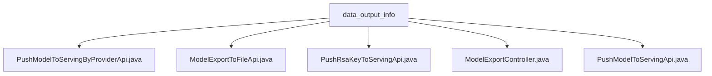

# Basic Information

|      |      |
|------|------|
| Name | data_output_info |
| Language | .java |
| Code Path | WeFe/board/board-service/src/main/java/com/welab/wefe/board/service/api/data_output_info |
| Package Name | docs.board.board-service.src.main.java.com.welab.wefe.board.service.api.data_output_info |
| Brief Description | PushModelToServingByProviderApi pushes the model to the serving system. ModelExportToFileApi exports and encrypts the model file. PushRsaKeyToServingApi pushes the RSA key. ModelExportController handles model export requests. PushModelToServingApi synchronizes the model to the server. |

# Description

## Overview  
The core responsibility of this module is to handle service-oriented operations related to model output, including pushing models to the serving system, file export, and key management. The interface specifications uniformly adopt the RESTful style, with the path prefix `data_output_info`, supporting signed access and multiple encryption methods. Key data structures include the `Input` class, where mandatory fields are `taskId` and `role`, such as the input for `PushModelToServingApi`. External dependencies include ServingService, file operation utilities, and AES/RSA/SM2 encryption components. Implementation examples are abundant, such as `ModelExportToFileApi` generating model files through hybrid encryption.  

## Key Business Scenarios  
The module primarily supports three types of scenarios: model service synchronization (similar to an event bus pattern), secure file export, and key pushing. Business processes are all triggered by `taskId` and `role`, such as `PushModelToServingByProviderApi` calling `syncModelToServing` to complete synchronization. Interaction modes include API calls (e.g., `PushRsaKeyToServingApi`) and file downloads (e.g., `ModelExportController` setting response headers). A typical application is in federated learning scenarios, where `ModelExportToFileApi` exports encrypted models for participants to download, while `PushRsaKeyToServingApi` synchronizes keys.

### Package Internal Structure View

This flowchart illustrates the hierarchical relationships of five Java files under the data_output_info directory. All files are directly subordinate to the data_output_info node with no nested subdirectory structure. The files include API implementation classes for various functional modules such as model pushing, RSA key pushing, and model exporting, reflecting the interface organization structure of data output information-related services.

# File List

| Name   | Type  | Description |
|-------|------|-------------|
| [PushModelToServingByProviderApi.java](PushModelToServingByProviderApi.md) | file | The API class `PushModelToServingByProviderApi`, with the path `data_output_info/provider/push_model_to_serving`, allows signed access. Its function is to synchronize the model to the serving environment, requiring the input of `taskId` and the model role. |
| [ModelExportToFileApi.java](ModelExportToFileApi.md) | file | The API exports model parameters to a file, encrypts the data using AES, and encrypts the key with RSA/SM2, ultimately returning the encrypted file. The input requires a task ID and a role. |
| [PushRsaKeyToServingApi.java](PushRsaKeyToServingApi.md) | file | The API class for pushing RSA keys to the server, inheriting from AbstractNoneOutputApi, executes the push operation via ServingService, with an empty input class. |
| [ModelExportController.java](ModelExportController.md) | file | The ModelExportController handles model export requests, validates parameters, and invokes the ModelExportService to export data, returning JSON results or error messages. |
| [PushModelToServingApi.java](PushModelToServingApi.md) | file | This API is used to synchronize the model to the server, receiving the task ID and role parameters, and invoking the ServingService to complete the synchronization operation. |

