# Basic Information

|      |      |
|------|------|
| Name | DataResourceQueryApi |
| Language | .java |
| Code Path | WeFe/board/board-service/src/main/java/com/welab/wefe/board/service/api/data_resource/DataResourceQueryApi.java |
| Package Name | com.welab.wefe.board.service.api.data_resource |
| Dependencies | ['com.welab.wefe.board.service.dto.base.PagingInput', 'com.welab.wefe.board.service.dto.base.PagingOutput', 'com.welab.wefe.board.service.service.data_resource.DataResourceService', 'com.welab.wefe.common.exception.StatusCodeWithException', 'com.welab.wefe.common.fieldvalidate.annotation.Check', 'com.welab.wefe.common.web.api.base.AbstractApi', 'com.welab.wefe.common.web.api.base.Api', 'com.welab.wefe.common.web.dto.ApiResult', 'com.welab.wefe.common.wefe.enums.DataResourceType', 'com.welab.wefe.common.wefe.enums.DeepLearningJobType', 'org.springframework.beans.factory.annotation.Autowired', 'java.util.List'] |
| Brief Description | The DataResourceQueryApi is used to query various types of data resources, including pagination input parameters such as resource ID, name, tags, uploader, resource type, etc., and returns paginated results. |

# Description

The code defines an API class named DataResourceQueryApi, which is used to query various types of data resources. The API path is "data_resource/query", inheriting from AbstractApi, with the input type as the inner class Input and the output as the paginated result PagingOutput. The Input class includes multiple query parameters: resource ID, name, tags, uploader, resource type list, as well as dataset-specific parameters such as whether to include Y values and task type. The class provides getter and setter methods for each parameter. The API processing logic is implemented by calling the query method of DataResourceService and returns the paginated query result.

# Class Summary

| Name   | Type  | Description |
|-------|------|-------------|
| DataResourceQueryApi | class | The DataResourceQueryApi is used to query various types of data resources, supporting pagination and multiple filtering conditions such as ID, name, tags, uploader, resource type, etc., and returns paginated results. |


## Class DataResourceQueryApi

|      |      |
|------|------|
| Access Modifier | @Api(path = "data_resource/query", name = "query all kinds of data resource");public |
| Type | class |
| Name | DataResourceQueryApi |
| Description | The DataResourceQueryApi is used to query various types of data resources, supporting pagination and multiple filtering conditions such as ID, name, tags, uploader, resource type, etc., and returns paginated results. |


### UML Class Diagram

```mermaid
classDiagram
    class DataResourceQueryApi {
        -DataResourceService dataResourceService
        +handle(Input input) ApiResult~PagingOutput~?~~
    }
    
    class AbstractApi~T, R~ {
        <<Interface>>
    }
    
    class PagingInput {
        <<Interface>>
    }
    
    class DataResourceQueryApi$Input {
        -String id
        -String name
        -String tag
        -String creator
        -List~DataResourceType~ dataResourceType
        -Boolean containsY
        -DeepLearningJobType forJobType
        +String getId()
        +void setId(String id)
        +String getName()
        +void setName(String name)
        +String getTag()
        +void setTag(String tag)
        +String getCreator()
        +void setCreator(String creator)
        +List~DataResourceType~ getDataResourceType()
        +void setDataResourceType(List~DataResourceType~ dataResourceType)
        +Boolean getContainsY()
        +void setContainsY(Boolean containsY)
        +DeepLearningJobType getForJobType()
        +void setForJobType(DeepLearningJobType forJobType)
    }
    
    class PagingOutput~T~ {
        <<Interface>>
    }
    
    class DataResourceService {
        <<Interface>>
        +query(Input input) PagingOutput~?~
    }
    
    DataResourceQueryApi --> AbstractApi~Input, PagingOutput~?~~ : extends
    DataResourceQueryApi --> DataResourceService : depends
    DataResourceQueryApi$Input --> PagingInput : extends
    DataResourceService ..> PagingOutput~?~ : returns
    DataResourceService ..> DataResourceQueryApi$Input : parameter
```

This class diagram illustrates the structure of the Data Resource Query API. The DataResourceQueryApi inherits from the generic abstract class AbstractApi and contains an inner class Input for encapsulating query parameters, where Input extends the PagingInput interface. The API performs actual query operations through the dependency-injected DataResourceService, returning paginated results PagingOutput. The diagram clearly shows inheritance, dependency, and association relationships between classes, including the instantiation process of generic parameters.


### Internal Method Call Graph

```mermaid
graph TD
    A["Class DataResourceQueryApi"]
    B["Inherits: AbstractApi<Input, PagingOutput<?>>"]
    C["Dependency: DataResourceService dataResourceService"]
    D["Overridden method: handle(Input input)"]
    E["Nested class: Input"]
    F["Property: String id"]
    G["Property: String name"]
    H["Property: String tag"]
    I["Property: String creator"]
    J["Property: List<DataResourceType> dataResourceType"]
    K["Property: Boolean containsY"]
    L["Property: DeepLearningJobType forJobType"]
    M["Method: getter/setter"]

    A --> B
    A --> C
    A --> D
    A --> E
    E --> F
    E --> G
    E --> H
    E --> I
    E --> J
    E --> K
    E --> L
    E --> M
    D --> C["Calls dataResourceService.query"]
    D --> N["Returns ApiResult.success"]
```



This flowchart illustrates the structure of the DataResourceQueryApi class and its key components. The class inherits from AbstractApi, includes an auto-injected DataResourceService dependency, and overrides the handle method to process input parameters. The nested Input class defines multiple properties with validation annotations and corresponding getter/setter methods. The handle method retrieves paginated results by calling dataResourceService.query and ultimately returns a successfully encapsulated ApiResult. The overall structure reflects the API layer's processing flow for data resource query requests.

### Field List

| Name  | Type  | Description |
|-------|-------|------|
| dataResourceService | DataResourceService | Automatically inject the DataResourceService instance. |

### Method List

| Name  | Type  | Description |
|-------|-------|------|
| handle | ApiResult<PagingOutput<?>> | Rewrite the method to handle input, call the service to query data, and return paginated results. |


