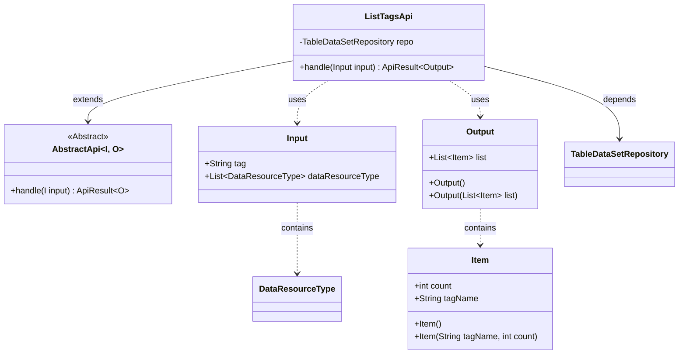
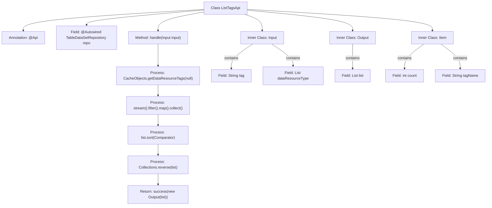

# Basic Information

|      |      |
|------|------|
| Name | ListTagsApi |
| Language | .java |
| Code Path | WeFe/board/board-service/src/main/java/com/welab/wefe/board/service/api/data_resource/ListTagsApi.java |
| Package Name | com.welab.wefe.board.service.api.data_resource |
| Dependencies | ['com.welab.wefe.board.service.database.repository.data_resource.TableDataSetRepository', 'com.welab.wefe.board.service.service.CacheObjects', 'com.welab.wefe.common.exception.StatusCodeWithException', 'com.welab.wefe.common.fieldvalidate.annotation.Check', 'com.welab.wefe.common.util.StringUtil', 'com.welab.wefe.common.web.api.base.AbstractApi', 'com.welab.wefe.common.web.api.base.Api', 'com.welab.wefe.common.web.dto.AbstractApiInput', 'com.welab.wefe.common.web.dto.ApiResult', 'com.welab.wefe.common.wefe.enums.DataResourceType', 'org.springframework.beans.factory.annotation.Autowired', 'java.util.Collections', 'java.util.Comparator', 'java.util.List', 'java.util.stream.Collectors'] |
| Brief Description | The ListTagsApi interface is used to retrieve a list of dataset tags, supporting fuzzy search by tag keywords and resource type filtering, and returns results sorted by tag count. |

# Description

The code defines an API class named ListTagsApi, designed to handle dataset tag query requests. The API path is "data_resource/tags," which accepts input parameters including a tag keyword and resource type. It retrieves tag data via cache, performs filtering and sorting, and outputs a list of tag names along with their counts, sorted in descending order by count. The input parameters support fuzzy search and resource type filtering, while the output consists of the sorted tag list.

# Class Summary

| Name   | Type  | Description |
|-------|------|-------------|
| ListTagsApi | class | The ListTagsApi class handles dataset tag queries, supporting fuzzy filtering by keywords and returning a list of tags sorted by count. The input includes tag keywords and resource types, and the output is a list of tag names and their counts. |

## Class ListTagsApi

|      |      |
|------|------|
| Access Modifier | @Api(path = "data_resource/tags", name = "all of the table data set tags");public |
| Type | class |
| Name | ListTagsApi |
| Description | The ListTagsApi class handles dataset tag queries, supporting fuzzy filtering by keywords and returning a list of tags sorted by count. The input includes tag keywords and resource types, and the output is a list of tag names and their counts. |

### UML Class Diagram

This code demonstrates the class structure of an API for handling dataset tag listings. The ListTagsApi inherits from the generic abstract class AbstractApi, takes Input parameters and returns Output results containing a list of Items. Its core functionality involves retrieving tag data through caching, supporting keyword filtering and count-based sorting, reflecting clear separation of input/output and data processing logic. The class diagram includes 5 main classes and 1 interface, clearly illustrating inheritance, dependency and containment relationships.

### Internal Method Call Graph

This code implements an API with tag filtering and sorting functionality. The main workflow involves: retrieving data resource tags via CacheObjects, performing stream filtering and mapping based on input parameters, sorting the result list by count, and returning the response. The Input class defines tag keyword and resource type parameters, while Output and Item classes encapsulate the response structure and its entries respectively. The entire process demonstrates a complete handling chain of data retrieval, filtering, sorting, and response.

### Field List

| Name  | Type  | Description |
|-------|-------|------|
| repo | TableDataSetRepository | Use @Autowired to automatically inject the TableDataSetRepository instance repo. |

### Method List

| Name  | Type  | Description |
|-------|-------|------|
| handle | ApiResult<Output> | The method processes input parameters, retrieves data from the cache, filters it by tags, sorts the results, and returns a list. |

