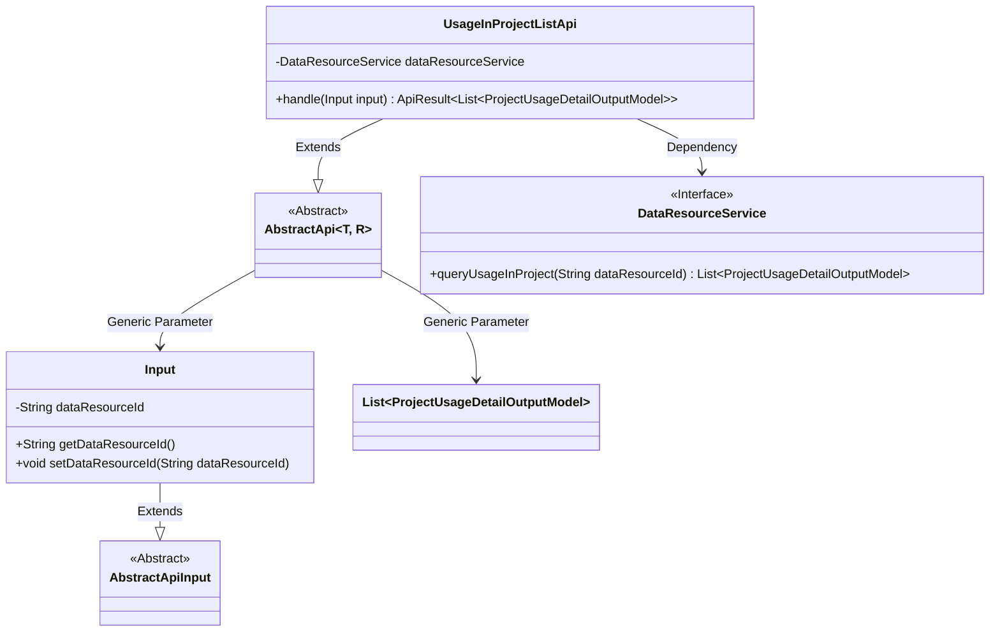

# Basic Information

|      |      |
|------|------|
| Name | UsageInProjectListApi |
| Language | .java |
| Code Path | WeFe/board/board-service/src/main/java/com/welab/wefe/board/service/api/data_resource/UsageInProjectListApi.java |
| Package Name | com.welab.wefe.board.service.api.data_resource |
| Dependencies | ['com.welab.wefe.board.service.dto.entity.project.ProjectUsageDetailOutputModel', 'com.welab.wefe.board.service.service.data_resource.DataResourceService', 'com.welab.wefe.common.exception.StatusCodeWithException', 'com.welab.wefe.common.fieldvalidate.annotation.Check', 'com.welab.wefe.common.web.api.base.AbstractApi', 'com.welab.wefe.common.web.api.base.Api', 'com.welab.wefe.common.web.dto.AbstractApiInput', 'com.welab.wefe.common.web.dto.ApiResult', 'org.springframework.beans.factory.annotation.Autowired', 'java.io.IOException', 'java.util.List'] |
| Brief Description | This API is used to query the usage of data resources across projects. It accepts a resource ID parameter and returns a detailed list of project usage. |

# Description

The code defines an API class named `UsageInProjectListApi`, which is used to query the usage of data resources in projects. The API path is `data_resource/usage_in_project_list`, and its function is to list projects based on data resource usage. This class inherits from `AbstractApi`, with the input type being the inner class `Input` and the output being a list of `ProjectUsageDetailOutputModel`. The input parameter `dataResourceId` is mandatory, and the result is obtained through the `queryUsageInProject` method of `DataResourceService`. The processing logic is encapsulated in the `handle` method, which returns the query result upon success.

# Class Summary

| Name   | Type  | Description |
|-------|------|-------------|
| UsageInProjectListApi | class | This API is used to query the usage of data resources within projects. It accepts a resource ID parameter and returns a detailed list of project usage. The core logic invokes the DataResourceService to process the query request. |

## Class UsageInProjectListApi

|      |      |
|------|------|
| Access Modifier | @Api(path = "data_resource/usage_in_project_list", name = "list project by data resource usage");public |
| Type | class |
| Name | UsageInProjectListApi |
| Description | This API is used to query the usage of data resources within projects. It accepts a resource ID parameter and returns a detailed list of project usage. The core logic invokes the DataResourceService to process the query request. |

### UML Class Diagram

This code demonstrates a REST endpoint implementation based on an abstract API framework, primarily used for querying data resource usage within projects. The core class UsageInProjectListApi inherits from the generic abstract class AbstractApi, specifying the input type Input and return type List<ProjectUsageDetailOutputModel>. Business logic is implemented through the dependency-injected DataResourceService interface, while the Input class encapsulates the required data resource ID field as parameters. The overall design reflects a clear hierarchical structure and separation of responsibilities, with input validation achieved through annotations and exception handling uniformly managed by the parent class.

### Internal Method Call Graph

```mermaid
graph TD
    A["Class UsageInProjectListApi"]
    B["Annotation: @Api"]
    C["Inheritance: AbstractApi<Input, List<ProjectUsageDetailOutputModel>>"]
    D["Dependency Injection: @Autowired DataResourceService"]
    E["Overridden Method: handle(Input input)"]
    F["Inner Class: Input"]
    G["Field: String dataResourceId"]
    H["Validation Annotation: @Check"]
    I["getter/setter methods"]
    J["Method Invocation: dataResourceService.queryUsageInProject"]

    A --> B
    A --> C
    A --> D
    A --> E
    A --> F
    F --> G
    F --> H
    F --> I
    E --> J
```

This code defines an API class named UsageInProjectListApi, which inherits from the base class AbstractApi and is used to query the usage of data resources within projects. The class contains an inner Input class for receiving request parameters, injects the DataResourceService via @Autowired, and overrides the handle method to invoke the queryUsageInProject service. The dataResourceId field in the Input class is validated using the @Check annotation to ensure the resource ID is mandatory. The overall flow clearly illustrates the complete chain from API entry to service invocation.

### Field List

| Name  | Type  | Description |
|-------|-------|------|
| dataResourceService | DataResourceService | Using @Autowired to automatically inject an instance of DataResourceService. |

### Method List

| Name  | Type  | Description |
|-------|-------|------|
| handle | ApiResult<List<ProjectUsageDetailOutputModel>> | Rewrite the method to handle project resource usage queries, returning query results or exceptions. |

