# Basic Information

|      |      |
|------|------|
| Name | data_resource |
| Language | .java |
| Code Path | WeFe/board/board-service/src/main/java/com/welab/wefe/board/service/api/data_resource |
| Package Name | docs.board.board-service.src.main.java.com.welab.wefe.board.service.api.data_resource |
| Brief Description | Manage the dataset lifecycle, including CRUD operations, preview, and metadata handling. Supports file uploads, structured storage, and sample viewing. Provides Bloom filter management, image dataset maintenance, and label query functionality. APIs adhere to RESTful specifications, uniformly inheriting from AbstractApi with clear path prefixes. Key data structures include input/output models, relying on the service layer for business logic processing. |

# Description

## Overview  
The core responsibility of this module is to uniformly manage the full lifecycle of multimodal data resources (tables/images/Bloom filters), providing standard CRUD operations, metadata maintenance, and cross-project usage tracking, similar to a data middle platform architecture. The interface specifications inherit from the AbstractApi base class, with paths layered by resource type (e.g., `table_data_set/add`). Input and output are encapsulated using Model classes, such as the DataResourceAddOutputModel for cross-module reuse. Key data structures include three types of models: input validation classes (e.g., TableDataSetUpdateInputModel), pagination wrapper classes (PagingOutput), and business entity classes (e.g., ImageDataSet entity). External dependencies include resource-specific Services (e.g., BloomFilterService), generic repositories (Repository), and caching components. For example, the ListTagsApi optimizes tag query performance through caching.

## Main Business Scenarios  
Typical workflows form a closed loop for data governance: 1) Resource ingestion (importing CSV/Excel via AddApi/file upload APIs); 2) Metadata management (DetailApi maintains descriptive information, ListTagsApi handles tags); 3) Application analysis (StatisticsApi generates heatmaps, UsageInProjectListApi tracks usage scenarios). Interaction modes combine precise queries (e.g., ID-based retrieval) and batch operations (e.g., paginated filtering), resembling a database management system. API types cover: basic CRUD (e.g., DeleteApi), extended functionality (PreviewApi for file parsing), statistical operations (tag counting and sorting), and integration classes (DataResourceQueryApi supports multi-condition joint queries). For example, an image dataset scenario requires chaining UpdateApi for annotation updates, DownloadApi for file exports, and StatisticsApi for distribution visualization.

### Package Internal Structure View

```mermaid
graph TD
    data_resource --> table_data_set
    data_resource --> upload_task
    data_resource --> bloom_filter
    data_resource --> image_data_set
    data_resource --> UsageInProjectListApi
    data_resource --> ListTagsApi
    data_resource --> DataResourceQueryApi

    table_data_set --> column
    table_data_set --> ListServerLocalFilesApi
    table_data_set --> UpdateApi
    table_data_set --> AddApi
    table_data_set --> TableDataSetDeleteApi
    table_data_set --> DetailApi
    table_data_set --> PreviewApi

    column --> ListApi

    upload_task --> DataResourceUploadTaskDetailApi
    upload_task --> DataResourceUploadTaskQueryApi

    bloom_filter --> BloomFilterPreviewApi
    bloom_filter --> BloomFilterDeleteApi
    bloom_filter --> BloomFilterDataResourceListApi
    bloom_filter --> BloomFilterDetailApi
    bloom_filter --> BloomFilterAddApi
    bloom_filter --> BloomFilterUpdateApi

    image_data_set --> sample
    image_data_set --> ImageDataSetUpdateApi
    image_data_set --> ImageDataSetAddApi
    image_data_set --> ImageDataSetDetailApi
    image_data_set --> ImageDataSetDownloadApi
    image_data_set --> ImageDataSetDeleteApi

    sample --> ImageDataSetSampleDeleteApi
    sample --> ImageDataSetSampleQueryApi
    sample --> ImageDataSetSampleDownloadApi
    sample --> ImageDataSetSampleUpdateApi
    sample --> ImageDataSetSampleStatisticsApi
```

This flowchart illustrates the complete API structure of the data resource module, comprising four submodules (table dataset, upload task, bloom filter, and image dataset) along with their corresponding API interfaces. Each submodule is further divided into specific functional interfaces, such as column operation interfaces for table datasets and sample management interfaces for image datasets. The top level also includes three independent data resource query APIs. The entire structure clearly demonstrates the hierarchical relationships between modules.

# File List

| Name   | Type  | Description |
|-------|------|-------------|
| [UsageInProjectListApi.java](UsageInProjectListApi.md) | file | This API is used to query the usage of data resources across projects. It accepts a resource ID parameter and returns a detailed list of project usage. |
| [ListTagsApi.java](ListTagsApi.md) | file | The ListTagsApi interface is used to retrieve a list of dataset tags, supporting fuzzy search by tag keywords and filtering by resource type, returning results sorted by tag count. |
| [DataResourceQueryApi.java](DataResourceQueryApi.md) | file | The DataResourceQueryApi is used to query various types of data resources, including pagination input parameters such as resource ID, name, tags, uploader, resource type, etc., and returns paginated results. |
| [image_data_set](image_data_set/_module.md) | package | This module provides CRUD management functions for image datasets, including creation, deletion, modification, query, download, and label statistics. The APIs follow the RESTful style, with paths uniformly prefixed by `image_data_set`. Core functionalities encompass data operations and statistical analysis, relying on the service layer and database to implement business logic. |
| [bloom_filter](bloom_filter/_module.md) | package | BloomFilterPreviewApi previews Bloom filter data, supporting database and file reading. BloomFilterDeleteApi deletes a Bloom filter. BloomFilterDataResourceListApi queries data resources. BloomFilterDetailApi retrieves Bloom filter details. BloomFilterAddApi adds a Bloom filter. BloomFilterUpdateApi updates Bloom filter information. |
| [upload_task](upload_task/_module.md) | package | The `DataResourceUploadTaskDetailApi` class is used to retrieve details of a dataset upload task, inheriting from `AbstractApi` and querying via `dataResourceId`. The `DataResourceUploadTaskQueryApi` class is designed for paginated querying of task lists, inheriting from `AbstractApi` and returning paginated results using the `PagingInput` parameter. Both classes handle queries through the `DataResourceUploadTaskService`. |
| [table_data_set](table_data_set/_module.md) | package | The ListApi class is used to retrieve the list of dataset fields, with the path `table_data_set/column/list`. The ListServerLocalFilesApi class queries server files, displaying only xls, xlsx, and csv files. The UpdateApi class updates dataset information, with the path `table_data_set/update`. The AddApi class adds a dataset, with the path `table_data_set/add`. The DeleteApi class deletes a dataset, with the path `table_data_set/delete`. The DetailApi class retrieves dataset details, with the path `table_data_set/detail`. The PreviewApi class previews dataset rows, supporting both database and file data sources. |

