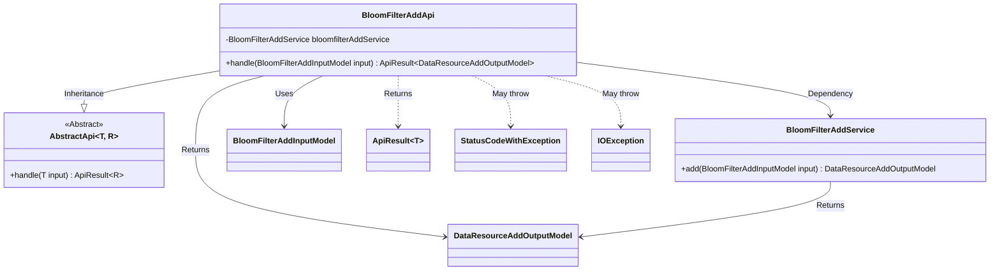
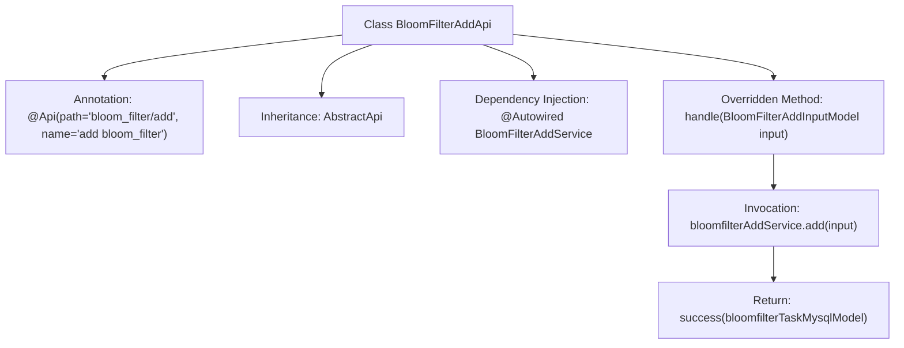

# Basic Information

|      |      |
|------|------|
| Name | BloomFilterAddApi |
| Language | .java |
| Code Path | WeFe/board/board-service/src/main/java/com/welab/wefe/board/service/api/data_resource/bloom_filter/BloomFilterAddApi.java |
| Package Name | com.welab.wefe.board.service.api.data_resource.bloom_filter |
| Dependencies | ['com.welab.wefe.board.service.dto.vo.data_resource.BloomFilterAddInputModel', 'com.welab.wefe.board.service.dto.vo.data_resource.DataResourceAddOutputModel', 'com.welab.wefe.board.service.service.data_resource.add.BloomFilterAddService', 'com.welab.wefe.common.exception.StatusCodeWithException', 'com.welab.wefe.common.web.api.base.AbstractApi', 'com.welab.wefe.common.web.api.base.Api', 'com.welab.wefe.common.web.dto.ApiResult', 'org.springframework.beans.factory.annotation.Autowired', 'java.io.IOException'] |
| Brief Description | This is a Bloom filter add API class, which inherits from AbstractApi, uses BloomFilterAddService to handle add requests, and returns DataResourceAddOutputModel results. |

# Description

This code describes a Java class named BloomFilterAddApi, which is a Spring framework-based API interface designed to handle Bloom filter addition operations. The class extends AbstractApi, with generic parameters specifying the input model BloomFilterAddInputModel and the output model DataResourceAddOutputModel. The BloomFilterAddService is injected via the @Autowired annotation. The handle method overrides the parent class method, invoking bloomfilterAddService.add to process the input parameters and returning a successful ApiResult response. The entire class is annotated with @Api, defining the API path as "bloom_filter/add" and the name as "add bloom_filter".

# Class Summary

| Name   | Type  | Description |
|-------|------|-------------|
| BloomFilterAddApi | class | This is a Bloom filter add API class, inherited from AbstractApi, which uses BloomFilterAddService to process add requests and returns DataResourceAddOutputModel results. |

## Class BloomFilterAddApi

|      |      |
|------|------|
| Access Modifier | @Api(path = "bloom_filter/add", name = "add bloom_filter");public |
| Type | class |
| Name | BloomFilterAddApi |
| Description | This is a Bloom filter add API class, inherited from AbstractApi, which uses BloomFilterAddService to process add requests and returns DataResourceAddOutputModel results. |

### UML Class Diagram

Class Diagram Description: This diagram illustrates that the BloomFilterAddApi class inherits from the generic abstract class AbstractApi and relies on BloomFilterAddService for business processing. BloomFilterAddApi accepts BloomFilterAddInputModel as input and returns an ApiResult containing DataResourceAddOutputModel, while potentially throwing StatusCodeWithException and IOException exceptions. The service layer BloomFilterAddService handles the core addition logic, demonstrating a clear hierarchical invocation relationship.

### Internal Method Call Graph

This code demonstrates a Spring framework-based API class BloomFilterAddApi for handling Bloom filter addition operations. The class inherits from the AbstractApi abstract class, injects BloomFilterAddService via @Autowired, and overrides the handle method to implement core logic: invoking the service's add method to process the input model, ultimately returning a successful ApiResult. The flowchart clearly presents the class structure, dependency relationships, and main method invocation chain.

### Field List

| Name  | Type  | Description |
|-------|-------|------|
| bloomfilterAddService | BloomFilterAddService | Using @Autowired to automatically inject an instance of BloomFilterAddService. |

### Method List

| Name  | Type  | Description |
|-------|-------|------|
| handle | ApiResult<DataResourceAddOutputModel> | Rewrite the method to handle Bloom filter addition requests, invoke the service to add data, and return the result. |

