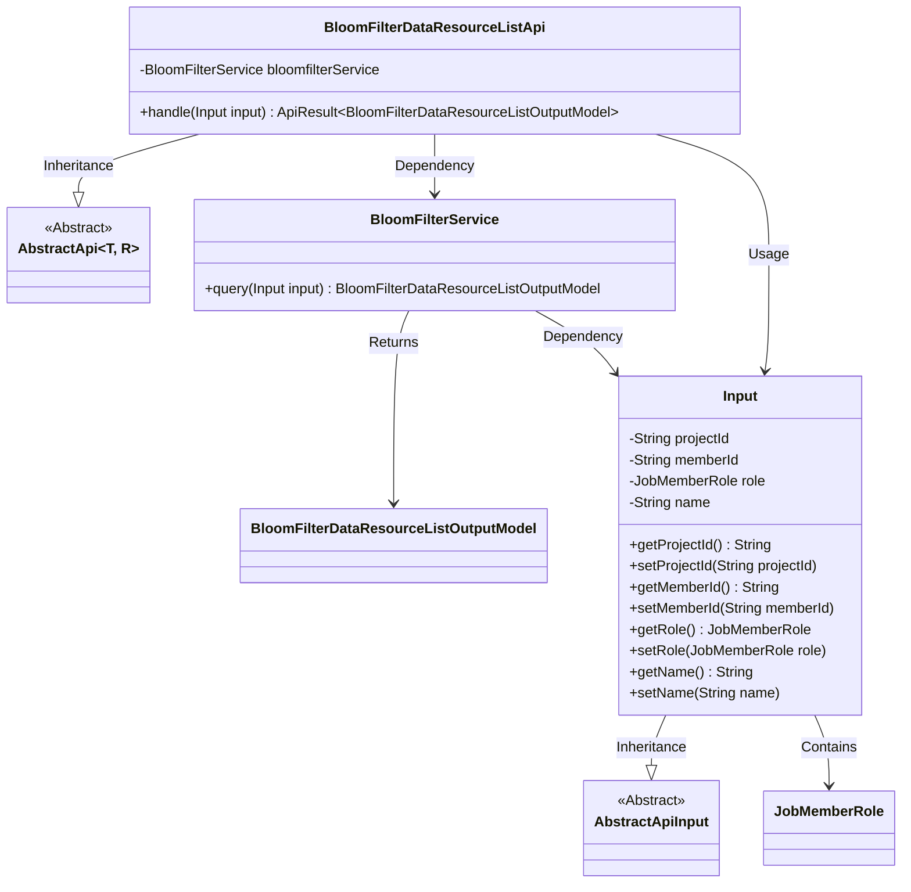
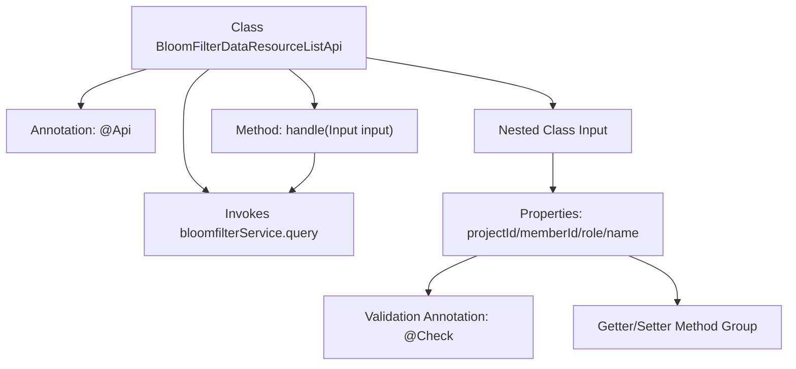

# Basic Information

|      |      |
|------|------|
| Name | BloomFilterDataResourceListApi |
| Language | .java |
| Code Path | WeFe/board/board-service/src/main/java/com/welab/wefe/board/service/api/data_resource/bloom_filter/BloomFilterDataResourceListApi.java |
| Package Name | com.welab.wefe.board.service.api.data_resource.bloom_filter |
| Dependencies | ['com.welab.wefe.board.service.dto.entity.BloomFilterDataResourceListOutputModel', 'com.welab.wefe.board.service.service.data_resource.bloom_filter.BloomFilterService', 'com.welab.wefe.common.exception.StatusCodeWithException', 'com.welab.wefe.common.fieldvalidate.annotation.Check', 'com.welab.wefe.common.web.api.base.AbstractApi', 'com.welab.wefe.common.web.api.base.Api', 'com.welab.wefe.common.web.dto.AbstractApiInput', 'com.welab.wefe.common.web.dto.ApiResult', 'com.welab.wefe.common.wefe.enums.JobMemberRole', 'org.springframework.beans.factory.annotation.Autowired', 'java.io.IOException'] |
| Brief Description | The BloomFilterDataResourceListApi class is used to query data resources. It requires providing the project ID, member ID, and member type, with an optional data resource name, and calls bloomfilterService.query to process the request. |

# Description

The code defines an API class named BloomFilterDataResourceListApi, which is used to query data resources. The API path is data_resource/member/query, inheriting from the AbstractApi class, and processes the input type Input and output type BloomFilterDataResourceListOutputModel. The input parameters include the mandatory project ID, member ID, member type, and optional data resource name. The request is processed and the result is returned via the query method of BloomFilterService. The input parameters are accessed and modified through getter and setter methods.

# Class Summary

| Name   | Type  | Description |
|-------|------|-------------|
| BloomFilterDataResourceListApi | class | The BloomFilterDataResourceListApi class is used to query data resources. It requires providing the project ID, member ID, and member type, with an optional data resource name. It calls the BloomFilterService to process the request and returns the result. |

## Class BloomFilterDataResourceListApi

|      |      |
|------|------|
| Access Modifier | @Api(path = "data_resource/member/query", name = "query data_resource");public |
| Type | class |
| Name | BloomFilterDataResourceListApi |
| Description | The BloomFilterDataResourceListApi class is used to query data resources. It requires providing the project ID, member ID, and member type, with an optional data resource name. It calls the BloomFilterService to process the request and returns the result. |

### UML Class Diagram

This code describes a Bloom filter-based data resource query API. The BloomFilterDataResourceListApi inherits from the generic abstract class AbstractApi, processes the input class Input containing parameters such as project ID, member ID, and member type, performs queries via BloomFilterService, and returns the BloomFilterDataResourceListOutputModel result. The Input class inherits from AbstractApiInput and contains multiple fields with validation annotations along with their getter/setter methods. The overall structure demonstrates a typical layered architecture of API layer, service layer, and data model layer.

### Internal Method Call Graph

This flowchart illustrates the core structure of the BloomFilterDataResourceListApi class, including API annotation marking, service dependency injection, request handling method, and the composition of nested input parameter class. The Input class contains four properties with validation annotations and corresponding getter/setter methods. The handle method processes input parameters through bloomfilterService and returns results. The diagram presents a complete invocation chain from API entry to business processing.

### Field List

| Name  | Type  | Description |
|-------|-------|------|
| bloomfilterService | BloomFilterService | Using @Autowired to automatically inject an instance of BloomFilterService. |

### Method List

| Name  | Type  | Description |
|-------|-------|------|
| handle | ApiResult<BloomFilterDataResourceListOutputModel> | This method overrides the parent class logic, invokes the bloomfilterService to query the input parameters and returns the result, potentially throwing exceptions. |

