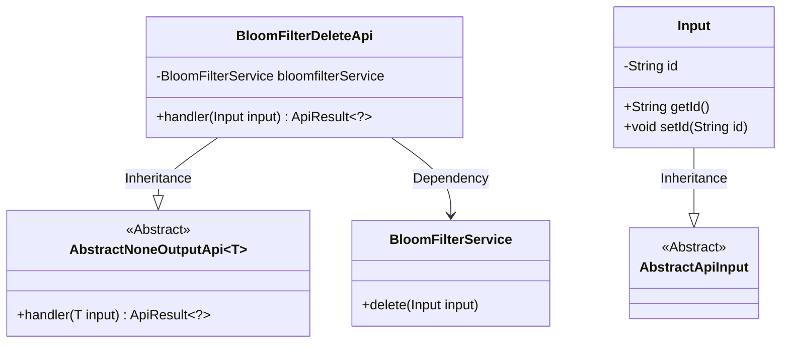

# Basic Information

|      |      |
|------|------|
| Name | BloomFilterDeleteApi |
| Language | .java |
| Code Path | WeFe/board/board-service/src/main/java/com/welab/wefe/board/service/api/data_resource/bloom_filter/BloomFilterDeleteApi.java |
| Package Name | com.welab.wefe.board.service.api.data_resource.bloom_filter |
| Dependencies | ['com.welab.wefe.board.service.service.data_resource.bloom_filter.BloomFilterService', 'com.welab.wefe.common.fieldvalidate.annotation.Check', 'com.welab.wefe.common.web.api.base.AbstractNoneOutputApi', 'com.welab.wefe.common.web.api.base.Api', 'com.welab.wefe.common.web.dto.AbstractApiInput', 'com.welab.wefe.common.web.dto.ApiResult', 'org.springframework.beans.factory.annotation.Autowired'] |
| Brief Description | The BloomFilterDeleteApi class is used to delete a Bloom filter, accepting the dataset ID as a required parameter and invoking the bloomfilterService.delete method for processing. |

# Description

The code defines an API class named `BloomFilterDeleteApi`, which is used to delete a Bloom filter. It inherits from `AbstractNoneOutputApi`, with the input parameter being the inner class `Input`. `Input` contains a mandatory field `id`, representing the dataset ID. The API processes the deletion request via the `delete` method of `BloomFilterService` and returns an empty result upon success. The entire class is annotated with API path and name, and utilizes Spring's dependency injection.

# Class Summary

| Name   | Type  | Description |
|-------|------|-------------|
| BloomFilterDeleteApi | class | This is an API class for deleting a Bloom filter, which takes a dataset ID as input, invokes the service layer to perform the deletion operation, and returns no value. |

## Class BloomFilterDeleteApi

|      |      |
|------|------|
| Access Modifier | @Api(path = "bloom_filter/delete", name = "delete bloom_filter");public |
| Type | class |
| Name | BloomFilterDeleteApi |
| Description | This is an API class for deleting a Bloom filter, which takes a dataset ID as input, invokes the service layer to perform the deletion operation, and returns no value. |

### UML Class Diagram

Class Diagram Description: This diagram illustrates the structural relationships of BloomFilterDeleteApi and its associated classes. BloomFilterDeleteApi inherits from the generic class AbstractNoneOutputApi<Input> and relies on BloomFilterService for delete operations. The Input class inherits from AbstractApiInput, containing an id attribute and corresponding getter/setter methods. The overall structure reflects a Spring-style layered design of API controllers and services.

### Internal Method Call Graph

```mermaid
graph TD
    A["Class BloomFilterDeleteApi"]
    B["Inheritance: AbstractNoneOutputApi<Input>"]
    C["Annotation: @Api(path='bloom_filter/delete', name='delete bloom_filter')"]
    D["Dependency Injection: @Autowired BloomFilterService"]
    E["Overridden Method: handler(Input input)"]
    F["Inner Class: Input"]
    G["Inheritance: AbstractApiInput"]
    H["Field: String id"]
    I["Validation Annotation: @Check(name='Dataset Id', require=true)"]
    J["getter/setter methods"]

    A --> B
    A --> C
    A --> D
    A --> E
    E --> D
    E --> F
    F --> G
    F --> H
    H --> I
    H --> J
```

This code describes the implementation of a Bloom filter deletion API, primarily consisting of the BloomFilterDeleteApi class and its inner Input parameter class. The flowchart illustrates key structures including class inheritance, dependency injection, method overriding, and parameter validation. The external API class invokes the BloomFilterService through the handler method, while the inner Input class encapsulates the mandatory dataset ID field with validation. The overall design follows a layered pattern, conforming to typical API implementation practices.

### Field List

| Name  | Type  | Description |
|-------|-------|------|
| bloomfilterService | BloomFilterService | Using @Autowired to automatically inject an instance of BloomFilterService. |

### Method List

| Name  | Type  | Description |
|-------|-------|------|
| handler | ApiResult<?> | This method overrides the parent class handler, takes an Input parameter, invokes the delete method of bloomfilterService to process the input, and returns an ApiResult upon success. It throws an Exception in case of errors. |

