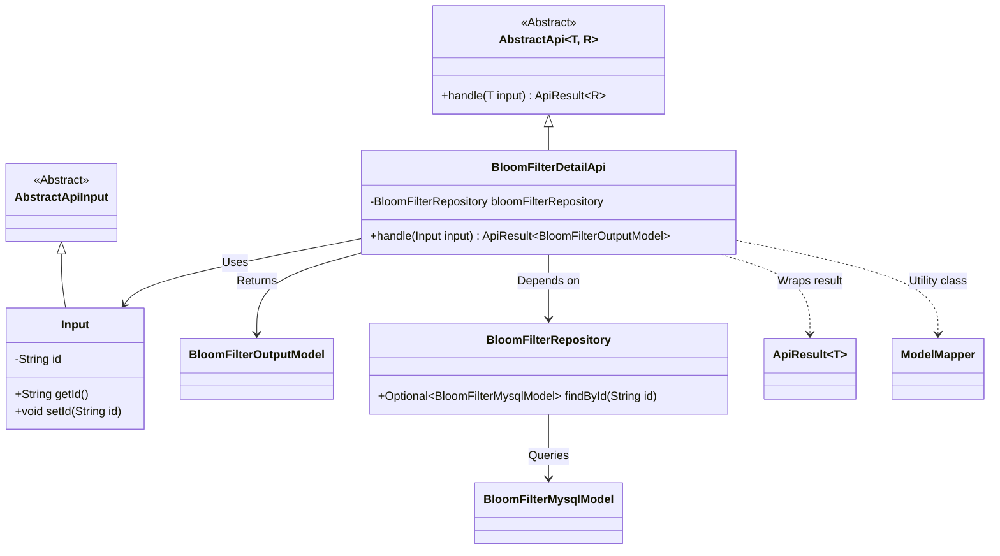

# Basic Information

|      |      |
|------|------|
| Name | BloomFilterDetailApi |
| Language | .java |
| Code Path | WeFe/board/board-service/src/main/java/com/welab/wefe/board/service/api/data_resource/bloom_filter/BloomFilterDetailApi.java |
| Package Name | com.welab.wefe.board.service.api.data_resource.bloom_filter |
| Dependencies | ['com.welab.wefe.board.service.database.entity.data_resource.BloomFilterMysqlModel', 'com.welab.wefe.board.service.database.repository.data_resource.BloomFilterRepository', 'com.welab.wefe.board.service.dto.entity.data_resource.output.BloomFilterOutputModel', 'com.welab.wefe.common.exception.StatusCodeWithException', 'com.welab.wefe.common.web.api.base.AbstractApi', 'com.welab.wefe.common.web.api.base.Api', 'com.welab.wefe.common.web.dto.AbstractApiInput', 'com.welab.wefe.common.web.dto.ApiResult', 'com.welab.wefe.common.web.util.ModelMapper', 'org.springframework.beans.factory.annotation.Autowired'] |
| Brief Description | The BloomFilterDetailApi class queries Bloom filter details by ID and returns a BloomFilterOutputModel result. If no data is found, it returns null. |

# Description

This code defines an API class named BloomFilterDetailApi, which is used to retrieve detailed information about a Bloom filter. The class annotation specifies the API path and name. It inherits from AbstractApi, with the input type being the inner class Input and the output type being BloomFilterOutputModel. The BloomFilterRepository is injected via Autowired to access the database. The handle method queries the database based on the input ID, maps it to the output model and returns if it exists, or returns an empty success result if it does not. The Input inner class contains an id field and its getter/setter methods. The entire process implements the functionality of querying Bloom filter details by ID.

# Class Summary

| Name   | Type  | Description |
|-------|------|-------------|
| BloomFilterDetailApi | class | The BloomFilterDetailApi class queries Bloom filter details by ID and returns a BloomFilterOutputModel. It uses BloomFilterRepository to fetch data, returning null if the record does not exist. The input parameter is the ID. |

## Class BloomFilterDetailApi

|      |      |
|------|------|
| Access Modifier | @Api(path = "bloom_filter/detail", name = "get BloomFilter detail");public |
| Type | class |
| Name | BloomFilterDetailApi |
| Description | The BloomFilterDetailApi class queries Bloom filter details by ID and returns a BloomFilterOutputModel. It uses BloomFilterRepository to fetch data, returning null if the record does not exist. The input parameter is the ID. |

### UML Class Diagram

Class Diagram Description: The diagram illustrates a Spring framework-based implementation of a BloomFilter query API. BloomFilterDetailApi inherits from the generic abstract class AbstractApi, processes the Input class, and returns BloomFilterOutputModel encapsulated in ApiResult. It relies on BloomFilterRepository for database queries and utilizes ModelMapper for model conversion. Input, as an inner class extending AbstractApiInput, contains an id field with accessors. The overall structure demonstrates clear hierarchical relationships and dependency directions, aligning with Spring's dependency injection pattern.

### Internal Method Call Graph

```mermaid
graph TD
    A["Class BloomFilterDetailApi"]
    B["Annotation: @Api(path='bloom_filter/detail', name='get BloomFilter detail')"]
    C["Inheritance: AbstractApi<Input, BloomFilterOutputModel>"]
    D["Dependency Injection: @Autowired BloomFilterRepository"]
    E["Overridden Method: handle(Input input)"]
    F["Inner Class: Input extends AbstractApiInput"]
    G["Property: String id"]
    H["Methods: getId()/setId()"]
    I["Process: bloomFilterRepository.findById"]
    J["Condition Check: model == null"]
    K["Process: ModelMapper.map"]
    L["Return: success(output)"]

    A --> B
    A --> C
    A --> D
    A --> E
    A --> F
    F --> G
    F --> H
    E --> I
    E --> J
    J -->|No| K
    K --> L
    J -->|Yes| M["Return: success()"]
```

This flowchart describes the structure and core processing logic of the BloomFilterDetailApi class. The class defines an API path via annotations, inherits from an abstract template class, and injects a repository service. The main processing flow includes: querying a data model by ID, null value checking, model conversion, and returning a successful result. The inner class Input encapsulates the request parameter id and its accessor methods. The diagram presents the complete chain from request handling to result return.

### Field List

| Name  | Type  | Description |
|-------|-------|------|
| bloomFilterRepository | BloomFilterRepository | The code snippet uses @Autowired to automatically inject an instance of BloomFilterRepository. |

### Method List

| Name  | Type  | Description |
|-------|-------|------|
| handle | ApiResult<BloomFilterOutputModel> | The method processes the input and queries the Bloom filter model with the specified ID. If it does not exist, an empty success is returned; if it exists, it is mapped to the output model and a successful result is returned. |

