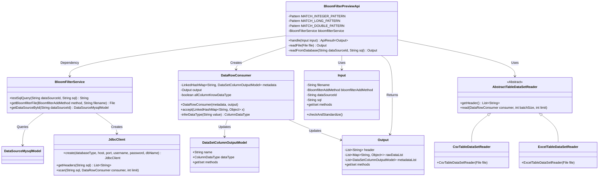

# Basic Information

|      |      |
|------|------|
| Name | BloomFilterPreviewApi |
| Language | .java |
| Code Path | WeFe/board/board-service/src/main/java/com/welab/wefe/board/service/api/data_resource/bloom_filter/BloomFilterPreviewApi.java |
| Package Name | com.welab.wefe.board.service.api.data_resource.bloom_filter |
| Dependencies | ['com.welab.wefe.board.service.constant.BloomfilterAddMethod', 'com.welab.wefe.board.service.constant.DataSetAddMethod', 'com.welab.wefe.board.service.database.entity.DataSourceMysqlModel', 'com.welab.wefe.board.service.dto.entity.data_set.DataSetColumnOutputModel', 'com.welab.wefe.board.service.service.data_resource.bloom_filter.BloomFilterService', 'com.welab.wefe.board.service.util.AbstractTableDataSetReader', 'com.welab.wefe.board.service.util.CsvTableDataSetReader', 'com.welab.wefe.board.service.util.ExcelTableDataSetReader', 'com.welab.wefe.common.StatusCode', 'com.welab.wefe.common.exception.StatusCodeWithException', 'com.welab.wefe.common.fieldvalidate.annotation.Check', 'com.welab.wefe.common.jdbc.JdbcClient', 'com.welab.wefe.common.util.ListUtil', 'com.welab.wefe.common.web.api.base.AbstractApi', 'com.welab.wefe.common.web.api.base.Api', 'com.welab.wefe.common.web.dto.AbstractApiInput', 'com.welab.wefe.common.web.dto.ApiResult', 'com.welab.wefe.common.wefe.ColumnDataTypeInferrer', 'com.welab.wefe.common.wefe.enums.ColumnDataType', 'org.apache.commons.lang3.StringUtils', 'org.springframework.beans.factory.annotation.Autowired', 'java.io.File', 'java.io.IOException', 'java.util.ArrayList', 'java.util.LinkedHashMap', 'java.util.List', 'java.util.Map', 'java.util.function.Consumer', 'java.util.regex.Pattern', 'java.util.stream.Collectors'] |
| Brief Description | The BloomFilterPreviewApi class is designed for previewing Bloom filter data, supporting data retrieval from databases or files, inferring data types, and returning metadata along with preview data. |

# Description

BloomFilterPreviewApi is an API class designed for previewing Bloom filter data, inheriting from AbstractApi. It supports reading data from databases or files and performs data type inference. Key functionalities include: validating input parameters, reading data via BloomFilterService, testing database connections, parsing CSV or Excel files, inferring data types (integer, long, double, string), and generating outputs containing headers, raw data, and metadata. The input class Input includes fields such as filename, data source ID, and SQL, while the output class Output comprises headers, raw data, and a metadata list.

# Class Summary

| Name   | Type  | Description |
|-------|------|-------------|
| BloomFilterPreviewApi | class | BloomFilter Preview API, which supports reading data from databases or files, parsing data types, and generating preview results, including field lists, raw data, and metadata information. |

## Class BloomFilterPreviewApi

|      |      |
|------|------|
| Access Modifier | @Api(path = "bloom_filter/preview", name = "preview bloom_filter rows");public |
| Type | class |
| Name | BloomFilterPreviewApi |
| Description | BloomFilter Preview API, which supports reading data from databases or files, parsing data types, and generating preview results, including field lists, raw data, and metadata information. |

### UML Class Diagram

This code implements a Bloom filter preview API, primarily functioning to read data from databases or files and infer data types. The BloomFilterPreviewApi inherits from AbstractApi, processing input parameters through the handle method and invoking readFromDatabase or readFile methods based on the data source. The DataRowConsumer class handles data rows and infers data types using regular expressions to match integers, long integers, and floating-point numbers. The BloomFilterService provides database connection and file operation services, JdbcClient executes SQL queries, and AbstractTableDataSetReader along with its subclasses are responsible for reading CSV and Excel files. The overall design adopts a layered architecture with clear responsibilities, supporting multiple data sources and file formats.

### Internal Method Call Graph

This flowchart illustrates the core processing logic of BloomFilterPreviewApi, featuring two data acquisition paths: database query and file reading. The database path involves JDBC connection and SQL execution, while the file path selects CSV or Excel parsers based on extensions. The sequence diagram details the complete call chain from client request to data processing, including exception handling and data conversion. DataRowConsumer serves as the core data processing unit, responsible for data type inference and result collection, supporting a maximum 10-row data preview limit.

### Field List

| Name  | Type  | Description |
|-------|-------|------|
| MATCH_DOUBLE_PATTERN = Pattern.compile("^-?\\d+\\.\\d+$") | Pattern | Define a static constant MATCH_DOUBLE_PATTERN for matching floating-point number formats with optional negative signs. |
| bloomfilterService | BloomFilterService | Automatically inject the Bloom filter service instance. |
| MATCH_INTEGER_PATTERN = Pattern.compile("^-?\\d{1,9}$") | Pattern | Define a static constant integer matching regex pattern to check for optional negative sign integers with 1 to 9 digits. |
| MATCH_LONG_PATTERN = Pattern.compile("^-?\\d{10,}$") | Pattern | Define a static constant MATCH_LONG_PATTERN, using a regular expression to match 10 or more digits, allowing a leading negative sign. |

### Method List

| Name  | Type  | Description |
|-------|-------|------|
| handle | ApiResult<Output> | The method selects the data source based on the input: if it is a database, it tests the SQL connection and reads the data, throwing an exception if it fails; if it is a file, it reads the file content, logs errors and throws a system error if any issues occur. Finally, it returns the processing result. |
| readFile | Output | The method `readFile` reads file data, processes the first row as column headers and the remaining rows as data rows, supports CSV and Excel formats, and returns an `Output` object containing metadata and content. |
| readFromDatabase | Output | Methods for reading data from a database: Retrieve the data source configuration based on the dataSourceId, establish a JDBC connection, and execute an SQL query. Check for duplicate column names, convert 'Y' to 'y', and if a 'y' column exists, move it to the second column. Construct an output object containing column names and metadata, process the data rows through a consumer, and return the result. |

