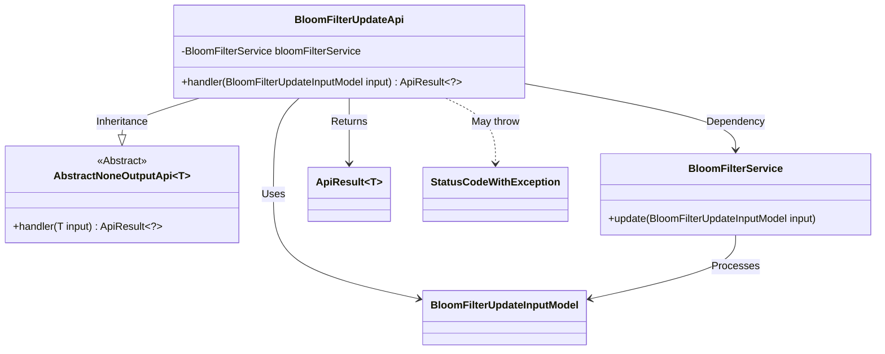
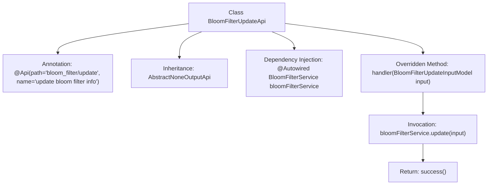

# Basic Information

|      |      |
|------|------|
| Name | BloomFilterUpdateApi |
| Language | .java |
| Code Path | WeFe/board/board-service/src/main/java/com/welab/wefe/board/service/api/data_resource/bloom_filter/BloomFilterUpdateApi.java |
| Package Name | com.welab.wefe.board.service.api.data_resource.bloom_filter |
| Dependencies | ['com.welab.wefe.board.service.dto.vo.data_resource.BloomFilterUpdateInputModel', 'com.welab.wefe.board.service.service.data_resource.bloom_filter.BloomFilterService', 'com.welab.wefe.common.exception.StatusCodeWithException', 'com.welab.wefe.common.web.api.base.AbstractNoneOutputApi', 'com.welab.wefe.common.web.api.base.Api', 'com.welab.wefe.common.web.dto.ApiResult', 'org.springframework.beans.factory.annotation.Autowired'] |
| Brief Description | This is an API class designed for updating Bloom filter information, which processes the input model through BloomFilterService and returns a successful result. |

# Description

This is a Java class named BloomFilterUpdateApi, designed for updating Bloom filter information. It extends the AbstractNoneOutputApi class with a generic parameter of BloomFilterUpdateInputModel. The class is annotated with @Api, specifying the path as "bloom_filter/update" and the name as "update bloom filter info". Inside the class, the BloomFilterService is autowired via the @Autowired annotation. The handler method is overridden to accept a BloomFilterUpdateInputModel input parameter, invoke the bloomFilterService.update method for the update operation, and finally return a successful ApiResult. The entire class implements a no-output API interface functionality.

# Class Summary

| Name   | Type  | Description |
|-------|------|-------------|
| BloomFilterUpdateApi | class | The BloomFilterUpdateApi class is used to update Bloom filter information, inheriting from AbstractNoneOutputApi, and calls the update method of BloomFilterService to process the input model BloomFilterUpdateInputModel. |

## Class BloomFilterUpdateApi

|      |      |
|------|------|
| Access Modifier | @Api(path = "bloom_filter/update", name = "update bloom filter info");public |
| Type | class |
| Name | BloomFilterUpdateApi |
| Description | The BloomFilterUpdateApi class is used to update Bloom filter information, inheriting from AbstractNoneOutputApi, and calls the update method of BloomFilterService to process the input model BloomFilterUpdateInputModel. |

### UML Class Diagram

This code demonstrates a Spring framework-based API class BloomFilterUpdateApi, which inherits from the generic abstract class AbstractNoneOutputApi and is specifically designed for handling Bloom filter update operations. The class diagram clearly illustrates the dependency relationship between this API and the service layer BloomFilterService, as well as the data flow path of the input model BloomFilterUpdateInputModel. The core business logic is implemented through the Autowired-injected service class, ultimately returning a uniformly encapsulated ApiResult. Exception handling is achieved through StatusCodeWithException, reflecting a clear hierarchical structure and division of responsibilities.

### Internal Method Call Graph

This flowchart illustrates the structure and workflow of the BloomFilterUpdateApi class. The class defines an API path and name through the @Api annotation, inherits from the AbstractNoneOutputApi base class, and injects the BloomFilterService. The core handler method receives an input model, invokes the update method of the service layer to perform Bloom filter updates, and finally returns a success result. The entire process clearly presents the call chain relationship from the API entry point to business processing.

### Field List

| Name  | Type  | Description |
|-------|-------|------|
| bloomFilterService | BloomFilterService | Using @Autowired to automatically inject an instance of BloomFilterService. |

### Method List

| Name  | Type  | Description |
|-------|-------|------|
| handler | ApiResult<?> | The method handles Bloom filter update inputs by rewriting, invokes the service update, and returns a successful result upon completion. |

