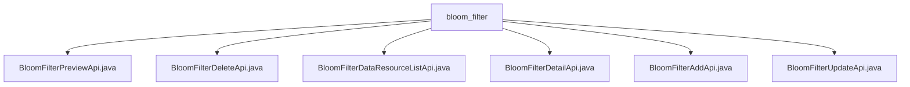

# Basic Information

|      |      |
|------|------|
| Name | bloom_filter |
| Language | .java |
| Code Path | WeFe/board/board-service/src/main/java/com/welab/wefe/board/service/api/data_resource/bloom_filter |
| Package Name | docs.board.board-service.src.main.java.com.welab.wefe.board.service.api.data_resource.bloom_filter |
| Brief Description | BloomFilterPreviewApi previews Bloom filter data, supporting database and file reading. BloomFilterDeleteApi deletes a Bloom filter. BloomFilterDataResourceListApi queries data resources. BloomFilterDetailApi retrieves Bloom filter details. BloomFilterAddApi adds a Bloom filter. BloomFilterUpdateApi updates Bloom filter information. |

# Description

## Overview  
The core responsibility of this module is to provide full lifecycle management of Bloom filter data, including operations such as preview, addition, deletion, modification, and query, similar to the CRUD service model. The interface specifications uniformly inherit from the AbstractApi base class, with inputs and outputs encapsulated using specific Model classes, such as BloomFilterAddInputModel and DataResourceAddOutputModel. Key data structures include Input classes (containing fields like ID/file name), Output classes (containing table headers/metadata), and various Model classes. External dependencies include the Spring framework, BloomFilterService, and BloomFilterRepository. For example, BloomFilterService handles deletion requests, while the Repository is used to query details.  

## Main Business Scenarios  
The business process covers data preview (supporting CSV/Excel parsing), resource list queries, detail retrieval, and addition/deletion/modification operations, forming a complete closed loop. Interaction modes are all implemented via REST APIs, such as the Preview API, which validates parameters before invoking the service layer to read data. Typical applications include: members querying data resources (requiring project ID/member ID) and updating filter configurations by ID. API types include standard CRUD (e.g., AddApi/DeleteApi) and special functions (e.g., PreviewApi). Integration examples include retrieving metadata lists via DetailApi.

### Package Internal Structure View

This flowchart illustrates the structural relationships of 6 API files under the bloom_filter directory. All Java files are directly subordinate to the bloom_filter node, presenting a flat hierarchy. These API files cover operational functionalities such as preview, deletion, list querying, detail viewing, addition, and updating of Bloom filters, serving as interface implementation files for the data resource management module.

# File List

| Name   | Type  | Description |
|-------|------|-------------|
| [BloomFilterPreviewApi.java](BloomFilterPreviewApi.md) | file | The BloomFilterPreviewApi class is used to preview Bloom filter data, supporting reading data from databases or files, inferring data types, and returning metadata and preview data. |
| [BloomFilterDeleteApi.java](BloomFilterDeleteApi.md) | file | The BloomFilterDeleteApi class is used to delete a Bloom filter, accepting the dataset ID as a mandatory parameter and invoking the bloomfilterService.delete method for processing. |
| [BloomFilterDataResourceListApi.java](BloomFilterDataResourceListApi.md) | file | The BloomFilterDataResourceListApi class is used to query data resources. It requires providing the project ID, member ID, and member type, with an optional data resource name, and calls bloomfilterService.query to process the request. |
| [BloomFilterDetailApi.java](BloomFilterDetailApi.md) | file | The BloomFilterDetailApi class queries Bloom filter details by ID and returns a BloomFilterOutputModel result. If no data is found, it returns null. |
| [BloomFilterAddApi.java](BloomFilterAddApi.md) | file | This is a Bloom filter addition API class, which inherits from AbstractApi, uses BloomFilterAddService to process addition requests, and returns DataResourceAddOutputModel results. |
| [BloomFilterUpdateApi.java](BloomFilterUpdateApi.md) | file | This is an API class for updating Bloom filter information, which processes the input model through BloomFilterService and returns a successful result. |

