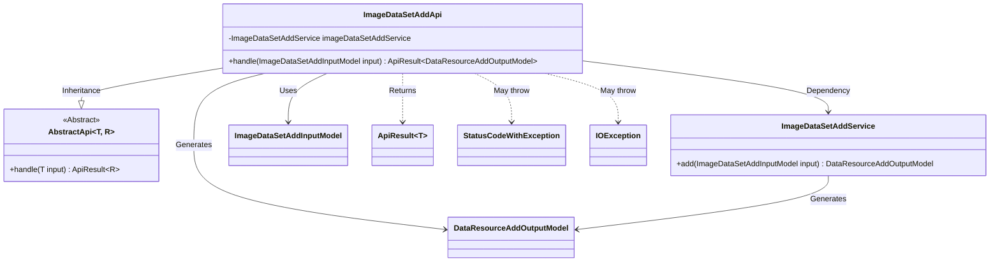
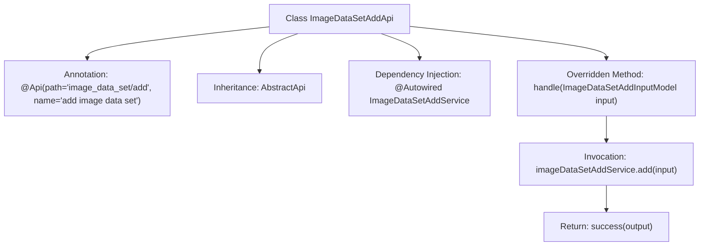

# Basic Information

|      |      |
|------|------|
| Name | ImageDataSetAddApi |
| Language | .java |
| Code Path | WeFe/board/board-service/src/main/java/com/welab/wefe/board/service/api/data_resource/image_data_set/ImageDataSetAddApi.java |
| Package Name | com.welab.wefe.board.service.api.data_resource.image_data_set |
| Dependencies | ['com.welab.wefe.board.service.dto.vo.data_resource.DataResourceAddOutputModel', 'com.welab.wefe.board.service.dto.vo.data_resource.ImageDataSetAddInputModel', 'com.welab.wefe.board.service.service.data_resource.add.ImageDataSetAddService', 'com.welab.wefe.common.exception.StatusCodeWithException', 'com.welab.wefe.common.web.api.base.AbstractApi', 'com.welab.wefe.common.web.api.base.Api', 'com.welab.wefe.common.web.dto.ApiResult', 'org.springframework.beans.factory.annotation.Autowired', 'java.io.IOException'] |
| Brief Description | This is an API class for adding image datasets, inheriting from AbstractApi, using ImageDataSetAddInputModel as input and DataResourceAddOutputModel as output. It processes the addition operation through ImageDataSetAddService and returns successful results. |

# Description

This is a Java class named ImageDataSetAddApi, designed for adding image datasets. It extends the AbstractApi base class, with generic parameters specifying the input model ImageDataSetAddInputModel and the output model DataResourceAddOutputModel. The class is annotated with @Api, defining the API path as "image_data_set/add" and the name as "add image data set". The ImageDataSetAddService is automatically injected via @Autowired. The core method is handle, which takes the input model, invokes the add method of the service layer to process business logic, and returns a successful ApiResult. This method may throw StatusCodeWithException and IOException exceptions.

# Class Summary

| Name   | Type  | Description |
|-------|------|-------------|
| ImageDataSetAddApi | class | This is an API class named ImageDataSetAddApi, designed for adding image datasets. It inherits from AbstractApi, processes ImageDataSetAddInputModel as input, and returns DataResourceAddOutputModel as output. The functionality is implemented by invoking the add method of imageDataSetAddService. |

## Class ImageDataSetAddApi

|      |      |
|------|------|
| Access Modifier | @Api(path = "image_data_set/add", name = "add image data set");public |
| Type | class |
| Name | ImageDataSetAddApi |
| Description | This is an API class named ImageDataSetAddApi, designed for adding image datasets. It inherits from AbstractApi, processes ImageDataSetAddInputModel as input, and returns DataResourceAddOutputModel as output. The functionality is implemented by invoking the add method of imageDataSetAddService. |

### UML Class Diagram

This code demonstrates the implementation class `ImageDataSetAddApi` for an image dataset addition API, which inherits from the generic abstract class `AbstractApi` and relies on `ImageDataSetAddService` to perform core business logic. The API accepts `ImageDataSetAddInputModel` as input, returns an `ApiResult` containing `DataResourceAddOutputModel`, and may throw `StatusCodeWithException` and `IOException` exceptions. The class diagram clearly illustrates inheritance, dependency, and usage relationships between components, reflecting a typical controller-layer implementation pattern in the Spring framework.

### Internal Method Call Graph

This code demonstrates a Spring framework-based API class for adding image datasets. The flowchart depicts key elements of the class structure: class inheritance, service injection, and the core method invocation chain. The class defines the endpoint path via the `@Api` annotation, inherits from an abstract template class to handle specific input/output models, relies on `ImageDataSetAddService` to implement business logic, and ultimately returns a properly encapsulated success result.

### Field List

| Name  | Type  | Description |
|-------|-------|------|
| imageDataSetAddService | ImageDataSetAddService | Using @Autowired to automatically inject an instance of ImageDataSetAddService. |

### Method List

| Name  | Type  | Description |
|-------|-------|------|
| handle | ApiResult<DataResourceAddOutputModel> | Processing image dataset addition request, calling service to generate output and returning successful result. |

