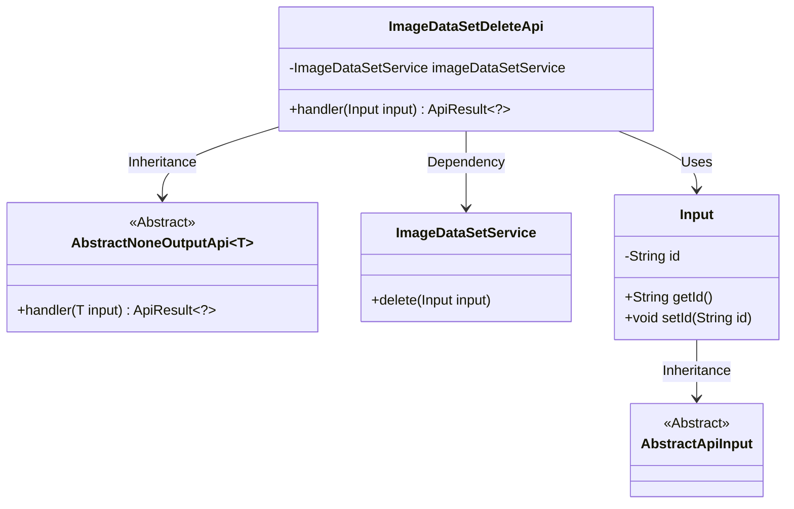

# Basic Information

|      |      |
|------|------|
| Name | ImageDataSetDeleteApi |
| Language | .java |
| Code Path | WeFe/board/board-service/src/main/java/com/welab/wefe/board/service/api/data_resource/image_data_set/ImageDataSetDeleteApi.java |
| Package Name | com.welab.wefe.board.service.api.data_resource.image_data_set |
| Dependencies | ['com.welab.wefe.board.service.service.data_resource.image_data_set.ImageDataSetService', 'com.welab.wefe.common.exception.StatusCodeWithException', 'com.welab.wefe.common.fieldvalidate.annotation.Check', 'com.welab.wefe.common.web.api.base.AbstractNoneOutputApi', 'com.welab.wefe.common.web.api.base.Api', 'com.welab.wefe.common.web.dto.AbstractApiInput', 'com.welab.wefe.common.web.dto.ApiResult', 'org.springframework.beans.factory.annotation.Autowired'] |
| Brief Description | This is an API class for deleting datasets, which accepts a dataset ID as a required parameter, invokes the service layer to delete the data, and returns a success result. |

# Description

The code defines an API class named `ImageDataSetDeleteApi` for deleting image datasets. The API path is `image_data_set/delete`, which processes input parameters via a POST request. The input class `Input` contains a required field `id`, representing the ID of the dataset to be deleted. This API invokes the `delete` method of `ImageDataSetService` to perform the deletion operation and returns an empty result upon success. The entire workflow is implemented by inheriting an abstract class, incorporating input validation and exception handling mechanisms.

# Class Summary

| Name   | Type  | Description |
|-------|------|-------------|
| ImageDataSetDeleteApi | class | API class for deleting datasets, which takes a dataset ID as input, invokes the service layer's delete operation, and returns a success result. |

## Class ImageDataSetDeleteApi

|      |      |
|------|------|
| Access Modifier | @Api(path = "image_data_set/delete", name = "delete data set");public |
| Type | class |
| Name | ImageDataSetDeleteApi |
| Description | API class for deleting datasets, which takes a dataset ID as input, invokes the service layer's delete operation, and returns a success result. |

### UML Class Diagram

This code demonstrates the implementation structure of an image dataset deletion API. The ImageDataSetDeleteApi inherits from the AbstractNoneOutputApi generic class, uses Input as the parameter type, and relies on ImageDataSetService to perform deletion operations. The Input class inherits from AbstractApiInput and contains the dataset ID field along with its accessor methods. The overall design follows a layered architecture, implementing business logic through inheritance of abstract classes and dependency on service classes.

### Internal Method Call Graph

```mermaid
graph TD
    A["Class ImageDataSetDeleteApi"]
    B["Annotation: @Api(path='image_data_set/delete', name='delete data set')"]
    C["Inheritance: AbstractNoneOutputApi<Input>"]
    D["Dependency Injection: @Autowired ImageDataSetService"]
    E["Overridden Method: handler(Input input)"]
    F["Invocation: imageDataSetService.delete(input)"]
    G["Return: success()"]
    H["Nested Class Input"]
    I["Inheritance: AbstractApiInput"]
    J["Field: @Check String id"]
    K["getter/setter methods"]

    A --> B
    A --> C
    A --> D
    A --> E
    E --> F
    E --> G
    A --> H
    H --> I
    H --> J
    H --> K
```

This flowchart illustrates the structure and key components of the ImageDataSetDeleteApi class. The class defines an API path via @Api annotation, inherits from AbstractNoneOutputApi, and implements the handler method to process deletion requests. The nested Input class extends AbstractApiInput, containing an id field with validation annotation and corresponding accessor methods. The handler method invokes imageDataSetService to perform deletion and returns a success result, forming a complete API processing workflow.

### Field List

| Name  | Type  | Description |
|-------|-------|------|
| imageDataSetService | ImageDataSetService | Automatically inject the ImageDataSetService instance. |

### Method List

| Name  | Type  | Description |
|-------|-------|------|
| handler | ApiResult<?> | Delete the specified input item in the image dataset service, and return the result upon successful operation. |

