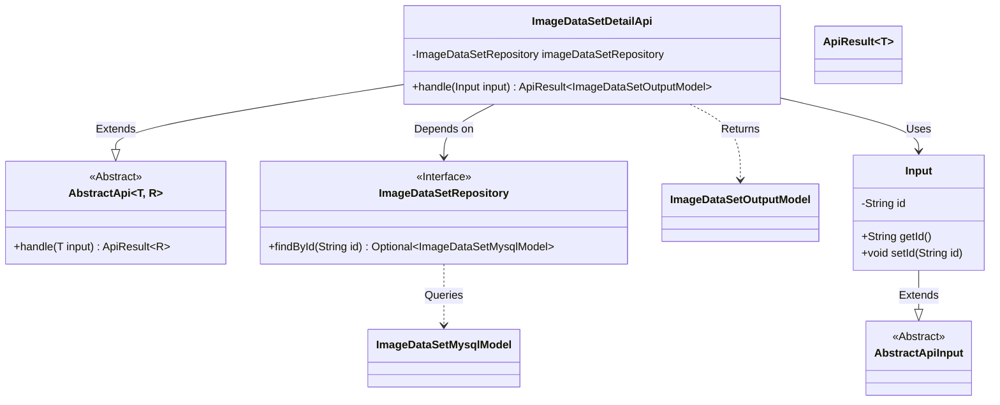

# Basic Information

|      |      |
|------|------|
| Name | ImageDataSetDetailApi |
| Language | .java |
| Code Path | WeFe/board/board-service/src/main/java/com/welab/wefe/board/service/api/data_resource/image_data_set/ImageDataSetDetailApi.java |
| Package Name | com.welab.wefe.board.service.api.data_resource.image_data_set |
| Dependencies | ['com.welab.wefe.board.service.database.entity.data_resource.ImageDataSetMysqlModel', 'com.welab.wefe.board.service.database.repository.data_resource.ImageDataSetRepository', 'com.welab.wefe.board.service.dto.entity.data_resource.output.ImageDataSetOutputModel', 'com.welab.wefe.common.exception.StatusCodeWithException', 'com.welab.wefe.common.web.api.base.AbstractApi', 'com.welab.wefe.common.web.api.base.Api', 'com.welab.wefe.common.web.dto.AbstractApiInput', 'com.welab.wefe.common.web.dto.ApiResult', 'com.welab.wefe.common.web.util.ModelMapper', 'org.springframework.beans.factory.annotation.Autowired'] |
| Brief Description | The code defines an API interface for retrieving image dataset details, which queries the database by ID and returns the mapped output model. It returns an empty result if no data is found. The input parameter is an ID string. |

# Description

The code defines an API class named `ImageDataSetDetailApi`, which is used to retrieve detailed information about an image dataset. This class inherits from `AbstractApi`, accepts input parameters of type `Input`, and returns a result of type `ImageDataSetOutputModel`. It uses `@Autowired` to inject `ImageDataSetRepository` for database access. The processing logic includes querying the database based on the input ID—returning `null` if the record does not exist, or mapping it to the output model and returning it if it exists. The `Input` inner class contains an `id` field along with its getter and setter methods. The API path is `"image_data_set/detail"`, and its name is `"get a image data set detail"`.

# Class Summary

| Name   | Type  | Description |
|-------|------|-------------|
| ImageDataSetDetailApi | class | This is an API class for retrieving image dataset details, which queries the database by ID and returns the mapped output model. It returns an empty result if no data is found. |

## Class ImageDataSetDetailApi

|      |      |
|------|------|
| Access Modifier | @Api(path = "image_data_set/detail", name = "get a image data set detail");public |
| Type | class |
| Name | ImageDataSetDetailApi |
| Description | This is an API class for retrieving image dataset details, which queries the database by ID and returns the mapped output model. It returns an empty result if no data is found. |

### UML Class Diagram

Class Diagram Description: The diagram illustrates that the ImageDataSetDetailApi class inherits from the generic abstract class AbstractApi and depends on the ImageDataSetRepository interface for data queries. Input serves as an inner class extending AbstractApiInput to encapsulate input parameters. ApiResult acts as a generic class wrapping return values, while ImageDataSetOutputModel and ImageDataSetMysqlModel represent output and database models respectively. The overall structure reflects a Spring-style API layer implementation, incorporating dependency injection and model conversion logic.

### Internal Method Call Graph

```mermaid
graph TD
    A["Class ImageDataSetDetailApi"]
    B["Annotation: @Api(path='image_data_set/detail', name='get a image data set detail')"]
    C["Inheritance: AbstractApi<Input, ImageDataSetOutputModel>"]
    D["Dependency Injection: @Autowired ImageDataSetRepository"]
    E["Overridden Method: handle(Input input)"]
    F["Inner Class: Input extends AbstractApiInput"]
    G["Field: String id"]
    H["Methods: getId()/setId()"]
    I["Operation: imageDataSetRepository.findById(input.id)"]
    J["Condition Check: model == null"]
    K["Operation: ModelMapper.map(model, ImageDataSetOutputModel.class)"]
    L["Return: success(output)"]
    M["Return: success()"]

    A --> B
    A --> C
    A --> D
    A --> E
    A --> F
    F --> G
    F --> H
    E --> I
    I --> J
    J -- Yes --> M
    J -- No --> K
    K --> L
```

This code defines an API class for retrieving image dataset details, inheriting from an abstract API base class. The main workflow includes: querying data from the repository by ID, mapping it to an output model if exists and returning, otherwise returning an empty success result. The inner class Input encapsulates the request parameter ID and its access methods. The flowchart clearly illustrates the class structure, dependency relationships, and the branching logic of core processing flow.

### Field List

| Name  | Type  | Description |
|-------|-------|------|
| imageDataSetRepository | ImageDataSetRepository | Automatically inject the ImageDataSetRepository instance. |

### Method List

| Name  | Type  | Description |
|-------|-------|------|
| handle | ApiResult<ImageDataSetOutputModel> | Rewrite the method to query the image dataset based on the input ID. If the ID does not exist, return an empty success response. If it exists, map it to the output model and return. |

