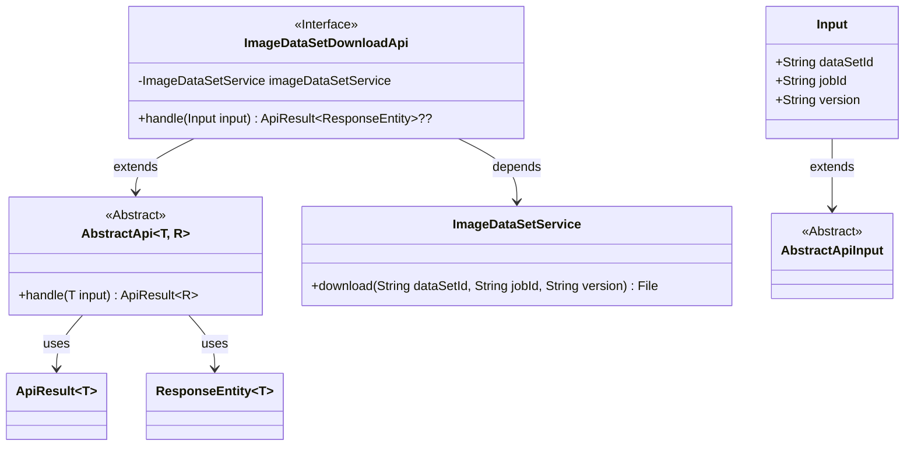
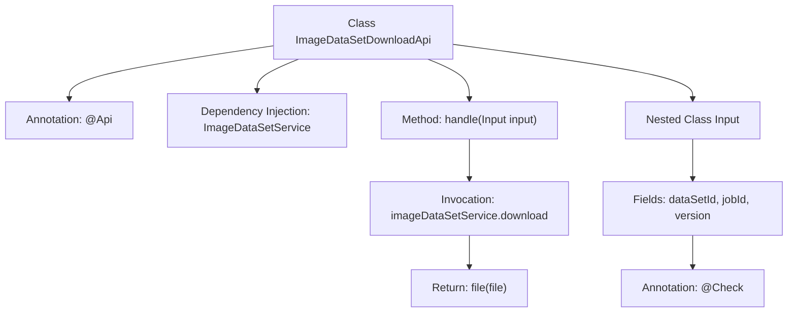
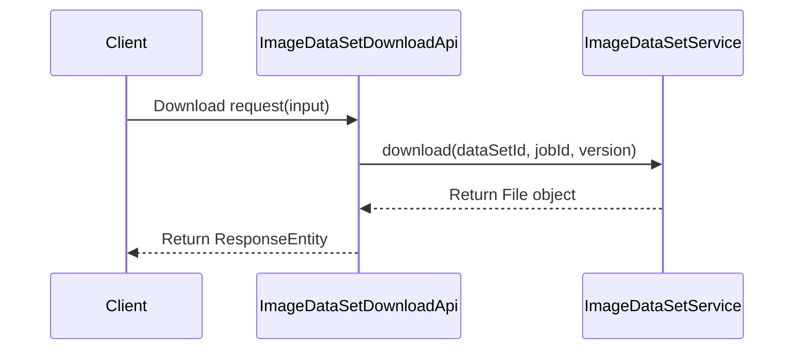

# Basic Information

|      |      |
|------|------|
| Name | ImageDataSetDownloadApi |
| Language | .java |
| Code Path | WeFe/board/board-service/src/main/java/com/welab/wefe/board/service/api/data_resource/image_data_set/ImageDataSetDownloadApi.java |
| Package Name | com.welab.wefe.board.service.api.data_resource.image_data_set |
| Dependencies | ['com.welab.wefe.board.service.service.data_resource.image_data_set.ImageDataSetService', 'com.welab.wefe.common.exception.StatusCodeWithException', 'com.welab.wefe.common.fieldvalidate.annotation.Check', 'com.welab.wefe.common.web.api.base.AbstractApi', 'com.welab.wefe.common.web.api.base.Api', 'com.welab.wefe.common.web.dto.AbstractApiInput', 'com.welab.wefe.common.web.dto.ApiResult', 'org.springframework.beans.factory.annotation.Autowired', 'org.springframework.http.ResponseEntity', 'java.io.File'] |
| Brief Description | This is an API class for downloading image datasets, with the path "image_data_set/download", allowing signed access. By inputting the dataset ID, task ID, and version number, it calls the service layer to download the file and returns the result. |

# Description

The code defines an API class named `ImageDataSetDownloadApi` for downloading image dataset files. The API path is `"image_data_set/download"` and allows signed access. The class inherits from `AbstractApi`, with the input type being the inner class `Input` and returning a `ResponseEntity`.  

`Input` contains three fields: the required dataset ID (`dataSetId`), task ID (`jobId`), and version number (`version`). The processing logic uses `imageDataSetService` to download the specified file and returns the file object.  

The entire API encapsulates the dataset download functionality, including parameter validation and exception handling mechanisms.

# Class Summary

| Name   | Type  | Description |
|-------|------|-------------|
| ImageDataSetDownloadApi | class | This is an image dataset download API class that allows signed access to download files by dataset ID, task ID, and version number, returning a file response. |

## Class ImageDataSetDownloadApi

|      |      |
|------|------|
| Access Modifier | @Api(path = "image_data_set/download", name = "download image data set file", allowAccessWithSign = true);public |
| Type | class |
| Name | ImageDataSetDownloadApi |
| Description | This is an image dataset download API class that allows signed access to download files by dataset ID, task ID, and version number, returning a file response. |

### UML Class Diagram

This code demonstrates the implementation structure of an image dataset download API. The ImageDataSetDownloadApi inherits from the generic abstract class AbstractApi, processes input parameters containing dataset ID, job ID, and version number, and completes file download functionality through ImageDataSetService. The class diagram clearly shows inheritance relationships (ImageDataSetDownloadApi→AbstractApi, Input→AbstractApiInput), dependency relationships (ImageDataSetDownloadApi→ImageDataSetService), and the use of generic classes (AbstractApi~T,R~, ApiResult~T~). The input parameter class Input contains three string fields, with dataSetId being mandatory. The overall design follows the Spring framework's API development pattern, achieving decoupling between business logic and foundational framework through a layered structure.

### Internal Method Call Graph

This code defines an API class for downloading image datasets, implementing file download functionality by inheriting an abstract API template and injecting a service layer. The flowchart illustrates the class structure, dependencies, and method call chain, while the sequence diagram depicts the complete interaction process from client request to file response. The nested Input class encapsulates required request parameters with validation annotations.

### Field List

| Name  | Type  | Description |
|-------|-------|------|
| imageDataSetService | ImageDataSetService | Automatically inject the ImageDataSetService instance. |

### Method List

| Name  | Type  | Description |
|-------|-------|------|
| handle | ApiResult<ResponseEntity<?>> | This method processes the input data, calls the service to download the specified dataset file, and returns the file result. |

