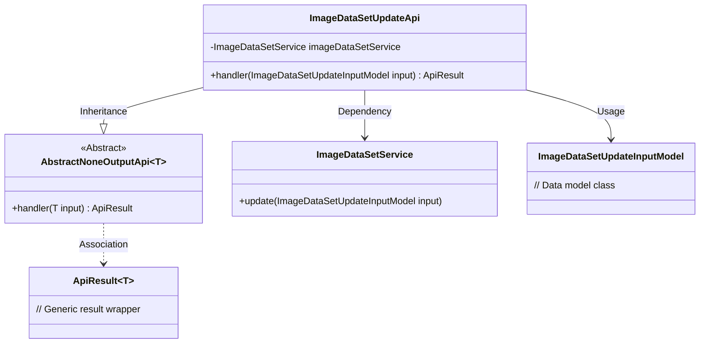
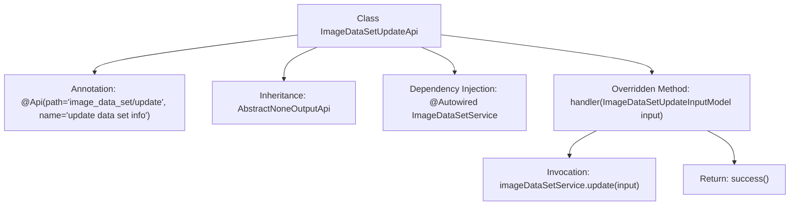

# Basic Information

|      |      |
|------|------|
| Name | ImageDataSetUpdateApi |
| Language | .java |
| Code Path | WeFe/board/board-service/src/main/java/com/welab/wefe/board/service/api/data_resource/image_data_set/ImageDataSetUpdateApi.java |
| Package Name | com.welab.wefe.board.service.api.data_resource.image_data_set |
| Dependencies | ['com.welab.wefe.board.service.dto.vo.data_resource.ImageDataSetUpdateInputModel', 'com.welab.wefe.board.service.service.data_resource.image_data_set.ImageDataSetService', 'com.welab.wefe.common.exception.StatusCodeWithException', 'com.welab.wefe.common.web.api.base.AbstractNoneOutputApi', 'com.welab.wefe.common.web.api.base.Api', 'com.welab.wefe.common.web.dto.ApiResult', 'org.springframework.beans.factory.annotation.Autowired'] |
| Brief Description | This is an API class for updating image dataset information, which calls the update method of ImageDataSetService to process the input and return a successful result. |

# Description

This is an API class designed for updating image dataset information, with the path "image_data_set/update". It inherits from the AbstractNoneOutputApi base class, with the generic parameter specifying the input model as ImageDataSetUpdateInputModel. The class obtains an instance of the ImageDataSetService via auto-injection. The core processing logic is implemented in the handler method, which receives input parameters, invokes the update method of the service layer to complete the data update operation, and finally returns a successful API result. The entire API does not generate output data but solely performs the update operation.

# Class Summary

| Name   | Type  | Description |
|-------|------|-------------|
| ImageDataSetUpdateApi | class | This is an API class for updating image dataset information. It calls the update method of ImageDataSetService to process the input parameters and returns an empty result upon success. |

## Class ImageDataSetUpdateApi

|      |      |
|------|------|
| Access Modifier | @Api(path = "image_data_set/update", name = "update data set info");public |
| Type | class |
| Name | ImageDataSetUpdateApi |
| Description | This is an API class for updating image dataset information. It calls the update method of ImageDataSetService to process the input parameters and returns an empty result upon success. |

### UML Class Diagram

This class diagram illustrates that ImageDataSetUpdateApi inherits from the generic abstract class AbstractNoneOutputApi and relies on ImageDataSetService for data update operations. As a REST API implementation class, it processes input parameters of type ImageDataSetUpdateInputModel through the handler method and returns ApiResult-wrapped results. The clear relationships between components demonstrate the application of Spring dependency injection and the template method pattern.

### Internal Method Call Graph

This flowchart illustrates the structure and execution flow of the ImageDataSetUpdateApi class. The class defines API path and name through @Api annotation, inherits from AbstractNoneOutputApi base class with specified input model type. Core logic is implemented in the handler method: first executes update operation via auto-injected ImageDataSetService, then returns success result. The entire process clearly reflects the call chain relationship from API entry to business processing.

### Field List

| Name  | Type  | Description |
|-------|-------|------|
| imageDataSetService | ImageDataSetService | Automatically inject the ImageDataSetService instance. |

### Method List

| Name  | Type  | Description |
|-------|-------|------|
| handler | ApiResult<?> | Coverage method processes image dataset updates, invokes the service to update input data, and returns successful results. |

